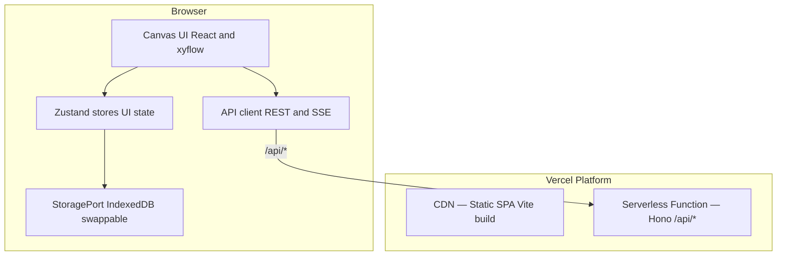
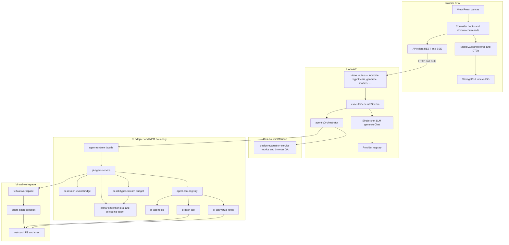
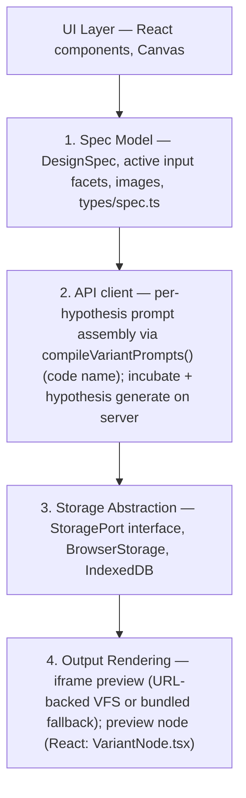

# Architecture

For a **readable end-to-end walkthrough** (canvas roles, prompts, PI agent, evaluation), see [SYSTEM_OVERVIEW.md](SYSTEM_OVERVIEW.md). This file stays the **technical** reference: layouts, routes, modules, and data flow.

## Client-Server Overview




**Client** — React SPA with Zustand stores, `@xyflow/react` canvas, IndexedDB for generated code. Makes REST and SSE calls to `/api/`*.

**Server** — Hono app deployed as a Vercel serverless function. Handles all LLM orchestration: compilation, generation (agentic Pi pipeline + evaluation), model listing, design system extraction. Holds API keys server-side.

**Local dev** — Two processes: Vite (SPA + HMR; default **4732**, `**VITE_PORT**`) and Hono (API; default **4731**, `**PORT**`, via `tsx watch`). Defaults: **`server/dev-defaults.ts`**. Vite `**loadEnv**` + proxy forwards `/api/`* to Hono. **`pnpm dev:all`** waits on `**/api/health**` at `**127.0.0.1:${PORT:-4731}**`.

## Design system (frontend)

UI color and typography tokens: **[DESIGN_SYSTEM.md](DESIGN_SYSTEM.md)** (Indigo brand + sage/amber status + pacific info; bone/ivory/white surface stack; Inter Tight + Fraunces + JetBrains Mono triad; light + dark themes via the `.dark` class on `<html>`, toggled by `src/hooks/useThemeEffect.ts`). Package shell at `packages/design-system/`: `tokens.json` → `build-tokens.mjs` (`pnpm tokens:build`, wired as `prebuild`) → `_generated-tokens.css` (`:root` + `.dark` base tokens) → `globals.css` (derived tokens, `@theme inline` utility registration, component layer). Atoms (`Button`, `Badge`) import via `@ds/components/ui/<name>`. Drift guards in `packages/design-system/__tests__/` chain into root `pnpm test`.

## Layered architecture (diagram)

The SPA is not classic MVC, but it helps to map roles: **View** (React / `@xyflow`), **Model** (Zustand stores, workspace DTOs, IndexedDB via `StoragePort`), **Controller** (hooks, `domain-commands`, `src/api/client.ts`). The server keeps routes thin and pushes orchestration into `generate-execution`, providers, and the agentic pipeline. `**[ApiServerGate](src/components/shared/ApiServerGate.tsx)`** wraps routed content (inside `**BrowserRouter**`) and blocks the canvas until `**GET /api/config**` succeeds—so running **Vite alone** without the API shows a single “API server not reachable” screen instead of partial failures and proxy spam. **Dev-only bypass:** `**/dev/design-tokens`** (kitchen sink) still mounts without the API (`**shouldBypassApiServerGate**` in `**src/lib/api-server-gate-utils.ts**`).




### Pi design sandbox (three-layer contract)

Confusing these layers causes bad prompts and false “tool not working” reports.

1. **Layer 1 — VFS + just-bash** (`[virtual-workspace.ts](server/services/virtual-workspace.ts)` over `[agent-bash-sandbox.ts](server/services/agent-bash-sandbox.ts)`, `just-bash`): In-memory tree at `**/home/user/project`**; `bash.fs.*` and `bash.exec`. Optional runtimes (**network**, **python**, **javascript**) are **not** enabled in our constructor—do not document `npm`, `curl`, etc. as available unless you change that code.
2. **Layer 2 — Tool registry + Pi `ToolDefinition`s** (`[agent-tool-registry.ts](server/services/agent-tool-registry.ts)`, `[virtual-tools.ts](server/services/pi-sdk/virtual-tools.ts)`, `[pi-bash-tool.ts](server/services/pi-bash-tool.ts)`, `[pi-app-tools.ts](server/services/pi-app-tools.ts)`): The registry groups virtual file tools, bash, app tools, and validation tools while preserving exact model-facing order. Tool definitions keep the same **names** and **parameter schemas** as Pi’s native tools; `**execute**` delegates to Layer 1. Model-facing `**description**` strings are merged from `**SANDBOX_TOOL_OVERRIDES**` (file tools + accurate sandbox copy). `**promptSnippet**` / `**promptGuidelines**` on tools are **not** injected into the system message when Pi uses a `**customPrompt**` (we pass the resolved designer system prompt from `**prompts/designer-agentic-system/PROMPT.md**` via `**server/lib/prompt-resolution.ts**` into `createSandboxResourceLoader.getSystemPrompt()`). Only `**description**` is reliably seen by the model **via the API tool schema** (JSON function definitions). See the comment above `**SANDBOX_TOOL_OVERRIDES**` in `virtual-tools.ts`.
3. **Layer 3 — What the design LLM sees:** **System message** = body from `**prompts/designer-agentic-system/PROMPT.md**` (loaded via `**server/lib/prompt-resolution.ts**`) + `**Current date**` and `**Current working directory**` appended by Pi’s `buildSystemPrompt`—those two lines are **not** in the repo prompt file. **User message** = hypothesis/spec + hardcoded workspace root reminder in `[pi-agent-service.ts](server/services/pi-agent-service.ts)`. Repo **skills** (including `**agents-md-file**`) are **not** copied into the sandbox; the agent loads `SKILL.md` via **`use_skill`** and optional sibling text resources via host-backed skill resource tools. Pi’s `getAgentsFiles()` is empty.

- `**agentic-orchestrator**` and task-agent execution call the app-owned `**agent-runtime**` facade — they do not import `@mariozechner/*` or `pi-agent-service.ts` directly. To replace Pi, rework `**server/services/pi-sdk/**`, `**pi-agent-service.ts**`, `**agent-tool-registry.ts**`, and the event bridge; keep the orchestrator’s build/eval/revision contract stable. **`[pi-agent-service.ts](server/services/pi-agent-service.ts)`** may call **`session.agent.continue()`** after **`[upstream-retry.ts](server/lib/upstream-retry.ts)`**-classified upstream errors (capped retries) when Pi’s built-in auto-retry regex does not match the provider message.
- `**createAgentSession**` uses `**tools: []**` so default Pi tools never touch the host filesystem; `**virtual-tools**` maps native Pi file tool schemas to `**just-bash**`, and `**pi-bash-tool**` runs shell commands in the same instance. `**cwd**` is the sandbox project root; `**createSandboxResourceLoader({ systemPrompt, contextWindow, getCompactionPromptBody? })**` (async: calls `**reload()**`) uses Pi `**DefaultResourceLoader**` + shared in-memory `**SettingsManager**` for compaction thresholds + optional `**getCompactionPromptBody**` (body from the `**agent-context-compaction**` skill on disk via `**prompt-resolution.ts**`); it injects the agentic system prompt via `**getSystemPrompt()**`.
- `**pi-session-event-bridge**` turns Pi session callbacks into `**AgentRunEvent**`, which `**executeGenerateStream**` serializes to SSE for the client. It handles **`agent_end`**: when the last assistant message has **`stopReason: error`** (upstream LLM/stream failure), the client receives **`error`** SSE plus a trace row so runs do not appear to succeed silently.
- `**virtual-workspace**` is the app VFS contract: it starts empty except optional **caller seeds** (e.g. prior design files on revision rounds), normalizes paths under the sandbox root, extracts file maps after a run, and computes files changed beyond the seed. The agent writes generated artifacts only—**skills are not copied into the VFS**. Evaluation runs in `**design-evaluation-service**` (parallel workers), not inside Pi tool definitions. Repo-root `**skills/**` packages (see `**server/lib/skill-discovery.ts**`) are walked at each Pi session boundary; non-`**manual**` skills matching the session tags are listed in `**<available_skills>**` on the Pi `**use_skill**` tool. `use_skill` loads `SKILL.md`; `list_skill_resources` / `read_skill_resource` expose non-hidden sibling text resources from the host package. Script files are readable only, not executable. Successful `**use_skill**` calls emit `**skill_activated**` (SSE + trace). `**skills_loaded**` (+ trace) advertises the catalog summary for the UI.

### Tool inventory

Every tool the design LLM can call during an agentic Pi session. Tools marked **VFS** operate on the just-bash in-memory tree at `/home/user/project`. Tools marked **App** run outside the virtual filesystem.


| Tool            | VFS? | Source                                                      | Parameters                                                                                                                                                             | How it works                                                                                                                                                                                                                                                                                                                                                                                                                                                                                                                                                                                                                                                                                                                                                                                                                                                                                    |
| --------------- | ---- | ----------------------------------------------------------- | ---------------------------------------------------------------------------------------------------------------------------------------------------------------------- | ----------------------------------------------------------------------------------------------------------------------------------------------------------------------------------------------------------------------------------------------------------------------------------------------------------------------------------------------------------------------------------------------------------------------------------------------------------------------------------------------------------------------------------------------------------------------------------------------------------------------------------------------------------------------------------------------------------------------------------------------------------------------------------------------------------------------------------------------------------------------------------------------- |
| `read`          | VFS  | `virtual-tools.ts` → `createReadToolDefinition`             | `path` (string, **required**); `offset` (number, optional) — 1-indexed start line; `limit` (number, optional) — max lines                                              | Reads UTF-8 text from the VFS. Output truncated to 2 000 lines or 50 KB. Model uses `offset`/`limit` to page large files.                                                                                                                                                                                                                                                                                                                                                                                                                                                                                                                                                                                                                                                                                                                                                                       |
| `write`         | VFS  | `virtual-tools.ts` → `createWriteToolDefinition`            | `path` (string, **required**); `content` (string, **required**)                                                                                                        | Creates or overwrites a file. Parent directories created automatically. Intended for **new files** or **complete rewrites**; prompt steers model toward `edit` for partial changes.                                                                                                                                                                                                                                                                                                                                                                                                                                                                                                                                                                                                                                                                                                             |
| `edit`          | VFS  | `virtual-tools.ts` → `createEditToolDefinition` (+ wrapper) | `path` (string, **required**); `edits` (array, **required**) — each `{ oldText: string, newText: string }`; legacy top-level `oldText`/`newText` folded into `edits[]` | Search-and-replace: each `oldText` must match **exactly once** in the **original** file (Pi applies the batch in one shot). Tool **description** (`SANDBOX_TOOL_OVERRIDES`) asks for ≥3 lines of surrounding context when feasible. **Read-before-edit (enforced):** for paths that already exist, the model must `read` or `write` that path before `edit`; after a successful `edit`, it must `read` again before another `edit` on that path. Duplicate substring matches → error (“provide more context”). **Not-found retry:** on Pi errors whose message matches “could not find” (case-insensitive), the wrapper reads the file, runs `[edit-match-cascade.ts](server/services/pi-sdk/edit-match-cascade.ts)` to correct `oldText` when a **unique** match is found, and retries **once**; duplicate-match errors are **not** retried; second failure returns the **original** Pi error. |
| `ls`            | VFS  | `virtual-tools.ts` → `createLsToolDefinition`               | `path` (optional, default cwd); `limit` (optional, default 500)                                                                                                        | Lists directory contents alphabetically; directories suffixed with `/`; includes dotfiles. Truncated to 500 entries or 50 KB.                                                                                                                                                                                                                                                                                                                                                                                                                                                                                                                                                                                                                                                                                                                                                                   |
| `find`          | VFS  | `virtual-tools.ts` → `createFindToolDefinition`             | `pattern` (string, **required**) — glob; `path` (optional); `limit` (optional, default 1 000)                                                                          | Glob search. No `.gitignore` in the sandbox. Truncated to 1 000 results or 50 KB.                                                                                                                                                                                                                                                                                                                                                                                                                                                                                                                                                                                                                                                                                                                                                                                                               |
| `grep`          | VFS  | `virtual-tools.ts` → `grepToolDefinition`                   | `pattern` (**required**); `path`, `glob`, `ignoreCase`, `literal`, `context`, `limit`                                                                                  | Ripgrep-style search via `bash.exec('rg …')`. Long lines truncated to 500 chars; cap 100 matches or 50 KB.                                                                                                                                                                                                                                                                                                                                                                                                                                                                                                                                                                                                                                                                                                                                                                                      |
| `bash`          | VFS  | `pi-bash-tool.ts`                                           | `command` (string, **required**)                                                                                                                                       | Runs in just-bash at project root; same tree as file tools. **No** `npm`, `node`, `python`, `curl`, or network.                                                                                                                                                                                                                                                                                                                                                                                                                                                                                                                                                                                                                                                                                                                                                                                 |
| `todo_write`    | App  | `pi-app-tools.ts`                                           | `todos` (array, **required**) — full replacement list; each `{ id, task, status: 'pending' | 'in_progress' | 'completed' }`                                            | Replaces the session todo list; summaries returned to the model.                                                                                                                                                                                                                                                                                                                                                                                                                                                                                                                                                                                                                                                                                                                                                                                                                                |
| `use_skill`     | App  | `pi-app-tools.ts` + `skill-discovery.ts`                    | `name` (string, **required**) — skill key under `skills/`                                                                                                              | Loads `SKILL.md` from the host catalog into the conversation and returns a concise package resource manifest. Catalog listed in the tool description (XML); not read from VFS.                                                                                                                                                                                                                                                                                                                                                                                                                                                                                                                                                                                                                                                                                                                   |
| `list_skill_resources` | App | `pi-app-tools.ts` + `skill-discovery.ts`              | `name` (string, **required**) — skill key already loaded with `use_skill`                                                                                              | Lists optional sibling resources in the host-backed skill package. Excludes `SKILL.md`, `_versions/**`, hidden paths, symlinks, and non-files.                                                                                                                                                                                                                                                                                                                                                                                                                                                                                                                                                                                                                                                                                    |
| `read_skill_resource` | App | `pi-app-tools.ts` + `skill-discovery.ts`               | `name` (string, **required**); `path` (string, **required**) — path returned by `list_skill_resources`                                                                  | Reads bounded UTF-8 text resources from an activated skill package. Binary resources are listed but not read as text; `scripts/` files are readable source only and are not executable.                                                                                                                                                                                                                                                                                                                                                                                                                                                                                                                                                                                                                                            |
| `validate_js`   | VFS  | `pi-app-tools.ts`                                           | `path` (string, **required**)                                                                                                                                          | Reads VFS file; `vm.compileFunction`. Syntax errors or “OK”.                                                                                                                                                                                                                                                                                                                                                                                                                                                                                                                                                                                                                                                                                                                                                                                                                                    |
| `validate_html` | VFS  | `pi-app-tools.ts`                                           | `path` (string, **required**)                                                                                                                                          | DOCTYPE, structural checks, balanced tags, local asset refs exist in VFS.                                                                                                                                                                                                                                                                                                                                                                                                                                                                                                                                                                                                                                                                                                                                                                                                                       |


### Edit tool resilience (`[edit-match-cascade.ts](server/services/pi-sdk/edit-match-cascade.ts)`)

Used **only** when the wrapped `edit` tool catches a Pi **“Could not find…”**-style error (`isEditNotFoundError`). The wrapper reads the current file from the VFS, normalizes CR/LF, then `**attemptMatchCascade**` tries to rewrite each `oldText` in the `edits` array using strategies **in order**; every strategy requires a **unique** match (zero or multiple matches → try next strategy / fail).

1. **Leading whitespace only:** Compare each line after stripping **leading** whitespace on both file lines and needle lines; if exactly one start index matches, use the file’s **original** (un-normalized) slice as the corrected `oldText`.
2. **Collapsed whitespace:** Collapse runs of whitespace to a single space in the model’s `oldText` and in candidate windows of the file; window line-count is bounded to roughly the `oldText` line count ±3 lines.
3. **Line trim anchors:** For a fixed window width equal to the number of lines in `oldText`, require **per-line** `.trim()` equality between file and `oldText`.

If all edits get a corrected `oldText` that differs from the model’s version, the wrapper retries `**editInner.execute**` **once**. If the cascade cannot produce a unique correction, or the retry still fails, the **original** Pi error is thrown (never a synthetic “cascade” error).

**Pi SDK fuzzy-match footgun:** If **any** replacement in an `edit` call triggers Pi’s fuzzy matching (e.g. `oldText` has trailing whitespace or smart quotes that do not exactly match the file), Pi applies `normalizeForFuzzyMatch` to the **entire file** before write—not only the edited region. That can strip trailing whitespace project-wide and normalize Unicode quotes/dashes. We do not fork Pi’s `edit-diff`; watch for “unrelated” diffs after a fuzzy edit.

**How descriptions reach the model:** For `read` / `write` / `edit` / `ls` / `find` / `grep`, `SANDBOX_TOOL_OVERRIDES` replaces the Pi SDK default `description` with sandbox-accurate text. `promptSnippet` / `promptGuidelines` are **not** injected when a `customPrompt` is set (`designer-agentic-system`). Only the `description` field is reliably visible via the OpenAI-format tool JSON.

**Scope:** Virtual file tools and just-bash apply during **design** **agentic Pi sessions** (initial build + each revision round in `agentic-orchestrator.ts`). Incubation, inputs-gen, design-system extraction, and evaluator steps also run through the Pi agentic pipeline with **session-scoped** skill catalogs; **meta-harness** hits the same API routes. Keep `**prompts/designer-agentic-system/PROMPT.md**`, `**server/lib/prompt-templates.ts**` placeholders, and tool *`*description`**s aligned with this doc.

**Multi-file persistence:** Agentic file maps go to IndexedDB via client `saveFiles()`; provenance can include evaluation rounds + checkpoint.

## Four Abstraction Layers




## Domain model, canvas projection, and session DTOs

**Canonical client model** — `src/stores/workspace-domain-store.ts` (persisted) holds workflow semantics without requiring a graph: incubator input wiring (input / preview node ids), model assignments per incubator and per hypothesis, design-system attachments, hypothesis ↔ incubator ↔ hypothesis-strategy links, preview slots (active result / pins), and mirrors for model/design-system payloads synced from the canvas. `src/types/workspace-domain.ts` defines the shapes.

**Hypothesis ↔ model (single active wiring)** — A hypothesis may have **only one** Model node connected at a time: connecting a new model replaces the previous edge, and domain `modelNodeIds` holds at most one id. Persisted state migrates with canvas **v25** (dedupe model→hypothesis edges, first edge wins) and workspace domain **v9** (truncate legacy multi-id lists). When an incubator has several models, auto-wiring new hypotheses inherits only the **first** model edge from the incubator.

**Canvas as projection** — `src/stores/canvas-store.ts` still persists React Flow–backed **nodes and edges** for layout and interaction. Graph edits call `src/workspace/domain-commands.ts` so domain relations stay the source of truth for incubate/generate. Pure graph helpers live in `src/workspace/graph-queries.ts`; mutation planning lives in `src/workspace/canvas-mutation-planner.ts`, and `src/stores/canvas/canvas-graph-transaction.ts` applies planned graph/domain/spec/layout effects so Zustand slices stay thin.

**Incubate → graph** — When incubation returns new **strategies**, the incubator UI calls `syncAfterIncubate` on the canvas store to add **hypothesis** nodes and edges (and `linkHypothesesAfterIncubate` for domain rows). Existing strategies already represented by a hypothesis `refId` are not duplicated.

**Node removal** — Prefer `canvas-store.removeNode` for deletes so domain cleanup (`syncDomainForRemovedNode`), incubator strategy pruning, and cascade removal of attached preview nodes stay consistent. Orchestrator paths that filter nodes out of Zustand directly must still call `syncDomainForRemovedNode` for each removed id (see `useCanvasOrchestrator`).

**Incubate inputs** — `buildIncubateInputs()` in `src/lib/canvas-graph.ts` accepts optional `DomainIncubatorWiring`; when present, structural inputs come from the domain list instead of only incoming edges to the incubator node.

**Graph queries** (`src/workspace/graph-queries.ts`) remain pure helpers over `WorkspaceNode[]` + `WorkspaceEdge[]` for legacy paths and visualization (e.g. lineage).

**Session DTOs** (`src/workspace/workspace-session.ts`) — contexts such as `HypothesisGenerationContext` prefer domain-backed model credentials and design-system text when a hypothesis exists in the domain store, with graph snapshot fallback.

**Provenance** for `/api/generate` lives in `src/types/provenance-context.ts`.

The **server** LLM engine stays UI-agnostic; client-only modules under `src/workspace/` are excluded from `tsconfig.server.json` so Vite-only imports do not typecheck as Node.

## Data Flow

```mermaid
flowchart TB
  designSpec[DesignSpec text and images]
  incubationPlan[IncubationPlan dimensions and hypothesis strategies]
  compiledPrompt["CompiledPrompt[] — one stored user prompt per hypothesis (browser)"]
  generate[POST /api/generate SSE stream]

  designSpec -->|POST /api/incubate| incubationPlan
  incubationPlan -->|user edits on canvas| compiledPrompt
  compiledPrompt -->|merge strategy + template: compileVariantPrompts()| generate

  generate --> singleMode
  generate --> agenticMode

  subgraph singleMode [mode=single]
    singleLLM[provider.generateChat → raw HTML]
    singleStore[code → StoragePort, meta → Zustand]
    singleLLM --> singleStore
  end

  subgraph agenticMode [mode=agentic]
    piLoop["Pi agent: virtual read/write/edit/ls/find/grep + bash"]
    agenticStore[files → StoragePort, meta → Zustand]
    piLoop --> agenticStore
  end

  singleStore --> iframe[Rendered iframe srcdoc]
  agenticStore --> iframe
  iframe -->|optional screenshot| nextIteration[Next iteration cycle]
```


## API Surface


| Endpoint                        | Method | Purpose                                                                                                                                                                                         | Response                   |
| ------------------------------- | ------ | ----------------------------------------------------------------------------------------------------------------------------------------------------------------------------------------------- | -------------------------- |
| `/api/config`                   | GET    | App flags (`lockdown` + pinned models when locked, `autoImprove`), **agentic evaluator defaults** (`agenticMaxRevisionRounds`, `agenticMinOverallScore` from env), `defaultRubricWeights`, and `maxConcurrentRuns` (= `MAX_CONCURRENT_AGENTIC_RUNS`) so the UI can proactively disable **Generate** with a *“Server busy (N/M)”* hint instead of letting the request fail with 503 | JSON                       |
| `/api/provider-status/openrouter` | GET  | Server-owned OpenRouter key/budget status for home page and canvas budget banners; exposes safe availability/reset fields, never the API key or account details | JSON                       |
| `/api/incubate`                 | POST   | Incubate spec into incubation plan (SSE: Pi task stream + `incubate_result`; client may also subscribe to **agentic** events for live monitor — see `incubateStream` options in `src/api/client.ts`) | SSE → `IncubationPlan`     |
| `/api/internal-context/generate` | POST  | Synthesize a design specification from spec sections and reference-image metadata (Pi task agent; SSE; final `task_result` with Markdown) | SSE stream                 |
| `/api/generate`                 | POST   | Generate one design (agentic path; legacy `mode: "single"` accepted as alias)                                                                                                                   | SSE stream                 |
| `/api/hypothesis/prompt-bundle` | POST   | Build **per-hypothesis prompt bundles** (`CompiledPrompt[]`) + eval/provenance from workspace slice                                                                                             | JSON                       |
| `/api/hypothesis/generate`      | POST   | Run all models for one hypothesis; multiplexed SSE (`laneIndex` on events, `lane_done` per lane) with agentic eval                                                                              | SSE stream                 |
| `/api/models/:provider`         | GET    | List available models                                                                                                                                                                           | JSON: `ProviderModel[]`    |
| `/api/models`                   | GET    | List available providers                                                                                                                                                                        | JSON: `ProviderInfo[]`     |
| `/api/logs`                     | GET    | Dev-only: snapshot `{ llm, trace, task }` (in-memory rings + optional NDJSON); **not consumed by the SPA** — use local dev tooling                                                             | JSON                       |
| `/api/logs`                     | DELETE | Clear log rings (dev-only)                                                                                                                                                                      | 204                        |
| `/api/design-system/extract`    | POST   | Generate a linted Google DESIGN.md document from design-system text, Markdown sources, and/or images (Pi task agent; SSE; final `task_result` with Markdown + lint summary)                         | SSE stream                 |
| `/api/inputs/generate`          | POST   | Auto-fill Research / Objectives / Constraints from Design Brief (Pi task agent; SSE; final `task_result` with plain text)                                                                         | SSE stream                 |
| `/api/health`                   | GET    | Health check                                                                                                                                                                                    | JSON: `{ ok: true }`       |
| `/api/preview/sessions`         | POST   | Register ephemeral virtual file tree for iframe preview; returns `{ id, entry }`                                                                                                                | JSON                       |
| `/api/preview/sessions/:id`     | GET    | Redirect to default HTML entry for that session                                                                                                                                                 | 302                        |
| `/api/preview/sessions/:id/*`   | GET    | Serve one file from the session (nested paths supported)                                                                                                                                        | raw bytes + `Content-Type` |
| `/api/preview/sessions/:id`     | PUT    | Replace session file map (optional; client re-POST is primary)                                                                                                                                  | JSON                       |
| `/api/preview/sessions/:id`     | DELETE | Drop session from memory                                                                                                                                                                        | JSON                       |


`**/api/generate` request fields:** `prompt`, `providerId`, `modelId`, `supportsVision`, `mode` (optional; defaults to agentic; `single` is a deprecated alias), `thinkingLevel` (`off` | `minimal` | `low` | `medium` | `high`), `evaluationContext` (object, `**null`**, or omit — `**null**` skips all evaluation; omit runs eval workers as before).

**SSE events:** `progress` (status label), `activity` (streaming agent text), `file` (path + content), `plan` (declared file list), `skills_loaded` (non-manual skill catalog for this Pi session; may repeat on revision rounds), `skill_activated` (successful `**use_skill`** call), `evaluation_worker_done` (one per rubric worker in an eval round; payload includes `round`, `rubric`, `report` snapshot for live UI), `error`, `done`.

**Hypothesis flow:** The canvas still owns graph/domain state (Zustand + React Flow), but **prompt assembly and multi-model orchestration** for a hypothesis go through `/api/hypothesis/*`. Pure workspace helpers live in `src/workspace/hypothesis-generation-pure.ts` (importable by the server). `/api/hypothesis/generate` adds `laneIndex` to each event payload and emits `lane_done` per model lane before a final `done`; the client demuxes into one `GenerationResult` per lane. **Prompt bodies** load on the server from `**skills/*/SKILL.md`** and `**prompts/designer-agentic-system/PROMPT.md**` via `**server/lib/prompt-resolution.ts**`; structural composition uses `**server/lib/prompt-templates.ts**`. The SPA does not send prompt overrides; all prompt text is server-resolved from disk.

POST endpoints validate bodies with Zod (typically via `**parse-request**` / `safeParse`). Validation and opaque failures use `**apiJsonError**` so JSON error responses stay shape-consistent (`{ error: string }` with selective `details`) across **400** / **404** / **413** / **422** / **500** / **503** before any LLM call where applicable.

### Validation stacks (Zod vs TypeBox)

- **Zod** — HTTP request and response shapes and shared client/server DTOs.
- **TypeBox** — Pi SDK `ToolDefinition` parameters in `[server/services/pi-sdk/virtual-tools.ts](server/services/pi-sdk/virtual-tools.ts)` (mapped native tools), `[server/services/pi-bash-tool.ts](server/services/pi-bash-tool.ts)`, and `[server/services/pi-app-tools.ts](server/services/pi-app-tools.ts)`. Keep these aligned with the Pi coding-agent tool surface; do not migrate to Zod unless the Pi stack documents equivalent support.

## Server Architecture (`server/`)

### Import convention (server ↔ `src/`)

- **Direct `../../src/...` imports are OK** for pure types, Zod schemas, and shared **constants** with no Node/browser coupling (e.g. `src/types/*`, `src/lib/workspace-snapshot-schema.ts`, `src/constants/*`).
- Prefer `**server/lib/`** for small shared helpers (`api-json-error`, `parse-request`, `provider-helpers`, `lockdown-model`, skill/prompt discovery, `build-agentic-system-context`, etc.) so routes stay shallow. Orchestration and modules that need route-adjacent logging or workspace bundling live under `**server/services/`** (e.g. `llm-call-logger`, `pi-llm-log`, `hypothesis-workspace`, `provider-model-context`) — `server/lib/` must not import upward into `server/services/`.
- **Pure shared helpers** that live only under `**src/lib/`** (`error-utils`, `utils`, Zod schemas, constants) are imported from `**../../src/...`** directly — do not add one-line re-export barrels in `server/lib/`.
- Do **not** import React, Vite-only code, or browser APIs from `server/`.


| File                                       | Responsibility                                                                                                                                                                                                                                          |
| ------------------------------------------ | ------------------------------------------------------------------------------------------------------------------------------------------------------------------------------------------------------------------------------------------------------- |
| `app.ts`                                   | Hono app: mounts routes, CORS                                                                                                                                                                                                                           |
| `env.ts`                                   | `process.env` config (replaces `import.meta.env`)                                                                                                                                                                                                       |
| `dev.ts`                                   | Local dev entry (Hono + `@hono/node-server`; default port from `**server/dev-defaults.ts**`, `**PORT**` override)                                                                                                                                         |
| `log-store.ts`                             | In-memory LLM call ring (dev); **task** run/result rings (`task_run`, `task_result`); finalized rows + one-shots → `writeObservabilityLine` NDJSON via `server/lib/observability-sink.ts`                                                            |
| `trace-log-store.ts`                       | Run-trace ring (dedupe by `event.id`); client POST `/api/logs/trace`; same NDJSON sink                                                                                                                                                                  |
| `routes/config.ts`                         | GET /api/config — feature flags (`lockdown`, `autoImprove`), lockdown model ids, `AGENTIC_MAX_REVISION_ROUNDS` / `AGENTIC_MIN_OVERALL_SCORE`, `defaultRubricWeights`, `MAX_CONCURRENT_AGENTIC_RUNS`                                                        |
| `routes/provider-status.ts`                | GET /api/provider-status/openrouter — safe OpenRouter availability/budget status for UI banners and home page status                                                                                                                                       |
| `routes/incubate.ts`                       | POST /api/incubate                                                                                                                                                                                                                                      |
| `routes/internal-context.ts`                | POST /api/internal-context/generate — task-agent synthesis of the design specification from spec inputs                                                                                                                                                  |
| `routes/generate.ts`                       | POST /api/generate — delegates to `services/generate-execution.ts`                                                                                                                                                                                      |
| `routes/hypothesis.ts`                     | POST `/api/hypothesis/prompt-bundle`, `/api/hypothesis/generate`                                                                                                                                                                                        |
| `services/generate-execution.ts`           | SSE multiplex: agentic path; optional `laneIndex` / `lane_done`; shares one `AbortController` with `runAgenticWithEvaluation` so SSE writes stop when delivery fails (same signal Pi uses as `effectiveSignal`)                                                                                                                                                                                         |
| `lib/generate-stream-schema.ts`            | Zod schema shared by generate + hypothesis routes                                                                                                                                                                                                       |
| `routes/models.ts`                         | GET /api/models/:provider                                                                                                                                                                                                                               |
| `routes/logs.ts`                           | GET `/api/logs` → `{ llm, trace, task }`; POST `/api/logs/trace` body validated by **`lib/run-trace-ingest-schema.ts`** (aligned with **`src/lib/run-trace-event-schema.ts`**); DELETE clears rings (file append-only)                                                                                                                                         |
| `routes/design-system.ts`                  | POST /api/design-system/extract — task-agent generation of DESIGN.md plus lint validation                                                                                                                                                                |
| `routes/inputs-generate.ts`                | POST /api/inputs/generate                                                                                                                                                                                                                               |
| `routes/preview.ts`                        | POST/GET `/api/preview/sessions*` — ephemeral virtual FS for iframe + eval                                                                                                                                                                              |
| `lib/prompt-resolution.ts`                 | Resolve prompt bodies from disk (`skills/*/SKILL.md`, `prompts/designer-agentic-system/PROMPT.md`) for incubation, inputs-gen, design-system extract, evaluators, and agentic paths                                                                     |
| `lib/prompt-templates.ts`                  | Structural placeholder / template-variable glue on top of resolved bodies                                                                                                                                                                               |
| `services/agent-runtime.ts`                | App-owned runtime facade for design and task sessions. Orchestrators import this boundary, not `pi-agent-service.ts` directly.                                                                                                                          |
| `services/pi-sdk/`                         | **Only** place that imports `@mariozechner/pi-ai` / `@mariozechner/pi-coding-agent`; types, `createAgentSession`, `streamSimple`, stream budget, `**virtual-tools.ts`** (Pi tool definitions → `just-bash` FS / `grep` via `bash.exec`).                |
| `services/pi-agent-service.ts`             | Pi session adapter — `tools: []`, `customTools` from `agent-tool-registry`; `session.prompt`; LLM log wrapping; merges app + SDK system prompts; SSE via `pi-session-event-bridge.ts`. |
| `services/virtual-workspace.ts` / `agent-bash-sandbox.ts` | App VFS contract over `just-bash`: seed design files, normalize project paths, snapshot/extract artifacts, and compute files changed beyond seed.                                                                                                           |
| `services/agent-tool-registry.ts`          | Capability grouping and deterministic ordering for virtual file tools, bash, app tools, validation tools, and session-scoped skill catalog injection.                                                                                                    |
| `services/pi-bash-tool.ts`                 | Pi `bash` tool → `bash.exec`, snapshot diff → SSE file events for design paths.                                                                                                                                                                         |
| `services/pi-app-tools.ts`                 | Pi tools: `todo_write`, `use_skill` (loads `SkillCatalogEntry` body + `skill_activated` event), skill resource list/read tools, `validate_js`, `validate_html` (HTML checks delegate to **`html-validation.ts`**).                                                                                                                                      |
| `services/html-validation.ts`            | Shared workspace HTML validation (DOCTYPE, balance, asset refs) — testable without Pi session.                                                                                                                                                         |
| `services/pi-session-event-bridge.ts`      | Thin subscriber: maps `AgentSession` subscribe events → app `AgentRunEvent` stream; helpers in **`pi-bridge-core.ts`**, **`pi-bridge-tool-streaming.ts`**, **`pi-bridge-compaction-agent.ts`**; uses **`pi-bridge-narrowing**` on SDK shapes.          |
| `services/agentic-orchestrator.ts`         | Re-exports **`runAgenticWithEvaluation`**; implementation in **`services/agentic-orchestrator/`** (build session rounds, eval rounds, revision loop, checkpoint assembly)                                                                                                                                                                                                         |
| `services/design-evaluation-service.ts`    | Design evaluation payload handling                                                                                                                                                                                                                      |
| `services/browser-qa-evaluator.ts`         | Deterministic browser QA preflight (HTML + VM)                                                                                                                                                                                                          |
| `services/browser-playwright-evaluator.ts` | Playwright headless render + DOM/console checks                                                                                                                                                                                                         |
| `services/incubator.ts`                    | LLM incubation — Zod-validates request/response boundaries                                                                                                                                                                                              |
| `services/providers/openrouter.ts`         | OpenRouter provider (direct API, auth header)                                                                                                                                                                                                           |
| `services/openrouter-budget-status.ts`     | OpenRouter key status lookup and reset-time normalization for daily/weekly/monthly key limits                                                                                                                                                            |
| `services/providers/lmstudio.ts`           | LM Studio provider (direct URL)                                                                                                                                                                                                                         |
| `services/providers/registry.ts`           | Provider registration and lookup                                                                                                                                                                                                                        |
| `lib/provider-helpers.ts`                  | Re-exports from `src/lib/provider-fetch.ts` + server-specific `buildChatRequestFromMessages`                                                                                                                                                            |
| `lib/prompts/*`                            | Re-exports from `src/lib/prompts/` — no server-side duplication                                                                                                                                                                                         |
| `lib/api-json-error.ts`                    | `apiJsonError` — consistent JSON error bodies + Hono-typed status literals                                                                                                                                                                              |
| `lib/parse-request.ts`                     | Shared JSON parse + Zod validation helpers for routes                                                                                                                                                                                                   |
| `lib/sse-write-gate.ts`                    | `createWriteGate` — serializes SSE writes                                                                                                                                                                                                               |
| `lib/agentic-sse-map.ts`                   | Maps agentic/orchestrator events to SSE `event` + payload                                                                                                                                                                                               |
| `lib/build-agentic-system-context.ts`      | Composes agentic system context: resolved `**prompts/designer-agentic-system/PROMPT.md`** body + `**skillCatalog`** entries with resource manifests + empty `**sandboxSeedFiles`** (orchestrator may add caller seeds only); skills are **not** copied into the VFS                                            |
| `lib/skill-discovery.ts`                   | Walk `**skills/*/SKILL.md**`, build bounded resource manifests for sibling package files, filter by `when` mode, `**formatSkillsCatalogXml**` / `**buildUseSkillToolDescription**`; invalid packages omitted (dev `console.warn` on bad YAML / schema)                                            |
| `lib/skill-schema.ts`                      | Zod: skill YAML frontmatter                                                                                                                                                                                                                             |
| `lib/frontmatter.ts` / `lib/frontmatter-split.ts` | Shared `---` YAML frontmatter split for `**prompt-discovery**` / `**skill-discovery**` (split implementation + re-export)                                                                                                                            |
| `lib/sse-task-route.ts`                    | Shared SSE wrapper for task-agent routes (`incubate`, `inputs-generate`, `design-system`) — owns terminal task SSE (`phase: complete` + `done` on success, `error` + `done` on throw), write gate, dev write-count summary                                                                                                 |
| `services/task-agent-execution.ts`         | `executeTaskAgentStream` facade for Pi build-only task sessions; forwards non-terminal agentic SSE and throws typed task errors for route serialization. Slot lifecycle, Pi session invocation, result-file resolution, and observability live in the focused `task-agent-*` helper modules. |
| `services/task-agent-session.ts` / `task-agent-slot.ts` / `task-agent-result-files.ts` / `task-agent-observability.ts` | Task-agent internals split by responsibility: Pi session invocation, concurrency slot ownership, expected/fallback result-file policy, and NDJSON + `log-store` task entries. |
| `lib/pi-bridge-narrowing.ts`               | Runtime guards for Pi SDK message slices at the NPM boundary (`pi-session-event-bridge`)                                                                                                                                                                |
| `lib/agentic-skills-emission.ts`           | Shared `skills_loaded` trace + SSE for orchestrator and task-agent execution                                                                                                                                                                            |


## Generation Engine

Hypothesis and `/api/generate` traffic use the **agentic** orchestrator. `mode` in the request body is optional and defaults to agentic; `**single`** is still accepted as a **deprecated alias** (normalized server-side) for backward compatibility.

`server/routes/generate.ts` delegates to `server/services/agentic-orchestrator.ts` → `runAgenticWithEvaluation`. Agentic system text comes from `**prompts/designer-agentic-system/PROMPT.md`** (via `**prompt-resolution.ts**` / `buildAgenticSystemContext`); the skill catalog XML is attached to the `**use_skill**` Pi tool, not appended to the system prompt. Skills are not copied into the just-bash virtual filesystem — the agent loads `SKILL.md` via `**use_skill**` and optional text resources via host-backed skill resource tools.

**Orchestrator (`runAgenticWithEvaluation`):**

1. **Build:** `runDesignAgentSession` via `agent-runtime.ts` → `pi-agent-service.ts` — virtual FS starts empty except optional caller `seedFiles`; the agent writes design artifacts. Each Pi session boundary re-runs `**discoverSkills`** (revision rounds use a fresh Pi session and a fresh skill catalog).
2. **Evaluate + revise** *(skipped when `**evaluationContext`** is `**null**`, e.g. hypothesis **Auto-improve** off):* `runEvaluationWorkers` in `design-evaluation-service.ts` runs design / strategy / implementation LLM rubrics plus **browser** checks:
  - **Preflight:** `browser-qa-evaluator.ts` — HTML/VM heuristics (fast).
  - **Grounded:** `browser-playwright-evaluator.ts` — headless Chromium via Playwright (`setContent` on bundled HTML), console/page errors, visible text, layout box, broken images. Disabled when `VITEST=true` or `BROWSER_PLAYWRIGHT_EVAL=0`.
   Then the **revision loop** runs until `isEvalSatisfied` — with **no** target score, stop when `!shouldRevise` after `enforceRevisionGate`; with **Settings / per-hypothesis target score** (`agenticMinOverallScore`), stop only when **no hard fails** and **overall score ≥ target** (even if the rubric model sets `shouldRevise: false`). Otherwise continue until `**maxRevisionRounds`** or abort. Each revision re-seeds **prior design files** into the sandbox so the agent can edit them; skills remain available through the host-backed skill tools.
3. **Checkpoint:** `AgenticCheckpoint` includes `stopReason` (`satisfied` | `max_revisions` | `aborted` | `revision_failed` | `**build_only`**) and `revisionAttempts`. `**build_only**` means the Pi build finished and evaluation was not requested.

**Env defaults** (`server/env.ts`): `AGENTIC_MAX_REVISION_ROUNDS` (default `5`, clamped 0–20), optional `AGENTIC_MIN_OVERALL_SCORE`. Request body may pass `agenticMaxRevisionRounds` / `agenticMinOverallScore`. For Playwright in production: install browsers once (`pnpm exec playwright install chromium`).

`server/services/pi-sdk/` is the **NPM import boundary** for Pi packages (and the right place to replace Pi package imports later). Orchestrators import `agent-runtime.ts`, not Pi service modules. Session orchestration stays in `pi-agent-service.ts`; app-specific Pi tools in `pi-*-tool(s).ts`; capability grouping/order in `agent-tool-registry.ts`; virtual FS mapping in `pi-sdk/virtual-tools.ts`; the app VFS contract in `virtual-workspace.ts`; `**sandbox-resource-loader.ts`** supplies the sealed-session resource loader (`getSystemPrompt()` carries the embedded agentic system prompt; no host-repo merge). Agentic system context (system prompt + **`skillCatalog`**) is built in `server/lib/build-agentic-system-context.ts`.

**Google Fonts (agentic HTML):** Agent output may reference **only** `https://fonts.googleapis.com/...` (stylesheet API) and `**https://fonts.gstatic.com/...`** (font files referenced from that CSS). Allowlist logic lives in `[src/lib/google-fonts-allowlist.ts](src/lib/google-fonts-allowlist.ts)`; Pi `**validate_html`** permits those URLs in `<link rel="stylesheet">`, and allowed `@import` inside `<style>` blocks; other external stylesheets and any external `<script src>` remain invalid. The preview iframe can load allowlisted URLs when the **user’s browser** has network access; the `**browser-qa-evaluator`** VM does not fetch the network, so typography there is not ground-truth for CDN fonts.

### Generation Cancellation

SSE is unidirectional. The client holds an `AbortController` and calls `abort()` on unmount or user cancellation. The abort signal is forwarded into the agent run (`c.req.raw.signal` / `agent.abort()` via the orchestrator).

## Canvas Architecture

The primary interface is a node-graph canvas built on `@xyflow/react` v12.

### Node Types

9 node types in 3 categories: 5 source/input nodes (4 spec facets rendered by shared `InputNode.tsx`, plus `DesignSystemNode`), `ModelNode`, `IncubatorNode`, `HypothesisNode`, and **preview** nodes (canvas type `preview`; React component still named `VariantNode.tsx` for history). `ModelNode` centralizes provider/model selection for Incubator/Hypothesis work; Design System has no direct model edge and is self-contained source data in `node.data`, not the spec store. Each node uses a typed data interface from `types/canvas-data.ts`.

### HypothesisNode — Generation Controls

**Auto-improve**, **max revision rounds**, and **target score** for a hypothesis live in `**workspace-domain-store`** (`DomainHypothesis`), with defaults from **Settings → Evaluator defaults**; `[resolveEvaluatorSettings](src/hooks/resolveEvaluatorSettings.ts)` merges them per run. **Thinking** is configured on **Model** nodes. At generation time, `[useHypothesisGeneration](src/hooks/useHypothesisGeneration.ts)` reads the workspace snapshot and drives the multiplexed hypothesis SSE stream (`/api/hypothesis/prompt-bundle` + `/api/hypothesis/generate` via `[src/api/client.ts](src/api/client.ts)`). Lane orchestration lives in `[hypothesis-generation-run.ts](src/hooks/hypothesis-generation-run.ts)`; per-lane SSE callbacks and post-stream persistence are in `[placeholder-generation-session.ts](src/hooks/placeholder-generation-session.ts)` and `[placeholder-*](src/hooks/placeholder-stream-handlers.ts)` helpers.

### Preview Node — Multi-File Display

When a result has files (agentic output), the preview UI (`VariantNode` / canvas type `preview`) shows:

- **Generating state:** file explorer sidebar (planned + written files with status dots) + activity log (**Streamdown** markdown in `variant-run/StreamdownTimeline.tsx`; table copy/download/fullscreen controls off by default) + progress bar
- **Complete state:** Preview/Code tab bar. **Preview** registers the file map with `**/api/preview/sessions`** and loads the default entry in a sandboxed iframe via `**src`** (real relative URLs between HTML/CSS/JS). If the API is unreachable, `**bundleVirtualFS()**` inlines linked assets into `**srcDoc**` as a fallback. Code tab shows the file explorer + raw file content.
- **Download:** produces a `.zip` via `fflate`.

### Preview run workspace (`VariantRunInspector`)

`runInspectorPreviewNodeId` in `canvas-store` selects which preview’s workspace to show. `CanvasWorkspace` mounts `VariantRunInspector` as an **overlay** on the canvas column (not a layout sibling). A dim backdrop uses **`pointer-events-none`** so pan/zoom still hit React Flow. **`src/lib/canvas-fit-view.ts`** supplies debounced **`fitView`**: extra **right padding in px** when the dock opens (matches `--width-variant-inspector`), and **`scheduleCanvasFitViewToNodes`** after hypothesis **Design** syncs placeholders so the camera fits the **hypothesis + its preview node(s)** instead of the whole graph.

### Auto-Connection Logic (`canvas-connections.ts`)

Centralized rules for what connects to what when nodes are added or generated:

- `**buildAutoConnectEdges`** — Structural connections only: input nodes→incubator, design system→hypothesis.
- `**buildModelEdgeForNode`** — When a node is added from the palette, connects it to the first available Model node on the canvas.
- `**buildModelEdgesFromParent**` — When hypotheses are generated from an Incubator, they inherit that Incubator's connected Model — not every Model on the canvas.

Model connections are column-scoped: a Model node connects only to adjacent-column nodes.

### Lineage & incubate topology (`canvas-graph.ts`)

`computeLineage` performs a full connected-component walk (bidirectional BFS). Selecting a node highlights every node reachable through any chain of edges — including sibling inputs to shared targets. Unconnected nodes dim to 40%.

`buildIncubateInputs` builds the partial spec and reference designs for `/api/incubate`; it can use **domain incubator wiring** when provided so incubation does not depend solely on edge topology.

### Version Stacking

Results accumulate across generation runs. Each result has a `runId` (UUID) and `runNumber` (sequential per hypothesis). Preview nodes reuse the same canvas node across runs, with version navigation. `**userBestOverrides`** in `generation-store` pins which complete `GenerationResult` is treated as “best” for a `strategyId` ahead of evaluator scores; see `getBestCompleteResult` / `setUserBest`. `**domain-preview-selectors.ts`** maps a preview node id → hypothesis and lists sibling preview node ids for **hypothesis-scoped** full-screen stepping.

**Agentic eval-round files:** Each `EvaluationRoundSnapshot` may carry a `files` map; the orchestrator attaches the tree that was scored that round. The client persists those blobs under IndexedDB keys `{resultId}:round:{round}` and strips `files` from persisted `evaluationRounds` / provenance to save space (`StoragePort.saveRoundFiles` / `loadRoundFiles`).

### Parallel Generation

Multiple hypotheses generate simultaneously via `Promise.all`. Within a single hypothesis, multiple connected Models also generate in parallel. The global `isGenerating` flag only clears when all in-flight results reach a terminal status, preventing premature UI resets. Note: LM Studio runs sequentially — sending concurrent requests returns HTTP 500.

## Client Module Boundaries

### Types (`src/types/`)


| File             | Key types                                                                                                                  |
| ---------------- | -------------------------------------------------------------------------------------------------------------------------- |
| `spec.ts`        | `DesignSpec`, `SpecSection`, `ReferenceImage` (Zod schemas)                                                                |
| `incubator.ts`   | `IncubationPlan`, `HypothesisStrategy`, `CompiledPrompt`                                                                   |
| `provider.ts`    | `GenerationProvider`, `GenerationResult`, `ChatMessage`, `ProviderOptions`, `ChatResponse`, `ContentPart`, `ProviderModel` |
| `canvas-data.ts` | Per-node typed data interfaces                                                                                             |


### API Client (`src/api/`)


| File                 | Purpose                                                                                                                                                                                                      |
| -------------------- | ------------------------------------------------------------------------------------------------------------------------------------------------------------------------------------------------------------ |
| `client.ts`          | Barrel re-export — import from here for backward compatibility; implementation split across the modules below.                                                                                                                                 |
| `client-shared.ts`   | Shared helpers (e.g. `postJson`, base URL).                                                                                                                                                                   |
| `client-rest.ts`     | JSON GET/POST, config, models.                                                                                                                                                                                |
| `client-sse.ts`      | Public hypothesis + `/api/generate` SSE stream API; orchestrates callbacks while helper modules own JSON parsing, typed dispatch, lane routing, and finalization policy. |
| `client-sse-json.ts` / `client-sse-dispatch.ts` / `client-sse-lane-router.ts` | Internal SSE helpers for malformed JSON/Zod handling, event callback dispatch, and multiplexed hypothesis lane state. |
| `client-task-stream.ts` | Incubate, inputs-generate, design-system task SSE (looser JSON line parsing than hypothesis streams).                                                                                                     |
| `request-schemas.ts` / `hypothesis-request-schemas.ts` | Client/server-safe Zod request contracts for task-agent routes and hypothesis payloads. Server routes and client types import from these modules to avoid schema drift. |
| `wire-schemas.ts`    | Client/server-safe Zod response contracts shared by API parsers and routes that validate their own returned JSON (for example `/api/config`). `response-schemas.ts` re-exports this module for compatibility. |
| `types.ts`           | Public API request/response types inferred from shared request/response schemas where possible. `GenerateSSEEvent` includes alternate **event shapes** (e.g. `file`, `plan`). Legacy `/api/generate` wire types live on the server. |

**Behavior (unchanged from monolith):** Hypothesis design uses `generateHypothesisStream`; `incubateStream` accepts optional **`IncubateStreamOptions`** (`incubate` vs `agentic` callbacks). `GenerateStreamCallbacks` includes `onFile` / `onPlan` / trace hooks.


### Storage (`src/storage/`)


| File                 | Purpose                                                                                                       |
| -------------------- | ------------------------------------------------------------------------------------------------------------- |
| `types.ts`           | `StoragePort` interface — `saveFiles`, `loadFiles`, `deleteFiles`, `clearAllFiles`, GC returns `filesRemoved` |
| `browser-storage.ts` | `BrowserStorage` — wraps `idb-storage.ts` for IndexedDB (code, provenance, and files stores)                  |
| `index.ts`           | Default storage export                                                                                        |


### Stores (`src/stores/`)


| Store                    | Persistence                | What it owns                                                                                                                                                                                                                                                                                                                                                                                                                                         |
| ------------------------ | -------------------------- | ---------------------------------------------------------------------------------------------------------------------------------------------------------------------------------------------------------------------------------------------------------------------------------------------------------------------------------------------------------------------------------------------------------------------------------------------------- |
| `spec-store`             | localStorage               | Active `DesignSpec`, section/image CRUD                                                                                                                                                                                                                                                                                                                                                                                                              |
| `incubator-store`        | localStorage               | `IncubationPlan` per **incubator id** (same id as the Incubator canvas node today), `CompiledPrompt[]`, hypothesis editing                                                                                                                                                                                                                                                                                                                           |
| `generation-store`       | localStorage + StoragePort | `GenerationResult[]` metadata in localStorage (persist v5; v4 adds `userBestOverrides`, v5 renames `variantStrategyId` → `strategyId`; `evaluationRounds[].files` stripped in `partialize`), code in IndexedDB (`code` store), multi-file in IndexedDB (`files` store), optional per-eval-round file snapshots (`{resultId}:round:{n}` in the same files DB). `liveCode`, `liveFiles`, `liveFilesPlan` are in-memory only, stripped by `partialize`. |
| `workspace-domain-store` | localStorage               | Domain-first relations and payloads (hypotheses, incubator wiring, model assignments, preview slots, mirrored node content). Prefer this for workflow semantics.                                                                                                                                                                                                                                                                                     |
| `canvas-store`           | localStorage               | React Flow nodes/edges, viewport, auto-layout, transient UI (lineage, edge status, `previewNodeIdMap`). Kept in sync with domain on connect/disconnect and incubate/generate lifecycle.                                                                                                                                                                                                                                                              |

**Canvas Manager snapshots.** The saved canvas library uses `src/services/persistence.ts` as the compatibility layer: localStorage keeps only list metadata for fast manager rendering, while IndexedDB stores versioned `SavedCanvasSnapshot` payloads (`src/types/saved-canvas.ts`) plus generated artifacts. `canvas-snapshots.ts` captures and restores graph state, viewport, domain wiring, incubator plans, generation metadata, selected versions, best-pick overrides, and code/files/provenance/eval-round artifacts. `canvas-library-session.ts` checkpoints before replacing the active session (load, import, duplicate, new, header reset), while explicit reload-from-saved skips that checkpoint by design. Legacy spec-only entries still restore through the spec materialization path.


### Hooks (`src/hooks/`)


| File                         | Purpose                                                                                                                                                                                                                                                                                  |
| ---------------------------- | ---------------------------------------------------------------------------------------------------------------------------------------------------------------------------------------------------------------------------------------------------------------------------------------- |
| `useHypothesisGeneration.ts` | Canvas **Design**: reads `thinkingLevel` from model wiring + evaluator resolution from domain; calls hypothesis prompt bundle + multiplexed SSE generate; uses `createPlaceholderGenerationSession` for callbacks, RAF-batched activity/thinking, trace forward, and IndexedDB finalize. |
| `use-generation-stall-hints.ts` | Footer stall / stream-quiet hints during agentic generation (`computeGenerationStallHints` + tick); pure copy helpers in `**src/lib/generating-footer-primary.ts**`.                                                                                                                      |
| `useResultCode.ts`           | Loads generated code from StoragePort (single-file results)                                                                                                                                                                                                                              |
| `useResultFiles.ts`          | Loads multi-file result from StoragePort (agentic results)                                                                                                                                                                                                                               |
| `useProviderModels.ts`       | React Query hook — calls `apiClient.listModels()`                                                                                                                                                                                                                                        |
| `useConnectedModel.ts`       | Resolves provider/model: prefers domain (`incubatorModelNodeIds` / hypothesis `modelNodeIds`), then first upstream model edge                                                                                                                                                            |
| `useIncubatorDocumentPreparation.ts` | Refreshes generated design specification and DESIGN.md documents before incubation; owns task-stream monitor state patches for those document jobs.                                                                                                                                 |
| `useIncubatorRun.ts`         | Incubator **Generate** orchestration: placeholder hypotheses, document refresh prerequisites, `/api/incubate` task stream, domain/canvas sync, edge status, and post-run fitView.                                                                                                                                 |
| `useNodeRemoval.ts`          | Shared node + associated-edges removal logic                                                                                                                                                                                                                                             |


### Constants (`src/constants/`)

Single source of truth for string literals shared across the codebase. Eliminates magic strings and enables type-safe comparisons.


| File            | What it exports                                                         |
| --------------- | ----------------------------------------------------------------------- |
| `canvas.ts`     | `NODE_TYPES`, `INPUT_GHOST_NODE_TYPE`, `EDGE_TYPES`, `EDGE_STATUS`, `NODE_STATUS`, `buildEdgeId` |
| `generation.ts` | `GENERATION_STATUS`                                                     |


### Shared Lib Utilities (`src/lib/`)


| File                    | Purpose                                                                                                                                                                                           |
| ----------------------- | ------------------------------------------------------------------------------------------------------------------------------------------------------------------------------------------------- |
| `iframe-utils.ts`       | Re-exports `bundleVirtualFS` — optional **fallback** for multi-file `srcDoc` when preview API registration fails; `prepareIframeContent(code)` — single-file pass-through; `renderErrorHtml(msg)` |
| `preview-entry.ts`      | `resolvePreviewEntryPath`, `encodeVirtualPathForUrl`, `preferredArtifactFileOrder` — shared by bundler, preview URLs, and eval                                                                    |
| `zip-utils.ts`          | `downloadFilesAsZip(files, filename)` — bundles virtual FS into a `.zip` via `fflate` and triggers browser download                                                                               |
| `node-status.ts`        | `filledOrEmpty`, `processingOrFilled`, `previewNodeStatus` (preview card ring/border state) — pure helpers                                                                                        |
| `provider-fetch.ts`     | Environment-agnostic fetch utilities shared by client and server (`fetchChatCompletion`, `fetchModelList`, `parseChatResponse`, `extractMessageText`)                                             |
| `canvas-connections.ts` | Connection validation rules and auto-connect edge builders                                                                                                                                        |
| `canvas-graph.ts`       | Lineage BFS (`computeLineage`); `buildIncubateInputs` for `/api/incubate` (optional domain wiring)                                                                                                |
| `canvas-layout.ts`      | Sugiyama-style layout (`computeLayout`)                                                                                                                                                           |
| `error-utils.ts`        | `normalizeError` — consistent error normalization                                                                                                                                                 |
| `sse-diagnostics.ts`    | Dev-only `SseStreamDiagnostics` — event counters, drop tracker, `window.__SSE_DIAG`                                                                                                               |
| `sse-reader.ts`         | Shared SSE framing: `readSseEventStream` — handles multiline `data:`, comments, blank-line dispatch, final unterminated frames, and TCP chunk boundaries. |
| `constants.ts`          | UI timing constants (`FIT_VIEW_DURATION_MS`, `AUTO_LAYOUT_DEBOUNCE_MS`, etc.)                                                                                                                     |


## Key Design Decisions

**Why a Hono server with bounded synchronous streams.** All LLM orchestration runs server-side. API keys never reach the browser. V1 production uses Vercel Pro bounded streaming functions (`maxDuration = 800`) and requires the browser request to stay open until the run finishes. If the connection drops, the client marks the run as non-resumable and asks the user to start again. Durable async jobs are future v2 work, not part of the deployed V1 API surface.

**Why the server resolves prompts from the repo.** Prompt bodies live in `**skills/*/SKILL.md`** and `**prompts/designer-agentic-system/PROMPT.md**`; `**server/lib/prompt-resolution.ts**` loads them per request. The SPA sends workspace/spec payloads and model settings; prompt text is never client-editable.

**Why `.prompt-versions/` and `_versions/` exist.** Tunable copies (`**skills/`**, `**prompts/designer-agentic-system/PROMPT.md**`, `**src/lib/rubric-weights.json**`) get **shadow snapshots** before automated overwrites: **[meta-harness/version-store.ts](meta-harness/version-store.ts)** implements **`snapshotBeforeWrite`** and **`snapAll`**, wired from meta-harness and **`scripts/snap.ts`**. Skill/PROMPT snapshots live under **`skills/<key>/_versions/`** and **`prompts/designer-agentic-system/_versions/`**; rubric JSON stays under **`.prompt-versions/snapshots/`**; **`manifest.jsonl`** is the append-only log. **`_versions/`** is not read by skill discovery (history stays out of the agent catalog). Operators run **`pnpm snap`** (changed files only) or rely on the pre-commit hook — see **[USER_GUIDE.md § Version history](USER_GUIDE.md#version-history)**. Meta-harness write paths: **[meta-harness/VERSIONING.md](meta-harness/VERSIONING.md)**.

**Why `src/lib/prompts/defaults.ts` (no `shared-defaults.ts`).** It defines `**PromptKey`** and `**PROMPT_KEYS**` only; `**tsconfig.server.json**` includes it so server and SPA share identifiers. **Bodies** are on disk in skills and `**PROMPT.md`**, not in a shared TypeScript defaults module.

**Why `pi-sdk/` exists.** `@mariozechner/pi-coding-agent` / `pi-ai` can ship breaking changes. All direct imports live in `[server/services/pi-sdk/types.ts](server/services/pi-sdk/types.ts)` (and `stream-budget.ts` for Pi context heuristics). Upgrades start there; app code imports only from `pi-sdk/` + orchestration modules.

**Why SDK-managed compaction.** The Pi session uses **token-aware compaction** from `@mariozechner/pi-coding-agent` (summarize-and-keep-recent). The app does **not** rely on Pi loading `agent-context-compaction` from a prompt catalog (`sandbox-resource-loader` keeps `getPrompts` empty). Instead, `server/services/designer-compaction-extension.ts` handles `session_before_compact` and calls Pi `compact(...)` with the `**agent-context-compaction`** skill body from disk (via `**prompt-resolution.ts**`) merged as the summarizer’s **“Additional focus”** (Pi’s auto path otherwise passes `undefined`). **Earlier threshold:** `createSandboxResourceLoader` uses an in-memory `SettingsManager` shared with `createAgentSession`, with `reserveTokens ≈ max(24k, 28% × contextWindow)` so auto-compaction tends to run around **~72%** of the window (vs. Pi defaults that wait longer on large windows). **Micro-prune:** Pi’s summarization serializer already caps each tool-result chunk (~2000 chars) when building the summarizer prompt (`serializeConversation` in the SDK). **Observability:** `pi-session-event-bridge` maps `compaction_start` / `compaction_end` to progress + `trace` rows (tokens before, summary size, file-list counts, rehydration hint). **Rehydration:** checkpoint copy + system prompt tell the agent to re-ground via `use_skill` / file tools on needed skills, todos, and touched files after compaction — durable sandbox state is the source of truth, not the chat alone.

**Why `src/lib/provider-fetch.ts`.** LLM fetch logic is identical on client and server, but `import.meta.env` (client) and `process.env` (server) are incompatible. The shared module contains only environment-agnostic functions. Client and server each have their own `buildChatRequestFromMessages` that reads the correct env API, then re-export everything else from the shared module.

**Why `src/constants/`.** String literals for node types, edge types, and generation statuses appear across stores, hooks, components, and edge/node definitions. A dedicated constants layer eliminates magic strings and ensures TypeScript narrows to exact union types at every call site.

**Why SSE for generation.** Each hypothesis lane is a separate SSE stream. Events include `progress`, `activity`, `plan`, `file`, evaluator progress, and `done`. The client manages sequencing across lanes. **Dev diagnostics:** `SseStreamDiagnostics` (client, `src/lib/sse-diagnostics.ts`) tracks event counts, drops, and timing per stream — inspect via `window.__SSE_DIAG` in the browser console. Server-side `generate-execution` logs a write-count summary at stream close. `pi-session-event-bridge` uses `safeBridgeEmit` so async failures are logged instead of silently swallowed, and unknown Pi event types print in dev.

**Why URL-backed preview.** Agentic runs produce a **virtual file tree**. The API validates and canonicalizes relative file keys before serving them at `**/api/preview/sessions/:id/...`** so iframe `**src`** uses real relative URLs (multi-page `a href` works) without accepting absolute, traversal, duplicate-normalized, or no-entry file maps. Sessions are behind a `PreviewSessionStore` port; the default implementation is still ephemeral in-memory TTL storage.

**Why `bundleVirtualFS` still exists.** Fallback when preview registration fails, and for **evaluator** `bundled_preview_html` context. It inlines `<link>` / `<script src>` from the entry HTML determined by `**resolvePreviewEntryPath`**.

**Why StoragePort.** Generated code currently lives in IndexedDB (browser-local). The `StoragePort` abstraction allows swapping to a server-backed database later without changing any consuming code. The files store (agentic output) is added alongside the existing code and provenance stores.

**Why LM Studio is local-dev only.** Vercel serverless functions can't reach `localhost:1234`. In production, only cloud providers (OpenRouter) work.

**Why two TypeScript configs.** `tsconfig.app.json` targets the browser (DOM lib, JSX, Vite types). `tsconfig.server.json` targets Node.js (no DOM). Prevents browser globals from leaking into server code.

**Why sandboxed iframes.** Generated code is untrusted. Previews use `**allow-scripts`**; URL-backed previews also use `**allow-same-origin`** so the document can load sibling paths from the same preview origin. Tighten if the threat model changes.

## Meta-harness (optional CLI)

The `**meta-harness/**` package is a repo-local **Node CLI** (`pnpm meta-harness`, see root `package.json`) that exercises the same `**/api/*`** flows as the canvas (incubate, hypothesis generate + eval, **inputs-generate**) using JSON fixtures, an OpenRouter-based **proposer**, and gitignored `**meta-harness/history/session-<mode>-*/`** artifacts (folder name includes `**incubate` | `e2e` | `design` | `inputs`** before the timestamp; per-session `**PROMOTION_REPORT.md**` at the session root). **Four modes:** `--mode=incubate` (hypothesis rubric), `--mode=inputs` (inputs auto-fill quality rubric), `--mode=design` (agentic build + eval), `--mode=e2e` (inputs-gen → incubate → build → eval). Before the run loop it can **preflight** the most recent completed session: compare `**skills-snapshot/`** to `**skills/**` and `**candidate-*/rubric-weights.json**` to `**src/lib/rubric-weights.json**`, showing unified diffs in Ink (or stdout in `**--plain**`) unless `**--skip-promotion-check**` or `**--improve**`. In a TTY, `**P**` applies drift to `**skills/**` and `**src/lib/rubric-weights.json**` only. Designer system copy lives in `**prompts/designer-agentic-system/PROMPT.md**` — promote it via normal git, not harness `**P**`. `**--promote**` is preflight-only (plus health); `**--plain --promote**` prints diffs without auto-apply. It is not bundled in the SPA build. Operator runbook: [meta-harness/README.md](meta-harness/README.md) and [meta-harness/META_HARNESS_OUTER_LOOP.md](meta-harness/META_HARNESS_OUTER_LOOP.md).

**Two promotion surfaces** (repo source → what preflight compares → `**P`** promotion target):


| Surface            | Repo source of truth               | Compared in preflight                         | After `**P`**                                                                                      |
| ------------------ | ---------------------------------- | --------------------------------------------- | -------------------------------------------------------------------------------------------------- |
| **Skills**         | `skills/` (per-package `SKILL.md`) | `**skills-snapshot/`** vs `**skills/`**       | Copy / delete files under `**skills/**`                                                            |
| **Rubric weights** | `src/lib/rubric-weights.json`      | Winner `**rubric-weights.json`** vs repo file | Overwrite `**rubric-weights.json`**; **restart API** so `**GET /api/config`** exposes new defaults |


During a meta-harness **run**, repo `**skills/`** is **restored** from per-session `**skills-baseline/`** between candidates and in `**finally`**, so only promotion (`**P**`) or manual steps persist skill edits to the app tree.

## Adding a New Provider

1. Create `server/services/providers/yourprovider.ts`
2. Implement the `GenerationProvider` interface from `src/types/provider.ts`
3. Register it in `server/services/providers/registry.ts`
4. Add any server env defaults or lockdown mappings needed for the new provider id (see `server/lib/lockdown-model.ts` and provider `listModels` registration)

## Deployment

**Vercel:**

- `vercel.json` configures static output from `dist/` and API routes via `api/[[...route]].js`
- `api/[[...route]].js` exports `maxDuration = 800`, and `vercel.json` repeats `maxDuration = 800` for Vercel Pro / Fluid Compute compatibility streams
- `vercel.json` sets `NODEJS_HELPERS=0`; this is required by the Hono Node/Vercel adapter so SSE routes use raw request/response streams instead of Vercel's Node helper layer
- Set `OPENROUTER_API_KEY` as a Vercel environment variable
- Set `ALLOWED_ORIGINS` when the browser origin is not same-origin with `/api`
- Set `PREVIEW_PUBLIC_URL` when server-side browser evaluation must call a public deployment URL
- `pnpm build` produces the SPA; Vercel bundles the serverless function automatically
- Synchronous `/api/generate`, `/api/hypothesis/generate`, and task streams are the V1 production path. The browser tab/request must stay open; connection loss cannot resume an in-flight run.
- Default **preview sessions** and logs are per-instance. On multi-instance / cold-start serverless, a preview URL can 404 and the UI falls back where possible.

**Portable deployment:**

- Static SPA can run on Vercel, Netlify, Cloudflare Pages, or any CDN.
- API ingress can run as Hono on Vercel Functions or any Node host.
- Durable background workers, reconnect/resume, and database-backed artifact retention are future v2 work, not required for V1.

**Local dev:**

- `pnpm dev` — Vite dev server (default port 4732, `**VITE_PORT**`)
- `pnpm dev:server` — Hono API server (default port 4731, `**PORT**`)
- Vite proxy forwards `/api/`* to Hono
