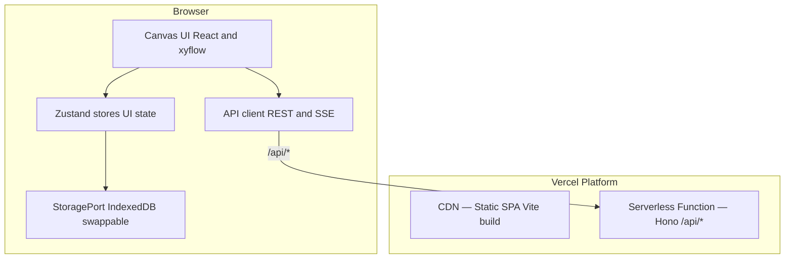
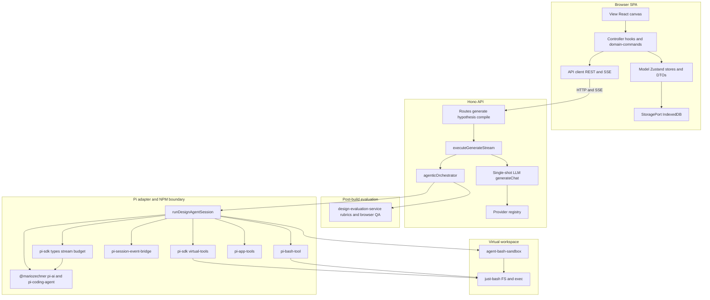
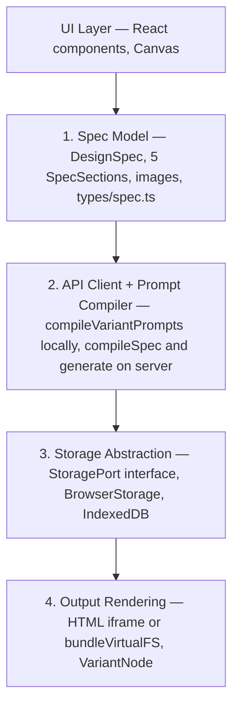
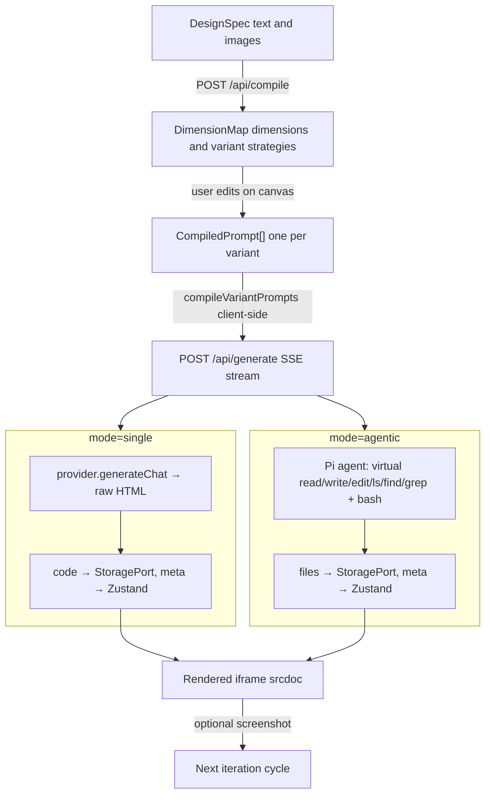

# Architecture

For a **readable end-to-end walkthrough** (canvas roles, prompts, PI agent, evaluation), see [SYSTEM_OVERVIEW.md](SYSTEM_OVERVIEW.md). This file stays the **technical** reference: layouts, routes, modules, and data flow.

## Client-Server Overview

**Client** — React SPA with Zustand stores, `@xyflow/react` canvas, IndexedDB for generated code. Makes REST and SSE calls to `/api/*`.

**Server** — Hono app deployed as a Vercel serverless function. Handles all LLM orchestration: compilation, generation (single-shot and agentic), model listing, design system extraction. Holds API keys server-side.

**Local dev** — Two processes: Vite (SPA + HMR on 5173) and Hono (API on 3001 via `tsx watch`). Vite proxy forwards `/api/*` to Hono.

## Layered architecture (diagram)

The SPA is not classic MVC, but it helps to map roles: **View** (React / `@xyflow`), **Model** (Zustand stores, workspace DTOs, IndexedDB via `StoragePort`), **Controller** (hooks, `domain-commands`, `src/api/client.ts`). The server keeps routes thin and pushes orchestration into `generate-execution`, providers, and the agentic pipeline.

- **`agentic-orchestrator`** calls **`runDesignAgentSession`** only — it does not import `@mariozechner/*` directly. To replace Pi, rework **`server/services/pi-sdk/`**, **`pi-agent-service.ts`**, and the event bridge; keep the orchestrator’s build/eval/revision contract stable.
- **`createAgentSession`** uses **`tools: []`** so default Pi tools never touch the host filesystem; **`virtual-tools`** maps native Pi file tool schemas to **`just-bash`**, and **`pi-bash-tool`** runs shell commands in the same instance.
- **`pi-session-event-bridge`** turns Pi session callbacks into **`AgentRunEvent`**, which **`executeGenerateStream`** serializes to SSE for the client.
- **`agent-bash-sandbox`** seeds skills and design files, then **`extractDesignFiles`** collects artifacts after the run; evaluation runs in **`design-evaluation-service`** (parallel workers), not inside Pi tool definitions.

## Four Abstraction Layers

## Domain model, canvas projection, and session DTOs

**Canonical client model** — `src/stores/workspace-domain-store.ts` (persisted) holds workflow semantics without requiring a graph: incubator input wiring (section / variant / critique node ids), model assignments per incubator and per hypothesis, design-system attachments, hypothesis ↔ incubator ↔ variant-strategy links, variant slots (active result / pins), and mirrors for model/design-system/critique payloads synced from the canvas. `src/types/workspace-domain.ts` defines the shapes.

**Canvas as projection** — `src/stores/canvas-store.ts` still persists React Flow–backed **nodes and edges** for layout and interaction. Graph edits call `src/workspace/domain-commands.ts` so domain relations stay the source of truth for compile/generate. `src/workspace/domain-to-graph.ts` holds small view helpers derived from domain state.

**Node removal** — Prefer `canvas-store.removeNode` for deletes so domain cleanup (`syncDomainForRemovedNode`), compiler variant pruning, and cascade removal of attached variant nodes stay consistent. Orchestrator paths that filter nodes out of Zustand directly must still call `syncDomainForRemovedNode` for each removed id (see `useCanvasOrchestrator`).

**Compile inputs** — `buildCompileInputs()` in `src/lib/canvas-graph.ts` accepts optional `DomainIncubatorWiring`; when present, structural inputs come from the domain list instead of only incoming edges to the compiler node.

**Graph queries** (`src/workspace/graph-queries.ts`) remain pure helpers over `WorkspaceNode[]` + `WorkspaceEdge[]` for legacy paths and visualization (e.g. lineage).

**Session DTOs** (`src/workspace/workspace-session.ts`) — contexts such as `HypothesisGenerationContext` prefer domain-backed model credentials and design-system text when a hypothesis exists in the domain store, with graph snapshot fallback.

**Provenance** for `/api/generate` lives in `src/types/provenance-context.ts`.

The **server** LLM engine stays UI-agnostic; client-only modules under `src/workspace/` are excluded from `tsconfig.server.json` so Vite-only imports do not typecheck as Node.

## Data Flow

## API Surface

| Endpoint | Method | Purpose | Response |
|---|---|---|---|
| `/api/compile` | POST | Compile spec into dimension map | JSON: `DimensionMap` |
| `/api/generate` | POST | Generate one variant (single-shot or agentic) | SSE stream |
| `/api/hypothesis/prompt-bundle` | POST | Build compiled prompts + eval/provenance from workspace slice (authoritative variant template) | JSON |
| `/api/hypothesis/generate` | POST | Run all models for one hypothesis; multiplexed SSE (`laneIndex` on events, `lane_done` per lane) | SSE stream |
| `/api/models/:provider` | GET | List available models | JSON: `ProviderModel[]` |
| `/api/models` | GET | List available providers | JSON: `ProviderInfo[]` |
| `/api/logs` | GET | Fetch LLM call log entries (dev-only) | JSON: `LlmLogEntry[]` |
| `/api/logs` | DELETE | Clear log entries (dev-only) | 204 |
| `/api/design-system/extract` | POST | Extract design tokens from screenshots | JSON: extracted tokens |
| `/api/prompts/*` | GET | Versioned prompt bodies (e.g. variant template) from DB | JSON |
| `/api/skills/*` | GET | Versioned skill definitions from DB | JSON |
| `/api/health` | GET | Health check | JSON: `{ ok: true }` |

**`/api/generate` request fields:** `prompt`, `providerId`, `modelId`, `promptOverrides` (`genSystemHtml`, `genSystemHtmlAgentic`, `variant`), `supportsVision`, `mode` (`single` | `agentic`), `thinkingLevel` (`off` | `minimal` | `low` | `medium` | `high`).

**SSE events:** `progress` (status label), `activity` (streaming agent text), `code` (final HTML in single-shot), `file` (path + content in agentic), `plan` (declared file list in agentic), `error`, `done`.

**Hypothesis flow:** The canvas still owns graph/domain state (Zustand + React Flow), but **prompt assembly and multi-model orchestration** for a hypothesis go through `/api/hypothesis/*`. Pure workspace helpers live in `src/workspace/hypothesis-generation-pure.ts` (importable by the server). `/api/hypothesis/generate` adds `laneIndex` to each event payload and emits `lane_done` per model lane before a final `done`; the client demuxes into one `GenerationResult` per lane.

All POST endpoints validate request bodies with Zod `safeParse` — malformed requests return a structured `400` before any LLM call is made.

### Validation stacks (Zod vs TypeBox)

- **Zod** — HTTP request and response shapes, shared client/server DTOs, and guarded deserialization from persistence (for example skill `filesJson` in `server/db/skills.ts`).
- **TypeBox** — Pi SDK `ToolDefinition` parameters in [`server/services/pi-sdk/virtual-tools.ts`](server/services/pi-sdk/virtual-tools.ts) (mapped native tools), [`server/services/pi-bash-tool.ts`](server/services/pi-bash-tool.ts), and [`server/services/pi-app-tools.ts`](server/services/pi-app-tools.ts). Keep these aligned with the Pi coding-agent tool surface; do not migrate to Zod unless the Pi stack documents equivalent support.

## Server Architecture (`server/`)

| File | Responsibility |
|------|---------------|
| `app.ts` | Hono app: mounts routes, CORS |
| `env.ts` | `process.env` config (replaces `import.meta.env`) |
| `dev.ts` | Local dev entry (Hono + `@hono/node-server` on 3001) |
| `log-store.ts` | In-memory LLM call ring (dev); finalized rows + one-shots → single `writeObservabilityLine` NDJSON via `server/lib/observability-sink.ts` |
| `trace-log-store.ts` | Run-trace ring (dedupe by `event.id`); client POST `/api/logs/trace`; same NDJSON sink |
| `routes/compile.ts` | POST /api/compile |
| `routes/generate.ts` | POST /api/generate — delegates to `services/generate-execution.ts` |
| `routes/hypothesis.ts` | POST `/api/hypothesis/prompt-bundle`, `/api/hypothesis/generate` |
| `services/generate-execution.ts` | Shared single-lane generate stream (optional `laneIndex` + `lane_done` for multiplex) |
| `lib/generate-stream-schema.ts` | Zod schema shared by generate + hypothesis routes |
| `routes/models.ts` | GET /api/models/:provider |
| `routes/logs.ts` | GET `/api/logs` → `{ llm, trace }`; POST `/api/logs/trace` (Zod); DELETE clears both rings (file append-only) |
| `routes/design-system.ts` | POST /api/design-system/extract |
| `routes/prompts.ts` | GET `/api/prompts/:key` — latest prompt body from Langfuse (label from `LANGFUSE_PROMPT_LABEL`) |
| `routes/skills.ts` | GET `/api/skills`, `/api/skills/:key` — latest skill versions (metadata + body + optional `filesJson`) |
| `db/` | Prisma client singleton (`DATABASE_URL`, SQLite in dev) |
| `services/pi-sdk/` | **Only** place that imports `@mariozechner/pi-ai` / `@mariozechner/pi-coding-agent`; types, `createAgentSession`, `streamSimple`, stream budget, **`virtual-tools.ts`** (Pi tool definitions → `just-bash` FS / `grep` via `bash.exec`). |
| `services/pi-agent-service.ts` | Pi session adapter — `tools: []`, `customTools` = virtual file tools + bash + app tools; `session.prompt`; LLM log wrapping; merges app + SDK system prompts; SSE via `pi-session-event-bridge.ts`. |
| `services/agent-bash-sandbox.ts` | `just-bash` instance: seed design files + skills, extract artifacts after the run. |
| `services/pi-bash-tool.ts` | Pi `bash` tool → `bash.exec`, snapshot diff → SSE file events for design paths. |
| `services/pi-app-tools.ts` | Pi tools: `todo_write`, `validate_js`, `validate_html`. |
| `services/pi-session-event-bridge.ts` | Maps `AgentSession` subscribe events → app `AgentRunEvent` stream. |
| `services/agentic-orchestrator.ts` | Agentic evaluation / tool orchestration helpers |
| `services/design-evaluation-service.ts` | Design evaluation payload handling |
| `services/browser-qa-evaluator.ts` | Deterministic browser QA preflight (HTML + VM) |
| `services/browser-playwright-evaluator.ts` | Playwright headless render + DOM/console checks |
| `db/skills.ts` | List skill versions, build virtual skill file maps (`filesJson` or `body`) |
| `lib/skills/*` | Skill catalog XML (`format-for-prompt`), selection (`select-skills`) |
| `services/compiler.ts` | LLM compilation — Zod-validates request/response boundaries |
| `services/providers/openrouter.ts` | OpenRouter provider (direct API, auth header) |
| `services/providers/lmstudio.ts` | LM Studio provider (direct URL) |
| `services/providers/registry.ts` | Provider registration and lookup |
| `lib/provider-helpers.ts` | Re-exports from `src/lib/provider-fetch.ts` + server-specific `buildChatRequestFromMessages` |
| `lib/prompts/*` | Re-exports from `src/lib/prompts/` — no server-side duplication |
| `lib/extract-code.ts` | Re-exports `src/lib/extract-code.ts` |
| `lib/error-utils.ts` | Error normalization (`normalizeError`) |
| `lib/utils.ts` | ID generation, interpolation |

## Generation Engine

### Single-Shot

`server/routes/generate.ts` (when `mode === 'single'`):
1. Validates the request with Zod
2. Resolves the `genSystemHtml` system prompt (default or client-provided override)
3. Calls `provider.generateChat([system, user], options)`
4. Extracts the HTML code block via `extractCode()`
5. Streams three SSE events: `progress` (start), `code` (HTML), `done`

### Agentic

`server/routes/generate.ts` (when `mode === 'agentic'`) loads **versioned skills** from Prisma (`listLatestSkillVersions`), selects them with `selectSkillsForContext` using `evaluationContext.outputFormat` and `Skill.nodeTypes`, hydrates virtual paths under `skills/{key}/…` (`buildVirtualSkillFiles`), appends an Agent Skills–style `<available_skills>` catalog via `formatSkillsForPrompt`, then calls `server/services/agentic-orchestrator.ts` → `runAgenticWithEvaluation`.

**Orchestrator (`runAgenticWithEvaluation`):**
1. **Build:** `runDesignAgentSession` in `pi-agent-service.ts` — virtual FS is seeded with `virtualSkillFiles` (read-only; stripped from returned design `files`), then the agent writes design artifacts.
2. **Evaluate:** `runEvaluationWorkers` in `design-evaluation-service.ts` runs design / strategy / implementation LLM rubrics plus **browser** checks:
   - **Preflight:** `browser-qa-evaluator.ts` — HTML/VM heuristics (fast).
   - **Grounded:** `browser-playwright-evaluator.ts` — headless Chromium via Playwright (`setContent` on bundled HTML), console/page errors, visible text, layout box, broken images. Disabled when `VITEST=true` or `BROWSER_PLAYWRIGHT_EVAL=0`.
3. **Revision loop:** Until `isEvalSatisfied` (primary: `!shouldRevise` after `enforceRevisionGate`; optional: `agenticMinOverallScore` + zero hard fails) or **`maxRevisionRounds`** is reached, or abort. Each revision re-seeds prior design files merged with skill files.
4. **Checkpoint:** `AgenticCheckpoint` includes `stopReason` (`satisfied` | `max_revisions` | `aborted` | `revision_failed`) and `revisionAttempts`.

**Env defaults** (`server/env.ts`): `AGENTIC_MAX_REVISION_ROUNDS` (default `5`, clamped 0–20), optional `AGENTIC_MIN_OVERALL_SCORE`. Request body may pass `agenticMaxRevisionRounds` / `agenticMinOverallScore`. For Playwright in production: install browsers once (`pnpm exec playwright install chromium`).

`server/services/pi-sdk/` is the **NPM import boundary** for Pi packages (and the right place to replace Pi with another agent later). Other server code uses `./pi-sdk` or `../services/pi-sdk` for types/session helpers only — not deep Pi imports. Session orchestration stays in `pi-agent-service.ts`; app-specific Pi tools in `pi-*-tool(s).ts`; virtual FS mapping in `pi-sdk/virtual-tools.ts`; sandbox in `agent-bash-sandbox.ts`.

### Generation Cancellation

SSE is unidirectional. The client holds an `AbortController` and calls `abort()` on unmount or user cancellation. Single-shot: the server checks `c.req.raw.signal.aborted`. Agentic: the abort signal is forwarded to `agent.abort()` via the `params.signal` event listener.

## Canvas Architecture

The primary interface is a node-graph canvas built on `@xyflow/react` v12.

### Node Types

11 node types in 3 categories: 5 input nodes rendered by shared `SectionNode.tsx`, plus `ModelNode`, `DesignSystemNode`, `CompilerNode`, `HypothesisNode`, `VariantNode`, and `CritiqueNode`. `ModelNode` centralizes provider/model selection. Design System is self-contained (data in `node.data`, not spec store). Each node uses a typed data interface from `types/canvas-data.ts`.

### HypothesisNode — Generation Controls

`HypothesisNode` stores `agentMode` (`single` | `agentic`) and `thinkingLevel` in canvas node data. The **Direct** / **Agentic** mode control and **Thinking** segmented control are inline on the node. At generation time, `useHypothesisGeneration` reads these from canvas state and passes them to `useGenerate()`.

### Variant Node — Multi-File Display

When a result has files (agentic output), `VariantNode` shows:
- **Generating state:** file explorer sidebar (planned + written files with status dots) + activity log + progress bar
- **Complete state:** Preview/Code tab bar. Preview bundles all files via `bundleVirtualFS()`. Code tab shows the file explorer + raw file content.
- **Download:** produces a `.zip` via `fflate`.

### Auto-Connection Logic (`canvas-connections.ts`)

Centralized rules for what connects to what when nodes are added or generated:

- **`buildAutoConnectEdges`** — Structural connections only: section→compiler, design system→hypothesis.
- **`buildModelEdgeForNode`** — When a node is added from the palette, connects it to the first available Model node on the canvas.
- **`buildModelEdgesFromParent`** — When hypotheses are generated from an Incubator, they inherit that Incubator's connected Model — not every Model on the canvas.

Model connections are column-scoped: a Model node connects only to adjacent-column nodes.

### Lineage & compile topology (`canvas-graph.ts`)

`computeLineage` performs a full connected-component walk (bidirectional BFS). Selecting a node highlights every node reachable through any chain of edges — including sibling inputs to shared targets. Unconnected nodes dim to 40%.

`buildCompileInputs` builds the partial spec, reference designs, and critiques for `/api/compile`; it can use **domain incubator wiring** when provided so compile does not depend solely on edge topology.

### Version Stacking

Results accumulate across generation runs. Each result has a `runId` (UUID) and `runNumber` (sequential per hypothesis). Variant nodes reuse the same canvas node across runs, with version navigation.

### Parallel Generation

Multiple hypotheses generate simultaneously via `Promise.all`. Within a single hypothesis, multiple connected Models also generate in parallel. The global `isGenerating` flag only clears when all in-flight results reach a terminal status, preventing premature UI resets. Note: LM Studio runs sequentially — sending concurrent requests returns HTTP 500.

## Client Module Boundaries

### Types (`src/types/`)

| File | Key types |
|------|-----------|
| `spec.ts` | `DesignSpec`, `SpecSection`, `ReferenceImage` (Zod schemas) |
| `compiler.ts` | `DimensionMap`, `VariantStrategy`, `CompiledPrompt` |
| `provider.ts` | `GenerationProvider`, `GenerationResult`, `ChatMessage`, `ProviderOptions`, `ChatResponse`, `ContentPart`, `ProviderModel` |
| `canvas-data.ts` | Per-node typed data interfaces |

### API Client (`src/api/`)

| File | Purpose |
|------|---------|
| `client.ts` | REST + SSE fetch wrappers. `GenerateStreamCallbacks` includes `onFile(path, content)` and `onPlan(files)` for agentic events. |
| `types.ts` | Request/response interfaces. `GenerateRequest` includes `mode` and `thinkingLevel`. `GenerateSSEEvent` includes `file` and `plan` variants. |

### Storage (`src/storage/`)

| File | Purpose |
|------|---------|
| `types.ts` | `StoragePort` interface — `saveFiles`, `loadFiles`, `deleteFiles`, `clearAllFiles`, GC returns `filesRemoved` |
| `browser-storage.ts` | `BrowserStorage` — wraps `idb-storage.ts` for IndexedDB (code, provenance, and files stores) |
| `index.ts` | Default storage export |

### Stores (`src/stores/`)

| Store | Persistence | What it owns |
|-------|-------------|--------------|
| `spec-store` | localStorage | Active `DesignSpec`, section/image CRUD |
| `compiler-store` | localStorage | `DimensionMap` per **incubator id** (same id as the Incubator canvas node today), `CompiledPrompt[]`, variant editing |
| `generation-store` | localStorage + StoragePort | `GenerationResult[]` metadata in localStorage, code in IndexedDB (`code` store), multi-file in IndexedDB (`files` store). `liveCode`, `liveFiles`, `liveFilesPlan` are in-memory only, stripped by `partialize`. |
| `workspace-domain-store` | localStorage | Domain-first relations and payloads (hypotheses, incubator wiring, model assignments, variant slots, mirrored node content). Prefer this for workflow semantics. |
| `canvas-store` | localStorage | React Flow nodes/edges, viewport, auto-layout, transient UI (lineage, edge status, `variantNodeIdMap`). Kept in sync with domain on connect/disconnect and compile/generate lifecycle. |
| `prompt-store` | localStorage | Prompt template overrides (sent as per-request overrides to server). Includes `genSystemHtmlAgentic`. |
| `theme-store` | — | Theme mode (always `dark`; static store) |

### Hooks (`src/hooks/`)

| File | Purpose |
|------|---------|
| `useGenerate.ts` | Generation orchestration — calls `apiClient.generate()` SSE stream, saves code or files to StoragePort. Forwards `mode`, `thinkingLevel`, and `genSystemHtmlAgentic` override. RAF-batches activity log updates to avoid >50 renders/sec. |
| `useHypothesisGeneration.ts` | Reads `agentMode` and `thinkingLevel` from canvas node data at generation time; passes to `useGenerate()` |
| `useResultCode.ts` | Loads generated code from StoragePort (single-file results) |
| `useResultFiles.ts` | Loads multi-file result from StoragePort (agentic results) |
| `useProviderModels.ts` | React Query hook — calls `apiClient.listModels()` |
| `useConnectedModel.ts` | Resolves provider/model: prefers domain (`incubatorModelNodeIds` / hypothesis `modelNodeIds`), then first upstream model edge |
| `useNodeRemoval.ts` | Shared node + associated-edges removal logic |

### Constants (`src/constants/`)

Single source of truth for string literals shared across the codebase. Eliminates magic strings and enables type-safe comparisons.

| File | What it exports |
|------|----------------|
| `canvas.ts` | `NODE_TYPES`, `EDGE_TYPES`, `EDGE_STATUS`, `NODE_STATUS`, `buildEdgeId` |
| `generation.ts` | `GENERATION_STATUS` |

### Shared Lib Utilities (`src/lib/`)

| File | Purpose |
|------|---------|
| `iframe-utils.ts` | `bundleVirtualFS(files)` — inlines `<link>` and `<script>` references for multi-file preview; `prepareIframeContent(code)` — single-file pass-through; `renderErrorHtml(msg)` |
| `zip-utils.ts` | `downloadFilesAsZip(files, filename)` — bundles virtual FS into a `.zip` via `fflate` and triggers browser download |
| `node-status.ts` | `filledOrEmpty`, `processingOrFilled`, `variantStatus` — pure helpers for node visual state |
| `provider-fetch.ts` | Environment-agnostic fetch utilities shared by client and server (`fetchChatCompletion`, `fetchModelList`, `parseChatResponse`, `extractMessageText`) |
| `canvas-connections.ts` | Connection validation rules and auto-connect edge builders |
| `canvas-graph.ts` | Lineage BFS (`computeLineage`); `buildCompileInputs` for compile (optional domain wiring) |
| `canvas-layout.ts` | Sugiyama-style layout (`computeLayout`) |
| `extract-code.ts` | LLM response code-block extraction |
| `error-utils.ts` | `normalizeError` — consistent error normalization |
| `constants.ts` | UI timing constants (`FIT_VIEW_DURATION_MS`, `AUTO_LAYOUT_DEBOUNCE_MS`, etc.) |

## Key Design Decisions

**Why a Hono server on Vercel.** All LLM orchestration runs server-side. API keys never reach the browser. LLM calls and SSE streaming run in a serverless function. Vercel supports 300s timeout (Hobby) or 800s (Pro) for streaming functions — sufficient for both single-shot and agentic generation.

**Why prompts are sent per-request.** The prompt store lives in the browser (localStorage). The server is stateless — it carries defaults and applies client-provided overrides. No shared state between server and client beyond the request payload.

**Why `src/lib/prompts/shared-defaults.ts`.** Prompt text is the same on client and server. A single shared module is the one source of truth. Both `src/lib/prompts/defaults.ts` (client) and `server/lib/prompts/defaults.ts` (server) import from it. `tsconfig.server.json` explicitly includes the file.

**Why `pi-sdk/` exists.** `@mariozechner/pi-coding-agent` / `pi-ai` can ship breaking changes. All direct imports live in [`server/services/pi-sdk/types.ts`](server/services/pi-sdk/types.ts) (and `stream-budget.ts` for Pi context heuristics). Upgrades start there; app code imports only from `pi-sdk/` + orchestration modules.

**Why SDK-managed compaction.** The Pi session uses **token-aware compaction** built into the coding-agent stack instead of a bespoke message-window strategy. App prompts still carry full hypothesis/spec context on each orchestrator call.

**Why `src/lib/provider-fetch.ts`.** LLM fetch logic is identical on client and server, but `import.meta.env` (client) and `process.env` (server) are incompatible. The shared module contains only environment-agnostic functions. Client and server each have their own `buildChatRequestFromMessages` that reads the correct env API, then re-export everything else from the shared module.

**Why `src/constants/`.** String literals for node types, edge types, and generation statuses appear across stores, hooks, components, and edge/node definitions. A dedicated constants layer eliminates magic strings and ensures TypeScript narrows to exact union types at every call site.

**Why SSE for generation.** Each variant is a separate SSE stream. Single-shot events: `progress`, `code`, `done`. Agentic events additionally include `activity`, `plan`, and `file`. The client manages sequencing across variants.

**Why `bundleVirtualFS` on the client.** The agentic agent produces separate files (index.html, styles.css, app.js). The sandboxed iframe environment has no file system — it renders a single HTML string. `bundleVirtualFS` inlines CSS and JS at display time, keeping the stored files pristine and separately downloadable.

**Why StoragePort.** Generated code currently lives in IndexedDB (browser-local). The `StoragePort` abstraction allows swapping to a server-backed database later without changing any consuming code. The files store (agentic output) is added alongside the existing code and provenance stores.

**Why LM Studio is local-dev only.** Vercel serverless functions can't reach `localhost:1234`. In production, only cloud providers (OpenRouter) work.

**Why two TypeScript configs.** `tsconfig.app.json` targets the browser (DOM lib, JSX, Vite types). `tsconfig.server.json` targets Node.js (no DOM). Prevents browser globals from leaking into server code.

**Why sandboxed iframes with srcdoc.** Generated code is untrusted. `sandbox="allow-scripts"` enables JS but blocks navigation, forms, and parent DOM access.

## Adding a New Provider

1. Create `server/services/providers/yourprovider.ts`
2. Implement the `GenerationProvider` interface from `src/types/provider.ts`
3. Register it in `server/services/providers/registry.ts`
4. Add the provider config to `getProviderConfig()` in `server/services/compiler.ts`

## Deployment

**Vercel:**
- `vercel.json` configures static output from `dist/` and API routes via `api/[[...route]].ts`
- Set `OPENROUTER_API_KEY` as a Vercel environment variable
- `pnpm build` produces the SPA; Vercel bundles the serverless function automatically

**Local dev:**
- `pnpm dev` — Vite dev server (port 5173)
- `pnpm dev:server` — Hono API server (port 3001)
- Vite proxy forwards `/api/*` to Hono
