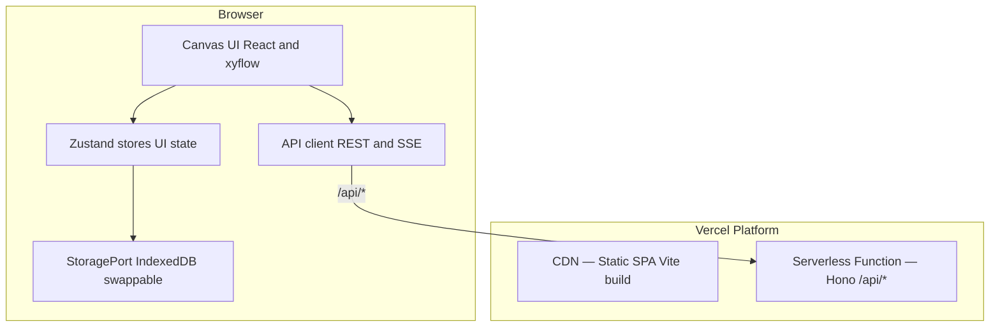
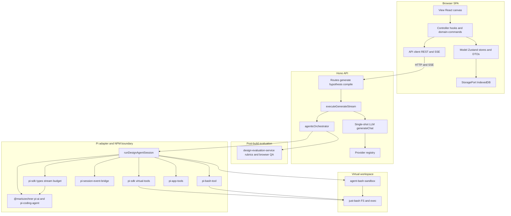
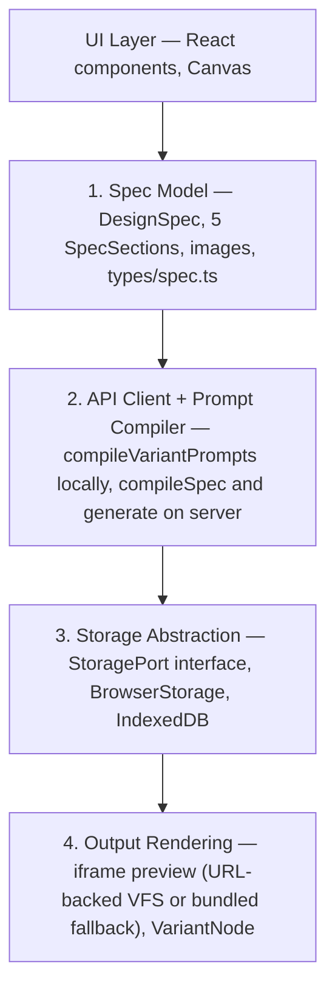
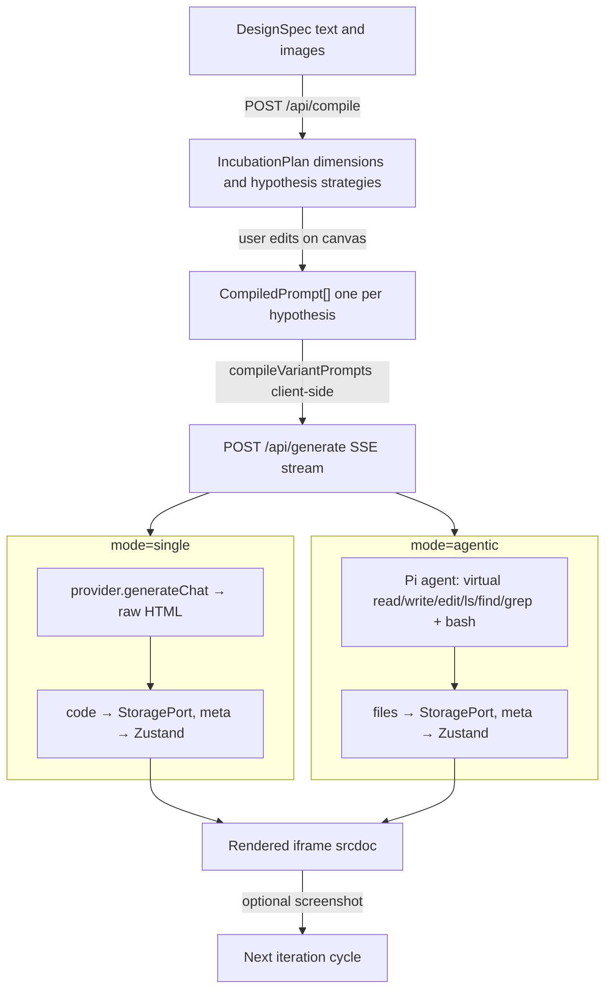

# Architecture

For a **readable end-to-end walkthrough** (canvas roles, prompts, PI agent, evaluation), see [SYSTEM_OVERVIEW.md](SYSTEM_OVERVIEW.md). This file stays the **technical** reference: layouts, routes, modules, and data flow.

## Client-Server Overview

**Client** — React SPA with Zustand stores, `@xyflow/react` canvas, IndexedDB for generated code. Makes REST and SSE calls to `/api/*`.

**Server** — Hono app deployed as a Vercel serverless function. Handles all LLM orchestration: compilation, generation (single-shot and agentic), model listing, design system extraction. Holds API keys server-side.

**Local dev** — Two processes: Vite (SPA + HMR on 5173) and Hono (API on 3001 via `tsx watch`). Vite proxy forwards `/api/*` to Hono.

## Design system (frontend)

UI color and typography tokens: **[DESIGN_SYSTEM.md](DESIGN_SYSTEM.md)** (Zinc neutrals, accent vs status, complementary info vs orange, file-role aliases). Implemented in `src/index.css` (`@theme`).

## Layered architecture (diagram)

The SPA is not classic MVC, but it helps to map roles: **View** (React / `@xyflow`), **Model** (Zustand stores, workspace DTOs, IndexedDB via `StoragePort`), **Controller** (hooks, `domain-commands`, `src/api/client.ts`). The server keeps routes thin and pushes orchestration into `generate-execution`, providers, and the agentic pipeline.

- **`agentic-orchestrator`** calls **`runDesignAgentSession`** only — it does not import `@mariozechner/*` directly. To replace Pi, rework **`server/services/pi-sdk/`**, **`pi-agent-service.ts`**, and the event bridge; keep the orchestrator’s build/eval/revision contract stable.
- **`createAgentSession`** uses **`tools: []`** so default Pi tools never touch the host filesystem; **`virtual-tools`** maps native Pi file tool schemas to **`just-bash`**, and **`pi-bash-tool`** runs shell commands in the same instance. **`cwd`** is the sandbox project root; **`createSandboxResourceLoader()`** is a no-op loader so Pi does not merge host-repo AGENTS/system prompts — sandbox **`AGENTS.md`** (if any) comes only from Langfuse **`agents-md-file`** via **`buildAgenticSystemContext`** → orchestrator seed merge.
- **`pi-session-event-bridge`** turns Pi session callbacks into **`AgentRunEvent`**, which **`executeGenerateStream`** serializes to SSE for the client.
- **`agent-bash-sandbox`** seeds design files (and optional **`AGENTS.md`** from Langfuse), then **`extractDesignFiles`** collects artifacts after the run; evaluation runs in **`design-evaluation-service`** (parallel workers), not inside Pi tool definitions. Repo-root **`skills/`** packages (see **`server/lib/skill-discovery.ts`**) are walked at each Pi session boundary; every non-**`manual`** skill is **pre-seeded** under **`skills/<key>/…`** and listed in **`<available_skills>`** inside the Pi **`use_skill`** tool description (progressive disclosure). Successful **`use_skill`** calls emit **`skill_activated`** (SSE + trace). **`skills_loaded`** (+ trace) advertises the catalog summary for the UI.

## Four Abstraction Layers

## Domain model, canvas projection, and session DTOs

**Canonical client model** — `src/stores/workspace-domain-store.ts` (persisted) holds workflow semantics without requiring a graph: incubator input wiring (section / preview node ids), model assignments per incubator and per hypothesis, design-system attachments, hypothesis ↔ incubator ↔ hypothesis-strategy links, preview slots (active result / pins), and mirrors for model/design-system payloads synced from the canvas. `src/types/workspace-domain.ts` defines the shapes.

**Canvas as projection** — `src/stores/canvas-store.ts` still persists React Flow–backed **nodes and edges** for layout and interaction. Graph edits call `src/workspace/domain-commands.ts` so domain relations stay the source of truth for compile/generate. Pure graph helpers live in `src/workspace/graph-queries.ts`.

**Node removal** — Prefer `canvas-store.removeNode` for deletes so domain cleanup (`syncDomainForRemovedNode`), compiler strategy pruning, and cascade removal of attached preview nodes stay consistent. Orchestrator paths that filter nodes out of Zustand directly must still call `syncDomainForRemovedNode` for each removed id (see `useCanvasOrchestrator`).

**Compile inputs** — `buildCompileInputs()` in `src/lib/canvas-graph.ts` accepts optional `DomainIncubatorWiring`; when present, structural inputs come from the domain list instead of only incoming edges to the compiler node.

**Graph queries** (`src/workspace/graph-queries.ts`) remain pure helpers over `WorkspaceNode[]` + `WorkspaceEdge[]` for legacy paths and visualization (e.g. lineage).

**Session DTOs** (`src/workspace/workspace-session.ts`) — contexts such as `HypothesisGenerationContext` prefer domain-backed model credentials and design-system text when a hypothesis exists in the domain store, with graph snapshot fallback.

**Provenance** for `/api/generate` lives in `src/types/provenance-context.ts`.

The **server** LLM engine stays UI-agnostic; client-only modules under `src/workspace/` are excluded from `tsconfig.server.json` so Vite-only imports do not typecheck as Node.

## Data Flow

## API Surface

| Endpoint | Method | Purpose | Response |
|---|---|---|---|
| `/api/config` | GET | App flags (`lockdown` + pinned models when locked) and **agentic evaluator defaults** (`agenticMaxRevisionRounds`, `agenticMinOverallScore` from env) for Settings → Evaluator seeding | JSON |
| `/api/compile` | POST | Compile spec into incubation plan; optional body **`promptOverrides`** (known prompt keys only, sanitized server-side) | JSON: `IncubationPlan` |
| `/api/generate` | POST | Generate one design (single-shot or agentic) | SSE stream |
| `/api/hypothesis/prompt-bundle` | POST | Build compiled prompts + eval/provenance from workspace slice; optional **`promptOverrides`** | JSON |
| `/api/hypothesis/generate` | POST | Run all models for one hypothesis; multiplexed SSE (`laneIndex` on events, `lane_done` per lane); optional **`promptOverrides`** threaded into stream + agentic eval | SSE stream |
| `/api/models/:provider` | GET | List available models | JSON: `ProviderModel[]` |
| `/api/models` | GET | List available providers | JSON: `ProviderInfo[]` |
| `/api/logs` | GET | Fetch LLM call log entries (dev-only) | JSON: `LlmLogEntry[]` |
| `/api/logs` | DELETE | Clear log entries (dev-only) | 204 |
| `/api/design-system/extract` | POST | Extract design tokens from screenshots; optional **`promptOverrides`** | JSON: extracted tokens |
| `/api/prompts/*` | GET (list + per-key + history + versions) | Read-only for **Prompt Studio** baseline / diff; **`PUT`** and **`revert-baseline`** exist for CLI/admin (not used by the in-app editor) | JSON |
| `/api/health` | GET | Health check | JSON: `{ ok: true }` |
| `/api/preview/sessions` | POST | Register ephemeral virtual file tree for iframe preview; returns `{ id, entry }` | JSON |
| `/api/preview/sessions/:id` | GET | Redirect to default HTML entry for that session | 302 |
| `/api/preview/sessions/:id/*` | GET | Serve one file from the session (nested paths supported) | raw bytes + `Content-Type` |
| `/api/preview/sessions/:id` | PUT | Replace session file map (optional; client re-POST is primary) | JSON |
| `/api/preview/sessions/:id` | DELETE | Drop session from memory | JSON |

**`/api/generate` request fields:** `prompt`, `providerId`, `modelId`, `promptOverrides` (`designer-direct-system`, `designer-agentic-system`, `designer-hypothesis-inputs`), `supportsVision`, `mode` (`single` | `agentic`), `thinkingLevel` (`off` | `minimal` | `low` | `medium` | `high`).

**SSE events:** `progress` (status label), `activity` (streaming agent text), `code` (final HTML in single-shot), `file` (path + content in agentic), `plan` (declared file list in agentic), `skills_loaded` (pre-seeded non-manual skills for this Pi session; may repeat on revision rounds), `skill_activated` (successful **`use_skill`** call), `evaluation_worker_done` (one per rubric worker in an eval round; payload includes `round`, `rubric`, `report` snapshot for live UI), `error`, `done`.

**Hypothesis flow:** The canvas still owns graph/domain state (Zustand + React Flow), but **prompt assembly and multi-model orchestration** for a hypothesis go through `/api/hypothesis/*`. Pure workspace helpers live in `src/workspace/hypothesis-generation-pure.ts` (importable by the server). `/api/hypothesis/generate` adds `laneIndex` to each event payload and emits `lane_done` per model lane before a final `done`; the client demuxes into one `GenerationResult` per lane. **Local prompt experimentation:** `src/stores/prompt-overrides-store.ts` (Zustand `persist` → `STORAGE_KEYS.PROMPTS`) supplies **`getActivePromptOverrides()`** for API payloads; `server/lib/prompt-overrides.ts` sanitizes keys and **`createResolvePromptBody`** layers overrides over **`getPromptBody`** for workspace bundle, compile, design-system extract, single-shot, and agentic paths.

POST endpoints validate bodies with Zod (typically via **`parse-request`** / `safeParse`). Validation and opaque failures use **`apiJsonError`** so JSON error responses stay shape-consistent (`{ error: string }` with selective `details`) across **400** / **404** / **422** / **500** / **503** before any LLM call where applicable.

### Validation stacks (Zod vs TypeBox)

- **Zod** — HTTP request and response shapes and shared client/server DTOs.
- **TypeBox** — Pi SDK `ToolDefinition` parameters in [`server/services/pi-sdk/virtual-tools.ts`](server/services/pi-sdk/virtual-tools.ts) (mapped native tools), [`server/services/pi-bash-tool.ts`](server/services/pi-bash-tool.ts), and [`server/services/pi-app-tools.ts`](server/services/pi-app-tools.ts). Keep these aligned with the Pi coding-agent tool surface; do not migrate to Zod unless the Pi stack documents equivalent support.

## Server Architecture (`server/`)

### Import convention (server ↔ `src/`)

- **Direct `../../src/...` imports are OK** for pure types, Zod schemas, and shared **constants** with no Node/browser coupling (e.g. `src/types/*`, `src/lib/workspace-snapshot-schema.ts`, `src/constants/*`).
- Prefer **`server/lib/`** modules for server-local shared logic (`api-json-error`, `parse-request`, `provider-helpers`, `lockdown-model`, hypothesis workspace helpers, etc.) so routes stay shallow.
- **Pure shared helpers** that live only under **`src/lib/`** (`extract-code`, `error-utils`, `utils`, Zod schemas, constants) are imported from **`../../src/...`** directly — do not add one-line re-export barrels in `server/lib/`.
- Do **not** import React, Vite-only code, or browser APIs from `server/`.

| File | Responsibility |
|------|---------------|
| `app.ts` | Hono app: mounts routes, CORS |
| `env.ts` | `process.env` config (replaces `import.meta.env`) |
| `dev.ts` | Local dev entry (Hono + `@hono/node-server` on 3001) |
| `log-store.ts` | In-memory LLM call ring (dev); finalized rows + one-shots → single `writeObservabilityLine` NDJSON via `server/lib/observability-sink.ts` |
| `trace-log-store.ts` | Run-trace ring (dedupe by `event.id`); client POST `/api/logs/trace`; same NDJSON sink |
| `routes/config.ts` | GET /api/config — `env.LOCKDOWN`, lockdown model ids, `AGENTIC_MAX_REVISION_ROUNDS` / `AGENTIC_MIN_OVERALL_SCORE` |
| `routes/compile.ts` | POST /api/compile |
| `routes/generate.ts` | POST /api/generate — delegates to `services/generate-execution.ts` |
| `routes/hypothesis.ts` | POST `/api/hypothesis/prompt-bundle`, `/api/hypothesis/generate` |
| `services/generate-execution.ts` | SSE multiplex: agentic path + **`executeSingleShotGenerateStream`**; optional `laneIndex` / `lane_done` |
| `services/single-shot-generate-stream.ts` | Single-shot `generateChat` + `extractCode` + SSE `progress` / `code` / `done` |
| `lib/generate-stream-schema.ts` | Zod schema shared by generate + hypothesis routes |
| `routes/models.ts` | GET /api/models/:provider |
| `routes/logs.ts` | GET `/api/logs` → `{ llm, trace }`; POST `/api/logs/trace` (Zod); DELETE clears both rings (file append-only) |
| `routes/design-system.ts` | POST /api/design-system/extract |
| `routes/prompts.ts` | GET `/api/prompts*`; **PUT** / **revert-baseline** for Langfuse writes (CLI/admin) |
| `routes/preview.ts` | POST/GET `/api/preview/sessions*` — ephemeral virtual FS for iframe + eval |
| `lib/prompt-overrides.ts` | Sanitize **`promptOverrides`**; **`createResolvePromptBody`** for per-request layering over **`getPromptBody`** |
| `db/prompts.ts` | Langfuse (or default) prompt reads for runtime + **GET** Prompt Studio |
| `services/pi-sdk/` | **Only** place that imports `@mariozechner/pi-ai` / `@mariozechner/pi-coding-agent`; types, `createAgentSession`, `streamSimple`, stream budget, **`virtual-tools.ts`** (Pi tool definitions → `just-bash` FS / `grep` via `bash.exec`). |
| `services/pi-agent-service.ts` | Pi session adapter — `tools: []`, `customTools` = virtual file tools + bash + **use_skill** (skill catalog in tool description) + app tools; `session.prompt`; LLM log wrapping; merges app + SDK system prompts; SSE via `pi-session-event-bridge.ts`. |
| `services/agent-bash-sandbox.ts` | `just-bash` instance: seed design files, extract artifacts after the run. |
| `services/pi-bash-tool.ts` | Pi `bash` tool → `bash.exec`, snapshot diff → SSE file events for design paths. |
| `services/pi-app-tools.ts` | Pi tools: `todo_write`, `use_skill` (loads `SkillCatalogEntry` body + `skill_activated` event), `validate_js`, `validate_html`. |
| `services/pi-session-event-bridge.ts` | Maps `AgentSession` subscribe events → app `AgentRunEvent` stream. |
| `services/agentic-orchestrator.ts` | Agentic evaluation / tool orchestration helpers |
| `services/design-evaluation-service.ts` | Design evaluation payload handling |
| `services/browser-qa-evaluator.ts` | Deterministic browser QA preflight (HTML + VM) |
| `services/browser-playwright-evaluator.ts` | Playwright headless render + DOM/console checks |
| `services/compiler.ts` | LLM compilation — Zod-validates request/response boundaries |
| `services/providers/openrouter.ts` | OpenRouter provider (direct API, auth header) |
| `services/providers/lmstudio.ts` | LM Studio provider (direct URL) |
| `services/providers/registry.ts` | Provider registration and lookup |
| `lib/provider-helpers.ts` | Re-exports from `src/lib/provider-fetch.ts` + server-specific `buildChatRequestFromMessages` |
| `lib/prompts/*` | Re-exports from `src/lib/prompts/` — no server-side duplication |
| `lib/api-json-error.ts` | `apiJsonError` — consistent JSON error bodies + Hono-typed status literals |
| `lib/parse-request.ts` | Shared JSON parse + Zod validation helpers for routes |
| `lib/sse-write-gate.ts` | `createWriteGate` — serializes SSE writes (also exported from `generate-execution` for tests) |
| `lib/agentic-sse-map.ts` | Maps agentic/orchestrator events to SSE `event` + payload |
| `lib/build-agentic-system-context.ts` | Langfuse agentic system prompt + **`AGENTS.md`** seed + **`skillCatalog`** entries + skill file seeds (no catalog on system string) |
| `lib/skill-discovery.ts` | Walk **`skills/*/SKILL.md`**, filter by `when` mode, **`formatSkillsCatalogXml`** / **`buildUseSkillToolDescription`** + sandbox seed map |
| `lib/skill-schema.ts` | Zod: skill YAML frontmatter |

## Generation Engine

### Single-Shot

`server/routes/generate.ts` (when `mode === 'single'`) delegates to **`executeSingleShotGenerateStream`** in `services/single-shot-generate-stream.ts`:
1. Request already Zod-validated by the route
2. Resolves the `designer-direct-system` system prompt (default or client-provided override)
3. Calls `provider.generateChat([system, user], options)`
4. Extracts the HTML code block via `extractCode()` (`src/lib/extract-code.ts`)
5. Streams three SSE events: `progress` (start), `code` (HTML), `done`

### Agentic

`server/routes/generate.ts` (when `mode === 'agentic'`) delegates to `server/services/agentic-orchestrator.ts` → `runAgenticWithEvaluation`. Agentic system text comes from Langfuse **`designer-agentic-system`** (and optional sandbox **`AGENTS.md`** from **`agents-md-file`** via `buildAgenticSystemContext`); the skill catalog XML is attached to the **`use_skill`** Pi tool, not appended to the system prompt. All non-**`manual`** skill bodies (+ small extras) are pre-seeded under **`skills/<key>/…`** in **`just-bash`** before the run.

**Orchestrator (`runAgenticWithEvaluation`):**
1. **Build:** `runDesignAgentSession` in `pi-agent-service.ts` — virtual FS is seeded with optional **`AGENTS.md`**, all catalog **skills** (`skills/<key>/…`), and any caller `seedFiles`, then the agent writes design artifacts. Each Pi session boundary re-runs **`discoverSkills`** (revision rounds use a fresh Pi session and re-seed skills).
2. **Evaluate:** `runEvaluationWorkers` in `design-evaluation-service.ts` runs design / strategy / implementation LLM rubrics plus **browser** checks:
   - **Preflight:** `browser-qa-evaluator.ts` — HTML/VM heuristics (fast).
   - **Grounded:** `browser-playwright-evaluator.ts` — headless Chromium via Playwright (`setContent` on bundled HTML), console/page errors, visible text, layout box, broken images. Disabled when `VITEST=true` or `BROWSER_PLAYWRIGHT_EVAL=0`.
3. **Revision loop:** Until `isEvalSatisfied` (primary: `!shouldRevise` after `enforceRevisionGate`; optional: `agenticMinOverallScore` + zero hard fails) or **`maxRevisionRounds`** is reached, or abort. Each revision re-seeds prior design files merged with fresh **`AGENTS.md`** (when configured) and the full non-**`manual`** skill packages again.
4. **Checkpoint:** `AgenticCheckpoint` includes `stopReason` (`satisfied` | `max_revisions` | `aborted` | `revision_failed`) and `revisionAttempts`.

**Env defaults** (`server/env.ts`): `AGENTIC_MAX_REVISION_ROUNDS` (default `5`, clamped 0–20), optional `AGENTIC_MIN_OVERALL_SCORE`. Request body may pass `agenticMaxRevisionRounds` / `agenticMinOverallScore`. For Playwright in production: install browsers once (`pnpm exec playwright install chromium`).

`server/services/pi-sdk/` is the **NPM import boundary** for Pi packages (and the right place to replace Pi with another agent later). Other server code uses `./pi-sdk` or `../services/pi-sdk` for types/session helpers only — not deep Pi imports. Session orchestration stays in `pi-agent-service.ts`; app-specific Pi tools in `pi-*-tool(s).ts`; virtual FS mapping in `pi-sdk/virtual-tools.ts`; sandbox in `agent-bash-sandbox.ts`; **`sandbox-resource-loader.ts`** supplies the sealed-session resource loader. Agentic system context (optional **`AGENTS.md`** seed + repo **skills**) is built in `server/lib/build-agentic-system-context.ts`.

**Google Fonts (agentic / single-shot HTML):** Agent output may reference **only** `https://fonts.googleapis.com/...` (stylesheet API) and **`https://fonts.gstatic.com/...`** (font files referenced from that CSS). Allowlist logic lives in [`src/lib/google-fonts-allowlist.ts`](src/lib/google-fonts-allowlist.ts); Pi **`validate_html`** permits those URLs in `<link rel="stylesheet">`, and allowed `@import` inside `<style>` blocks; other external stylesheets and any external `<script src>` remain invalid. The preview iframe can load allowlisted URLs when the **user’s browser** has network access; the **`browser-qa-evaluator`** VM does not fetch the network, so typography there is not ground-truth for CDN fonts.

### Generation Cancellation

SSE is unidirectional. The client holds an `AbortController` and calls `abort()` on unmount or user cancellation. Single-shot: the server checks `c.req.raw.signal.aborted`. Agentic: the abort signal is forwarded to `agent.abort()` via the `params.signal` event listener.

## Canvas Architecture

The primary interface is a node-graph canvas built on `@xyflow/react` v12.

### Node Types

10 node types in 3 categories: 5 input nodes rendered by shared `SectionNode.tsx`, plus `ModelNode`, `DesignSystemNode`, `CompilerNode`, `HypothesisNode`, and `PreviewNode` (`VariantNode.tsx`). `ModelNode` centralizes provider/model selection. Design System is self-contained (data in `node.data`, not spec store). Each node uses a typed data interface from `types/canvas-data.ts`.

### HypothesisNode — Generation Controls

`HypothesisNode` stores `agentMode` (`single` | `agentic`) and `thinkingLevel` in canvas node data. The **Direct** / **Agentic** mode control and **Thinking** segmented control are inline on the node. At generation time, [`useHypothesisGeneration`](src/hooks/useHypothesisGeneration.ts) reads these from canvas state and drives the multiplexed hypothesis SSE stream (`/api/hypothesis/prompt-bundle` + `/api/hypothesis/generate` via [`src/api/client.ts`](src/api/client.ts)). Lane orchestration lives in [`hypothesis-generation-run.ts`](src/hooks/hypothesis-generation-run.ts); per-lane SSE callbacks and post-stream persistence are in [`placeholder-generation-session.ts`](src/hooks/placeholder-generation-session.ts) and [`placeholder-*`](src/hooks/placeholder-stream-handlers.ts) helpers.

### Preview Node — Multi-File Display

When a result has files (agentic output), `VariantNode` (renders the `preview` canvas node type) shows:
- **Generating state:** file explorer sidebar (planned + written files with status dots) + activity log + progress bar
- **Complete state:** Preview/Code tab bar. **Preview** registers the file map with **`/api/preview/sessions`** and loads the default entry in a sandboxed iframe via **`src`** (real relative URLs between HTML/CSS/JS). If the API is unreachable, **`bundleVirtualFS()`** inlines linked assets into **`srcDoc`** as a fallback. Code tab shows the file explorer + raw file content.
- **Download:** produces a `.zip` via `fflate`.

### Auto-Connection Logic (`canvas-connections.ts`)

Centralized rules for what connects to what when nodes are added or generated:

- **`buildAutoConnectEdges`** — Structural connections only: section→compiler, design system→hypothesis.
- **`buildModelEdgeForNode`** — When a node is added from the palette, connects it to the first available Model node on the canvas.
- **`buildModelEdgesFromParent`** — When hypotheses are generated from an Incubator, they inherit that Incubator's connected Model — not every Model on the canvas.

Model connections are column-scoped: a Model node connects only to adjacent-column nodes.

### Lineage & compile topology (`canvas-graph.ts`)

`computeLineage` performs a full connected-component walk (bidirectional BFS). Selecting a node highlights every node reachable through any chain of edges — including sibling inputs to shared targets. Unconnected nodes dim to 40%.

`buildCompileInputs` builds the partial spec and reference designs for `/api/compile`; it can use **domain incubator wiring** when provided so compile does not depend solely on edge topology.

### Version Stacking

Results accumulate across generation runs. Each result has a `runId` (UUID) and `runNumber` (sequential per hypothesis). Preview nodes reuse the same canvas node across runs, with version navigation. **`userBestOverrides`** in `generation-store` pins which complete `GenerationResult` is treated as “best” for a `strategyId` ahead of evaluator scores; see `getBestCompleteResult` / `setUserBest`. **`domain-preview-selectors.ts`** maps a preview node id → hypothesis and lists sibling preview node ids for **hypothesis-scoped** full-screen stepping.

**Agentic eval-round files:** Each `EvaluationRoundSnapshot` may carry a `files` map; the orchestrator attaches the tree that was scored that round. The client persists those blobs under IndexedDB keys `{resultId}:round:{round}` and strips `files` from persisted `evaluationRounds` / provenance to save space (`StoragePort.saveRoundFiles` / `loadRoundFiles`).

### Parallel Generation

Multiple hypotheses generate simultaneously via `Promise.all`. Within a single hypothesis, multiple connected Models also generate in parallel. The global `isGenerating` flag only clears when all in-flight results reach a terminal status, preventing premature UI resets. Note: LM Studio runs sequentially — sending concurrent requests returns HTTP 500.

## Client Module Boundaries

### Types (`src/types/`)

| File | Key types |
|------|-----------|
| `spec.ts` | `DesignSpec`, `SpecSection`, `ReferenceImage` (Zod schemas) |
| `compiler.ts` | `IncubationPlan`, `HypothesisStrategy`, `CompiledPrompt` |
| `provider.ts` | `GenerationProvider`, `GenerationResult`, `ChatMessage`, `ProviderOptions`, `ChatResponse`, `ContentPart`, `ProviderModel` |
| `canvas-data.ts` | Per-node typed data interfaces |

### API Client (`src/api/`)

| File | Purpose |
|------|---------|
| `client.ts` | REST + SSE fetch wrappers. `GenerateStreamCallbacks` includes `onFile(path, content)` and `onPlan(files)` for agentic events. |
| `types.ts` | Request/response interfaces for compile, hypothesis, and observability. `GenerateSSEEvent` includes `file` and `plan` variants. Legacy `/api/generate` wire types live on the server. |

### Storage (`src/storage/`)

| File | Purpose |
|------|---------|
| `types.ts` | `StoragePort` interface — `saveFiles`, `loadFiles`, `deleteFiles`, `clearAllFiles`, GC returns `filesRemoved` |
| `browser-storage.ts` | `BrowserStorage` — wraps `idb-storage.ts` for IndexedDB (code, provenance, and files stores) |
| `index.ts` | Default storage export |

### Stores (`src/stores/`)

| Store | Persistence | What it owns |
|-------|-------------|--------------|
| `spec-store` | localStorage | Active `DesignSpec`, section/image CRUD |
| `compiler-store` | localStorage | `IncubationPlan` per **incubator id** (same id as the Incubator canvas node today), `CompiledPrompt[]`, hypothesis editing |
| `generation-store` | localStorage + StoragePort | `GenerationResult[]` metadata in localStorage (persist v5; v4 adds `userBestOverrides`, v5 renames `variantStrategyId` → `strategyId`; `evaluationRounds[].files` stripped in `partialize`), code in IndexedDB (`code` store), multi-file in IndexedDB (`files` store), optional per-eval-round file snapshots (`{resultId}:round:{n}` in the same files DB). `liveCode`, `liveFiles`, `liveFilesPlan` are in-memory only, stripped by `partialize`. |
| `workspace-domain-store` | localStorage | Domain-first relations and payloads (hypotheses, incubator wiring, model assignments, preview slots, mirrored node content). Prefer this for workflow semantics. |
| `canvas-store` | localStorage | React Flow nodes/edges, viewport, auto-layout, transient UI (lineage, edge status, `previewNodeIdMap`). Kept in sync with domain on connect/disconnect and compile/generate lifecycle. |
| `prompt-store` | localStorage | Prompt template overrides (sent as per-request overrides to server). Includes `designer-agentic-system`. |

### Hooks (`src/hooks/`)

| File | Purpose |
|------|---------|
| `useHypothesisGeneration.ts` | Canvas **Generate** / **Run agent**: reads `agentMode`, `thinkingLevel`, and snapshot from stores; calls hypothesis prompt bundle + multiplexed SSE generate; uses `createPlaceholderGenerationSession` for callbacks, RAF-batched activity/thinking, trace forward, and IndexedDB finalize. |
| `useResultCode.ts` | Loads generated code from StoragePort (single-file results) |
| `useResultFiles.ts` | Loads multi-file result from StoragePort (agentic results) |
| `useProviderModels.ts` | React Query hook — calls `apiClient.listModels()` |
| `useConnectedModel.ts` | Resolves provider/model: prefers domain (`incubatorModelNodeIds` / hypothesis `modelNodeIds`), then first upstream model edge |
| `useNodeRemoval.ts` | Shared node + associated-edges removal logic |

### Constants (`src/constants/`)

Single source of truth for string literals shared across the codebase. Eliminates magic strings and enables type-safe comparisons.

| File | What it exports |
|------|----------------|
| `canvas.ts` | `NODE_TYPES`, `EDGE_TYPES`, `EDGE_STATUS`, `NODE_STATUS`, `buildEdgeId` |
| `generation.ts` | `GENERATION_STATUS` |

### Shared Lib Utilities (`src/lib/`)

| File | Purpose |
|------|---------|
| `iframe-utils.ts` | Re-exports `bundleVirtualFS` — optional **fallback** for multi-file `srcDoc` when preview API registration fails; `prepareIframeContent(code)` — single-file pass-through; `renderErrorHtml(msg)` |
| `preview-entry.ts` | `resolvePreviewEntryPath`, `encodeVirtualPathForUrl`, `preferredArtifactFileOrder` — shared by bundler, preview URLs, and eval |
| `zip-utils.ts` | `downloadFilesAsZip(files, filename)` — bundles virtual FS into a `.zip` via `fflate` and triggers browser download |
| `node-status.ts` | `filledOrEmpty`, `processingOrFilled`, `variantStatus` — pure helpers for node visual state |
| `provider-fetch.ts` | Environment-agnostic fetch utilities shared by client and server (`fetchChatCompletion`, `fetchModelList`, `parseChatResponse`, `extractMessageText`) |
| `canvas-connections.ts` | Connection validation rules and auto-connect edge builders |
| `canvas-graph.ts` | Lineage BFS (`computeLineage`); `buildCompileInputs` for compile (optional domain wiring) |
| `canvas-layout.ts` | Sugiyama-style layout (`computeLayout`) |
| `extract-code.ts` | LLM response code-block extraction |
| `error-utils.ts` | `normalizeError` — consistent error normalization |
| `sse-diagnostics.ts` | Dev-only `SseStreamDiagnostics` — event counters, drop tracker, `window.__SSE_DIAG` |
| `sse-reader.ts` | Shared SSE framing: `readSseEventStream` — pairs `event:`/`data:` lines across TCP chunks |
| `constants.ts` | UI timing constants (`FIT_VIEW_DURATION_MS`, `AUTO_LAYOUT_DEBOUNCE_MS`, etc.) |

## Key Design Decisions

**Why a Hono server on Vercel.** All LLM orchestration runs server-side. API keys never reach the browser. LLM calls and SSE streaming run in a serverless function. Vercel supports 300s timeout (Hobby) or 800s (Pro) for streaming functions — sufficient for both single-shot and agentic generation.

**Why prompts are sent per-request.** The prompt store lives in the browser (localStorage). The server is stateless — it carries defaults and applies client-provided overrides. No shared state between server and client beyond the request payload.

**Why `src/lib/prompts/shared-defaults.ts`.** Prompt text is the same on client and server. `src/lib/prompts/defaults.ts` defines `PromptKey`, `PROMPT_KEYS`, and `PROMPT_META`; **`tsconfig.server.json` includes that file** so the API uses the same keys as the SPA (no duplicate server copy).

**Why `pi-sdk/` exists.** `@mariozechner/pi-coding-agent` / `pi-ai` can ship breaking changes. All direct imports live in [`server/services/pi-sdk/types.ts`](server/services/pi-sdk/types.ts) (and `stream-budget.ts` for Pi context heuristics). Upgrades start there; app code imports only from `pi-sdk/` + orchestration modules.

**Why SDK-managed compaction.** The Pi session uses **token-aware compaction** built into the coding-agent stack instead of a bespoke message-window strategy. App prompts still carry full hypothesis/spec context on each orchestrator call.

**Why `src/lib/provider-fetch.ts`.** LLM fetch logic is identical on client and server, but `import.meta.env` (client) and `process.env` (server) are incompatible. The shared module contains only environment-agnostic functions. Client and server each have their own `buildChatRequestFromMessages` that reads the correct env API, then re-export everything else from the shared module.

**Why `src/constants/`.** String literals for node types, edge types, and generation statuses appear across stores, hooks, components, and edge/node definitions. A dedicated constants layer eliminates magic strings and ensures TypeScript narrows to exact union types at every call site.

**Why SSE for generation.** Each hypothesis lane is a separate SSE stream. Single-shot events: `progress`, `code`, `done`. Agentic events additionally include `activity`, `plan`, and `file`. The client manages sequencing across lanes. **Dev diagnostics:** `SseStreamDiagnostics` (client, `src/lib/sse-diagnostics.ts`) tracks event counts, drops, and timing per stream — inspect via `window.__SSE_DIAG` in the browser console. Server-side `generate-execution` logs a write-count summary at stream close. `pi-session-event-bridge` uses `safeBridgeEmit` so async failures are logged instead of silently swallowed, and unknown Pi event types print in dev.

**Why URL-backed preview.** Agentic runs produce a **virtual file tree**. The API serves it at **`/api/preview/sessions/:id/...`** so iframe **`src`** uses real relative URLs (multi-page `a href` works). Sessions are ephemeral (TTL), not durable storage.

**Why `bundleVirtualFS` still exists.** Fallback when preview registration fails, and for **evaluator** `bundled_preview_html` context. It inlines `<link>` / `<script src>` from the entry HTML determined by **`resolvePreviewEntryPath`**.

**Why StoragePort.** Generated code currently lives in IndexedDB (browser-local). The `StoragePort` abstraction allows swapping to a server-backed database later without changing any consuming code. The files store (agentic output) is added alongside the existing code and provenance stores.

**Why LM Studio is local-dev only.** Vercel serverless functions can't reach `localhost:1234`. In production, only cloud providers (OpenRouter) work.

**Why two TypeScript configs.** `tsconfig.app.json` targets the browser (DOM lib, JSX, Vite types). `tsconfig.server.json` targets Node.js (no DOM). Prevents browser globals from leaking into server code.

**Why sandboxed iframes.** Generated code is untrusted. Previews use **`allow-scripts`**; URL-backed previews also use **`allow-same-origin`** so the document can load sibling paths from the same preview origin. Tighten if the threat model changes.

## Adding a New Provider

1. Create `server/services/providers/yourprovider.ts`
2. Implement the `GenerationProvider` interface from `src/types/provider.ts`
3. Register it in `server/services/providers/registry.ts`
4. Add the provider config to `getProviderConfig()` in `server/services/compiler.ts`

## Deployment

**Vercel:**
- `vercel.json` configures static output from `dist/` and API routes via `api/[[...route]].ts`
- Set `OPENROUTER_API_KEY` as a Vercel environment variable
- `pnpm build` produces the SPA; Vercel bundles the serverless function automatically
- **Preview sessions** are in-memory on one Node instance. On multi-instance / cold-start serverless, `POST /api/preview/sessions` and follow-up `GET` may hit different workers — the UI falls back to `bundleVirtualFS` `srcDoc` when requests fail; for sticky preview in production, persist maps (e.g. Redis) or route preview entirely client-side.

**Local dev:**
- `pnpm dev` — Vite dev server (port 5173)
- `pnpm dev:server` — Hono API server (port 3001)
- Vite proxy forwards `/api/*` to Hono
