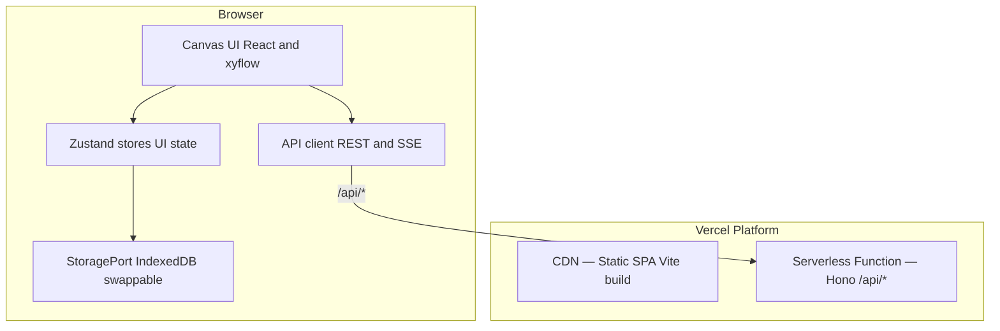
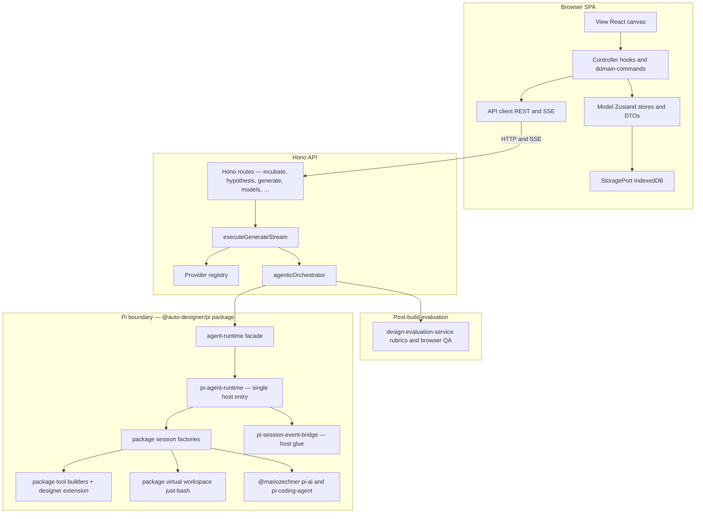
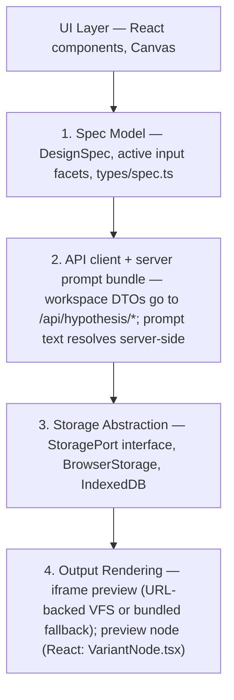
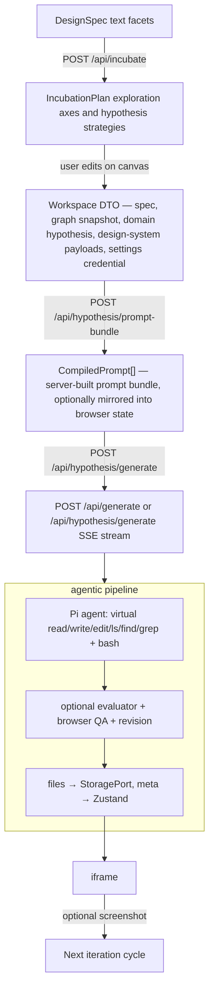

# Architecture

For a **readable end-to-end walkthrough** (canvas roles, prompts, PI agent, evaluation), see [SYSTEM_OVERVIEW.md](SYSTEM_OVERVIEW.md). This file stays the **technical** reference: layouts, routes, modules, and data flow.

## Client-Server Overview

```mermaid
flowchart TB
  subgraph vercel [Vercel Platform]
    cdn[CDN — Static SPA Vite build]
    fn[Serverless Function — Hono /api/*]
  end

  subgraph browser [Browser]
    canvas[Canvas UI React and xyflow]
    zustand[Zustand stores UI state]
    idb[StoragePort IndexedDB swappable]
    apiClient[API client REST and SSE]
    canvas --> zustand
    canvas --> apiClient
    zustand --> idb
  end

  apiClient -->|/api/*| fn
```

**Client** — React SPA with Zustand stores, `@xyflow/react` canvas, IndexedDB for generated code. Makes REST and SSE calls to `/api/`*.

**Server** — Hono app deployed as a Vercel serverless function. Handles all LLM orchestration: compilation, generation (agentic Pi pipeline + evaluation), model listing, design system extraction. Holds API keys server-side.

**Local dev** — Two processes: Vite (SPA + HMR; default **4732**, `**VITE_PORT**`) and Hono (API; default **4731**, `**PORT**`, via `tsx watch`). Defaults: **`server/dev-defaults.ts`**. Vite `**loadEnv**` + proxy forwards `/api/`* to Hono. **`pnpm dev:all`** waits on `**/api/health**` at `**127.0.0.1:${PORT:-4731}**`.

## Design system (frontend)

Canonical design-system documentation lives in [DESIGN_SYSTEM.md](DESIGN_SYSTEM.md). Architecture references the design system only where it affects system boundaries, such as the canvas Design System node and the dev-only `/dev/design-tokens` API-gate bypass.

## Layered architecture (diagram)

The SPA is not classic MVC, but it helps to map roles: **View** (React / `@xyflow`), **Model** (Zustand stores, workspace DTOs, IndexedDB via `StoragePort`), **Controller** (hooks, `domain-commands`, `src/api/client.ts`). The server keeps routes thin and pushes orchestration into `generate-execution`, providers, and the agentic pipeline. `**[ApiServerGate](src/components/shared/ApiServerGate.tsx)`** wraps routed content (inside `**BrowserRouter**`) and blocks the canvas until `**GET /api/config**` succeeds—so running **Vite alone** without the API shows a single “API server not reachable” screen instead of partial failures and proxy spam. **Dev-only bypass:** `**/dev/design-tokens`** (kitchen sink) still mounts without the API (`**shouldBypassApiServerGate**` in `**src/lib/api-server-gate-utils.ts**`).

```mermaid
flowchart TB
  subgraph client [Browser SPA]
    viewLayer[View React canvas]
    controllerLayer[Controller hooks and domain-commands]
    modelLayer[Model Zustand stores and DTOs]
    storagePort[StoragePort IndexedDB]
    apiClient[API client REST and SSE]
    viewLayer --> controllerLayer
    controllerLayer --> modelLayer
    controllerLayer --> apiClient
    modelLayer --> storagePort
  end

  subgraph server [Hono API]
    routes[Hono routes — incubate, hypothesis, generate, models, …]
    genExec[executeGenerateStream]
    providers[Provider registry]
    agentOrch[agenticOrchestrator]
    routes --> genExec
    genExec --> agentOrch
    genExec --> providers
  end

  subgraph evaluation [Post-build evaluation]
    evalSvc[design-evaluation-service rubrics and browser QA]
  end

  subgraph piAdapter [Pi boundary — @auto-designer/pi package]
    runtime[agent-runtime facade]
    piRuntime[pi-agent-runtime — single host entry]
    pkgSession[package session factories]
    pkgTools[package tool builders + designer extension]
    pkgVfs[package virtual workspace just-bash]
    piNpm["@mariozechner pi-ai and pi-coding-agent"]
    eventBridge[pi-session-event-bridge — host glue]
    runtime --> piRuntime
    piRuntime --> pkgSession
    pkgSession --> pkgTools
    pkgSession --> pkgVfs
    pkgSession --> piNpm
    piRuntime --> eventBridge
  end

  agentOrch --> evalSvc
  agentOrch --> runtime

  apiClient -->|HTTP and SSE| routes
```

### Pi design sandbox

The Pi boundary is the [`@auto-designer/pi`](packages/auto-designer-pi/) workspace package — a single `pi-package`-keyworded module that owns every `@mariozechner/pi-ai` and `@mariozechner/pi-coding-agent` import in the repo. The host calls it through one entry point (`server/services/pi-agent-runtime.ts`), then layers host-side glue (event bridge + LLM-log wrap) on top of the returned session. There is no in-place adapter shim; there is no integration flag.

The package owns:
1. **VFS + just-bash** — `packages/auto-designer-pi/src/sandbox/virtual-workspace.ts`. In-memory tree at `/home/user/project`; `bash.fs.*` and `bash.exec`. Optional runtimes (network, python, javascript) are **not** enabled — do not document `npm`, `curl`, etc. as available unless that constructor changes.
2. **Tool surface registry** — `packages/auto-designer-pi/src/internal/pi-tool-surface.ts` declares every tool the model can call as a discriminated handler (`sandboxed-pi`, `excluded-pi`, or `auto-designer-extension`). `ToolSurface.build()` produces one `ExtensionFactory` that registers every handler through `pi.registerTool` — the canonical pattern from Pi's `extensions.md` "Overriding Built-in Tools". Sandboxed-pi handlers replace Pi's stock built-ins by name (Pi resolves the override in `agent-session.js:_refreshToolRegistry`). The build performs a runtime tripwire: it reads upstream Pi's `allToolNames` Set literal at session construction time and throws `ToolSurfaceError` if any built-in lacks a disposition. **The next time someone bumps `@mariozechner/pi-coding-agent` and Pi adds a tool, the very first attempt to start a hypothesis session throws a clear, actionable error pointing at the registry — no documentation-only promise to remember.** Per-tool builders live in `packages/auto-designer-pi/src/tools/virtual-tools.ts` (`buildSandboxedReadTool`, `buildSandboxedWriteTool`, …) and `tools/bash-tool.ts` (`buildSandboxedBashTool`); they all share a `SandboxToolContext` and inject VFS-backed `*Operations` into the matching Pi factory. The auto-designer extension tools (`todo_write`, `validate_js`, `validate_html`, `validate_artifact`) live in `extension/designer-tools.ts`. The wrapped `edit` tool retries once on "could not find" via `tools/edit-match-cascade.ts`.
3. **Resource loader + session factories** — `packages/auto-designer-pi/src/resource-loader.ts` filters skills by session-type tags (`SessionScopedResourceLoader`) and exposes `applyPathRemapping` so seeded skill files can have their `filePath`/`baseDir` rewritten to VFS paths before Pi's `formatSkillsForPrompt` prints `<location>`. `packages/auto-designer-pi/src/sandbox/seed-skills.ts` reads each filtered skill's SKILL.md from disk and writes it into the VFS at `/home/user/project/.skills/<name>/SKILL.md` at session start; the model loads skill bodies through Pi's stock skill flow (read tool against the VFS path) — no `use_skill` invention. `packages/auto-designer-pi/src/host.ts` exposes `createDesignSession` / `createEvaluationSession` / `createIncubationSession` / `createInputsGenSession` / `createDesignSystemSession`. Each wires the right tag set + extension factories.
4. **Bundled prompt content** — `packages/auto-designer-pi/prompts/` and `packages/auto-designer-pi/skills/` hold the repo-owned prompt and skill bodies. Roles and runtime flow live in [RUNTIME_FLOW.md](RUNTIME_FLOW.md).

The host owns:
- **Single entry point** — `server/services/pi-agent-runtime.ts` resolves provider config from env, calls the right session factory by `params.sessionType`, runs the session, and maps `SessionRunResult` → `DesignAgentSessionResult`. Re-exported as `runDesignAgentSession` from `server/services/agent-runtime.ts` so orchestrators import the facade.
- **Event bridge** — `server/services/pi-session-event-bridge.ts` (with `pi-bridge-core.ts`, `pi-bridge-tool-streaming.ts`, `pi-bridge-compaction-agent.ts`) translates the package's session events into the host's `AgentRunEvent` SSE payloads. On `agent_end` with `stopReason: error`, an `error` SSE + trace row fires so runs never appear to succeed silently.
- **LLM logging** — `server/services/pi-llm-log.ts` wraps the package's `streamFn` to record each model turn into the dev `/api/logs` ring; `server/lib/pi-stream-budget.ts` chooses a per-turn `max_tokens` from prompt-token estimates.
- **Skill catalog for UI** — `server/lib/build-agentic-system-context.ts` reads `packages/auto-designer-pi/skills/` via `discoverSkills` to emit the `skills_loaded` SSE; the agent's actual catalog comes from Pi's resource loader inside the package.

Prompt and skill roles are cataloged in [RUNTIME_FLOW.md](RUNTIME_FLOW.md). At runtime, Pi receives the resolved system body plus Pi's stock `<available_skills>` block; route code supplies the task-specific user message; seeded SKILL.md files are loaded through the regular `read` tool. The Incubator's user message is assembled deterministically by `buildInternalContext(spec)` in [src/lib/prompts/internal-context.ts](src/lib/prompts/internal-context.ts), then wrapped by `buildIncubatorUserPrompt()` in [src/lib/prompts/incubator-user.ts](src/lib/prompts/incubator-user.ts).

### Tool inventory

Every tool the design LLM can call during an agentic Pi session. Tools marked **VFS** operate on the just-bash in-memory tree at `/home/user/project`. Tools marked **App** run outside the virtual filesystem.

| Tool            | VFS? | Source                                                      | Parameters                                                                                                                                                             | How it works                                                                                                                                                                                                                                                                                                                                                                                                                                                                                                                                                                                                                                                                                                                                                                                                                                                                                    |
| --------------- | ---- | ----------------------------------------------------------- | ---------------------------------------------------------------------------------------------------------------------------------------------------------------------- | ----------------------------------------------------------------------------------------------------------------------------------------------------------------------------------------------------------------------------------------------------------------------------------------------------------------------------------------------------------------------------------------------------------------------------------------------------------------------------------------------------------------------------------------------------------------------------------------------------------------------------------------------------------------------------------------------------------------------------------------------------------------------------------------------------------------------------------------------------------------------------------------------- |
| `read` / `write` / `edit` / `ls` / `find` / `grep` | VFS | Pi SDK + `packages/auto-designer-pi/src/tools/` | Pi-native parameter schemas (path, content, edits[], glob, etc.) | Pi's native virtual-file tools, bound to the package's just-bash workspace. The wrapped `edit` retries once on Pi "could not find" errors via `packages/auto-designer-pi/src/tools/edit-match-cascade.ts` (read-before-edit enforced; duplicate matches do not retry). |
| `bash` | VFS | `packages/auto-designer-pi/src/tools/bash-tool.ts` | `command` (string, **required**) | Runs in just-bash at project root; same tree as file tools. **No** `npm`, `node`, `python`, `curl`, or network. |
| `todo_write` | App | `packages/auto-designer-pi/src/extension/designer-tools.ts` | `todos` (array, **required**) — full replacement list; each `{ id, task, status: 'pending' \| 'in_progress' \| 'completed' }` | Replaces the session todo list; summaries returned to the model. |
| `validate_js` | VFS | `packages/auto-designer-pi/src/extension/designer-tools.ts` | `path` (string, **required**) | Reads VFS file; `vm.compileFunction`. Syntax errors or "OK". |
| `validate_html` | VFS | `packages/auto-designer-pi/src/extension/designer-tools.ts` (delegates to `internal/html-validation.ts`) | `path` (string, **required**) | DOCTYPE, structural checks, balanced tags, local asset refs exist in VFS, Google Fonts allowlist enforced. |
| `validate_artifact` | VFS | `packages/auto-designer-pi/src/extension/designer-tools.ts` (delegates to `internal/artifact-cross-ref.ts`) | `entry` (string, optional — defaults to `"index.html"`) | The cross-file semantic layer — the `tsc` equivalent for static-web prototypes. Reads the entry HTML, follows `<script src>` to linked JS, and reports every literal-string DOM id (`getElementById('foo')`, `querySelector('#foo')`) referenced from JS or inline `<script>` blocks that doesn't exist as an `id="foo"` in any HTML page or get assigned dynamically via `el.id = 'foo'` / `setAttribute('id', 'foo')`. Dynamic literals (`${...}`, `'prefix-' + id`) are skipped to avoid false positives. |

### Edit tool resilience (`packages/auto-designer-pi/src/tools/edit-match-cascade.ts`)

Used **only** when the wrapped `edit` tool catches a Pi **“Could not find…”**-style error (`isEditNotFoundError`). The wrapper reads the current file from the VFS, normalizes CR/LF, then `**attemptMatchCascade**` tries to rewrite each `oldText` in the `edits` array using strategies **in order**; every strategy requires a **unique** match (zero or multiple matches → try next strategy / fail).

1. **Leading whitespace only:** Compare each line after stripping **leading** whitespace on both file lines and needle lines; if exactly one start index matches, use the file’s **original** (un-normalized) slice as the corrected `oldText`.
2. **Collapsed whitespace:** Collapse runs of whitespace to a single space in the model’s `oldText` and in candidate windows of the file; window line-count is bounded to roughly the `oldText` line count ±3 lines.
3. **Line trim anchors:** For a fixed window width equal to the number of lines in `oldText`, require **per-line** `.trim()` equality between file and `oldText`.

If all edits get a corrected `oldText` that differs from the model’s version, the wrapper retries `**editInner.execute**` **once**. If the cascade cannot produce a unique correction, or the retry still fails, the **original** Pi error is thrown (never a synthetic “cascade” error).

**Pi SDK fuzzy-match footgun:** If **any** replacement in an `edit` call triggers Pi’s fuzzy matching (e.g. `oldText` has trailing whitespace or smart quotes that do not exactly match the file), Pi applies `normalizeForFuzzyMatch` to the **entire file** before write—not only the edited region. That can strip trailing whitespace project-wide and normalize Unicode quotes/dashes. We do not fork Pi’s `edit-diff`; watch for “unrelated” diffs after a fuzzy edit.

**How descriptions reach the model:** For `read` / `write` / `edit` / `ls` / `find` / `grep`, `SANDBOX_TOOL_OVERRIDES` replaces the Pi SDK default `description` with sandbox-accurate text. `promptSnippet` / `promptGuidelines` are **not** injected when a `customPrompt` is set (`designer-agentic-system`). Only the `description` field is reliably visible via the OpenAI-format tool JSON.

**Scope:** Virtual file tools and just-bash apply during **design** **agentic Pi sessions** (initial build + each revision round in `agentic-orchestrator.ts`). Incubation, inputs-gen, design-system extraction, and evaluator steps run through the same package-backed pipeline with **session-scoped** skill catalogs. Keep `packages/auto-designer-pi/prompts/_designer-system.md`, `server/lib/prompt-templates.ts` placeholders, and tool descriptions aligned with this doc.

**Multi-file persistence:** Agentic file maps go to IndexedDB via client `saveFiles()`; provenance can include evaluation rounds + checkpoint.

## Four Abstraction Layers

```mermaid
flowchart TB
  ui["UI Layer — React components, Canvas"]
  spec["1. Spec Model — DesignSpec, active input facets, types/spec.ts"]
  api["2. API client + server prompt bundle — workspace DTOs go to /api/hypothesis/*; prompt text resolves server-side"]
  storage["3. Storage Abstraction — StoragePort interface, BrowserStorage, IndexedDB"]
  output["4. Output Rendering — iframe preview (URL-backed VFS or bundled fallback); preview node (React: VariantNode.tsx)"]

  ui --> spec --> api --> storage --> output
```

## Domain model, canvas projection, and session DTOs

**Canonical client model** — `src/stores/workspace-domain-store.ts` (persisted) holds workflow semantics without requiring a graph: incubator input wiring (input / preview node ids), design-system attachments, hypothesis ↔ incubator ↔ hypothesis-strategy links, preview slots (active result / pins), and mirrored design-system payloads synced from the canvas. `src/types/workspace-domain.ts` defines the shapes.

**Model + reasoning live in Settings.** The rendered canvas Model node is retired. Each task — `design`, `incubate`, `inputs`, `design-system`, `evaluator` — has its own `(providerId, modelId, level)` override in `src/stores/task-config-store.ts`, with model defaults from `config/task-defaults.json` and reasoning budget defaults from `config/thinking-defaults.json`. Generate paths read effective settings via `useTaskConfigStore.getState().getEffective(task)`; `useTaskModel(task)` applies lockdown pins and model capability metadata for UI affordances. Persist migrations drop the old `internal-context` task slot and workspace-domain version 12 removes legacy `modelNodeIds` / `incubatorModelNodeIds` / `modelProfiles`; `migrateModelNodeToSettings()` still copies pre-Phase-7-D saved Model node selections into Settings before canvas migration strips those nodes from active snapshots.

**Canvas as projection** — `src/stores/canvas-store.ts` still persists React Flow–backed **nodes and edges** for layout and interaction. Graph edits call `src/workspace/domain-commands.ts` so domain relations stay the source of truth for incubate/generate. Pure graph helpers live in `src/workspace/graph-queries.ts`; mutation planning lives in `src/workspace/canvas-mutation-planner.ts`, and `src/stores/canvas/canvas-graph-transaction.ts` applies planned graph/domain/spec/layout effects so Zustand slices stay thin.

**Incubate → graph** — When incubation returns new **strategies**, the incubator UI calls `syncAfterIncubate` on the canvas store to add **hypothesis** nodes and edges (and `linkHypothesesAfterIncubate` for domain rows). Existing strategies already represented by a hypothesis `refId` are not duplicated.

**Node removal** — Prefer `canvas-store.removeNode` for deletes so domain cleanup (`syncDomainForRemovedNode`), incubator strategy pruning, and cascade removal of attached preview nodes stay consistent. Orchestrator paths that filter nodes out of Zustand directly must still call `syncDomainForRemovedNode` for each removed id (see `useCanvasOrchestrator`).

**Incubate inputs** — `buildIncubateInputs()` in `src/lib/canvas-graph.ts` accepts optional `DomainIncubatorWiring`; when present, structural inputs come from the domain list instead of only incoming edges to the incubator node.

**Graph queries** (`src/workspace/graph-queries.ts`) remain pure helpers over `WorkspaceNode[]` + `WorkspaceEdge[]` for legacy paths and visualization (e.g. lineage).

**Session DTOs** (`src/workspace/workspace-session.ts`) — contexts such as `HypothesisGenerationContext` use the Settings-backed model credential plus domain-backed design-system text when a hypothesis exists in the domain store, with graph snapshot fallback for design-system edges.

**Provenance** for `/api/generate` lives in `src/types/provenance-context.ts`.

The **server** LLM engine stays UI-agnostic; client-only modules under `src/workspace/` are excluded from `tsconfig.server.json` so Vite-only imports do not typecheck as Node.

## Data Flow

```mermaid
flowchart TB
  designSpec[DesignSpec text facets]
  incubationPlan[IncubationPlan exploration axes and hypothesis strategies]
  workspaceDto["Workspace DTO — spec, graph snapshot, domain hypothesis, design-system payloads, settings credential"]
  compiledPrompt["CompiledPrompt[] — server-built prompt bundle, optionally mirrored into browser state"]
  generate[POST /api/generate or /api/hypothesis/generate SSE stream]

  designSpec -->|POST /api/incubate| incubationPlan
  incubationPlan -->|user edits on canvas| workspaceDto
  workspaceDto -->|POST /api/hypothesis/prompt-bundle| compiledPrompt
  compiledPrompt -->|POST /api/hypothesis/generate| generate

  generate --> agenticMode

  subgraph agenticMode [agentic pipeline]
    piLoop["Pi agent: virtual read/write/edit/ls/find/grep + bash"]
    optionalEval[optional evaluator + browser QA + revision]
    agenticStore[files → StoragePort, meta → Zustand]
    piLoop --> optionalEval
    optionalEval --> agenticStore
  end

  agenticStore --> iframe
  iframe -->|optional screenshot| nextIteration[Next iteration cycle]
```

## API Surface

| Endpoint                        | Method | Purpose                                                                                                                                                                                         | Response                   |
| ------------------------------- | ------ | ----------------------------------------------------------------------------------------------------------------------------------------------------------------------------------------------- | -------------------------- |
| `/api/config`                   | GET    | App flags (`lockdown` + pinned models when locked, `autoImprove`), **agentic evaluator defaults** (`agenticMaxRevisionRounds`, `agenticMinOverallScore` from env), `defaultRubricWeights`, and `maxConcurrentRuns` (= `MAX_CONCURRENT_AGENTIC_RUNS`) so the UI can proactively disable **Generate** with a *“Server busy (N/M)”* hint instead of letting the request fail with 503 | JSON                       |
| `/api/provider-status/openrouter` | GET  | Server-owned OpenRouter key/budget status for home page and canvas budget banners; exposes safe availability/reset fields, never the API key or account details | JSON                       |
| `/api/incubate`                 | POST   | Incubate spec into incubation plan (SSE: Pi task stream + `incubate_result`; client may also subscribe to **agentic** events for live monitor — see `incubateStream` options in `src/api/client.ts`) | SSE → `IncubationPlan`     |
| `/api/generate`                 | POST   | Generate one design (agentic path; legacy `mode: "single"` accepted as alias)                                                                                                                   | SSE stream                 |
| `/api/hypothesis/prompt-bundle` | POST   | Build **per-hypothesis prompt bundles** (`CompiledPrompt[]`) + eval/provenance from workspace slice                                                                                             | JSON                       |
| `/api/hypothesis/generate`      | POST   | Run all models for one hypothesis; multiplexed SSE (`laneIndex` on events, `lane_done` per lane) with agentic eval                                                                              | SSE stream                 |
| `/api/models/:provider`         | GET    | List available models                                                                                                                                                                           | JSON: `ProviderModel[]`    |
| `/api/models`                   | GET    | List available providers                                                                                                                                                                        | JSON: `ProviderInfo[]`     |
| `/api/logs`                     | GET    | Dev-only: snapshot `{ llm, trace, task }` from in-memory rings; mirrored to `logs/agent-snapshot.json`; **not consumed by the SPA** — use local dev tooling                                                             | JSON                       |
| `/api/logs`                     | DELETE | Clear log rings (dev-only)                                                                                                                                                                      | 204                        |
| `/api/design-system/extract`    | POST   | Generate a linted Google DESIGN.md document from design-system text, Markdown sources, and/or images (Pi task agent; SSE; final `task_result` with Markdown + lint summary)                         | SSE stream                 |
| `/api/inputs/generate`          | POST   | Auto-fill Research / Objectives / Constraints from Design Brief (Pi task agent; SSE; final `task_result` with plain text)                                                                         | SSE stream                 |
| `/api/health`                   | GET    | Health check                                                                                                                                                                                    | JSON: `{ ok: true }`       |
| `/api/preview/sessions`         | POST   | Register ephemeral virtual file tree for iframe preview; returns `{ id, entry }`                                                                                                                | JSON                       |
| `/api/preview/sessions/:id`     | GET    | Redirect to default HTML entry for that session                                                                                                                                                 | 302                        |
| `/api/preview/sessions/:id/*`   | GET    | Serve one file from the session (nested paths supported)                                                                                                                                        | raw bytes + `Content-Type` |
| `/api/preview/sessions/:id`     | PUT    | Replace session file map (optional; client re-POST is primary)                                                                                                                                  | JSON                       |
| `/api/preview/sessions/:id`     | DELETE | Drop session from memory                                                                                                                                                                        | JSON                       |

`**/api/generate` request fields:** `prompt`, `providerId`, `modelId`, optional `correlationId`, `supportsVision`, `mode` (optional; defaults to agentic; `single` is accepted only as a deprecated alias and normalized to agentic), legacy `thinkingLevel`, preferred `thinking` (`{ level, budgetTokens }`), `evaluationContext` (object, `**null**`, or omit — `**null**` skips all evaluation; omit preserves legacy eval behavior), optional evaluator model fields, `agenticMaxRevisionRounds`, `agenticMinOverallScore`, and partial `rubricWeights`.

**SSE events:** `progress` (status label), `activity` (streaming agent text), `file` (path + content), `plan` (declared file list), `skills_loaded` (non-manual skill catalog for this Pi session; may repeat on revision rounds), `skill_activated` (fires when the agent reads a seeded SKILL.md from the VFS), `evaluation_worker_done` (one per rubric worker in an eval round; payload includes `round`, `rubric`, `report` snapshot for live UI), `error`, `done`.

**Hypothesis flow:** The canvas still owns graph/domain state (Zustand + React Flow), but **prompt assembly and multi-model orchestration** for a hypothesis go through `/api/hypothesis/*`. Pure workspace helpers live in `src/workspace/hypothesis-generation-pure.ts` (importable by the server). `/api/hypothesis/generate` adds `laneIndex` to each event payload and emits `lane_done` per model lane before a final `done`; the client demuxes into one `GenerationResult` per lane. **Prompt bodies** ship in `@auto-designer/pi` (`packages/auto-designer-pi/{skills,prompts}/`); `server/lib/prompt-resolution.ts` resolves them by `PromptKey`. Each design run’s **user** message merges structural glue (`designer-hypothesis-inputs` in `server/lib/prompt-templates.ts`), the bundled **`designer-agent-instructions`** body, and filled spec sections via `buildHypothesisPrompt()` / `buildHypothesisWorkspaceBundle()`. The SPA does not send prompt overrides; all prompt text is resolved server-side from the package.

POST endpoints validate bodies with Zod (typically via `**parse-request**` / `safeParse`). Validation and opaque failures use `**apiJsonError**` so JSON error responses stay shape-consistent (`{ error: string }` with selective `details`) across **400** / **404** / **413** / **422** / **500** / **503** before any LLM call where applicable.

### Validation stacks (Zod vs TypeBox)

- **Zod** — HTTP request and response shapes and shared client/server DTOs.
- **TypeBox** — Pi SDK `ToolDefinition` parameters inside `packages/auto-designer-pi/src/tools/` and `packages/auto-designer-pi/src/extension/designer-tools.ts`. Keep these aligned with the Pi coding-agent tool surface; do not migrate to Zod unless the Pi stack documents equivalent support.

## Server Architecture (`server/`)

### Import convention (server ↔ `src/`)

- **Direct `../../src/...` imports are OK** for pure types, Zod schemas, and shared **constants** with no Node/browser coupling (e.g. `src/types/*`, `src/lib/workspace-snapshot-schema.ts`, `src/constants/*`).
- Prefer `**server/lib/`** for small shared helpers (`api-json-error`, `parse-request`, `provider-helpers`, `lockdown-model`, skill/prompt discovery, `build-agentic-system-context`, etc.) so routes stay shallow. Orchestration and modules that need route-adjacent logging or workspace bundling live under `**server/services/`** (e.g. `llm-call-logger`, `pi-llm-log`, `hypothesis-workspace`, `provider-model-context`) — `server/lib/` must not import upward into `server/services/`.
- **Pure shared helpers** that live only under `**src/lib/`** (`error-utils`, `utils`, Zod schemas, constants) are imported from `**../../src/...`** directly — do not add one-line re-export barrels in `server/lib/`.
- Do **not** import React, Vite-only code, or browser APIs from `server/`.

| File                                       | Responsibility                                                                                                                                                                                                                                          |
| ------------------------------------------ | ------------------------------------------------------------------------------------------------------------------------------------------------------------------------------------------------------------------------------------------------------- |
| `app.ts`                                   | Hono app: mounts routes, CORS                                                                                                                                                                                                                           |
| `env.ts`                                   | `process.env` config (replaces `import.meta.env`)                                                                                                                                                                                                       |
| `dev.ts`                                   | Local dev entry (Hono + `@hono/node-server`; default port from `**server/dev-defaults.ts**`, `**PORT**` override)                                                                                                                                         |
| `log-store.ts`                             | In-memory LLM call ring (dev); **task** run/result rings (`task_run`, `task_result`); finalized rows + one-shots → `writeObservabilityLine` NDJSON via `server/lib/observability-sink.ts`; registers readers for the dev `logs/agent-snapshot.json` mirror |
| `trace-log-store.ts`                       | Run-trace ring (dedupe by `event.id`); client POST `/api/logs/trace`; same NDJSON sink; registers its reader for the dev `logs/agent-snapshot.json` mirror                                                                                                                                                                  |
| `routes/config.ts`                         | GET /api/config — feature flags (`lockdown`, `autoImprove`), lockdown model ids, `AGENTIC_MAX_REVISION_ROUNDS` / `AGENTIC_MIN_OVERALL_SCORE`, `defaultRubricWeights`, `MAX_CONCURRENT_AGENTIC_RUNS`                                                        |
| `routes/provider-status.ts`                | GET /api/provider-status/openrouter — safe OpenRouter availability/budget status for UI banners and home page status                                                                                                                                       |
| `routes/incubate.ts`                       | POST /api/incubate. Runs an optional brainstorm + curation prelude via [`server/lib/incubator-brainstorm.ts`](server/lib/incubator-brainstorm.ts) when `promptOptions.brainstormFirst === true`; the curated 5 product-shape candidates are stitched into the brief as a `<product_shape_candidates>` block before the main incubator stage. |
| `routes/generate.ts`                       | POST /api/generate — delegates to `services/generate-execution.ts`                                                                                                                                                                                      |
| `routes/hypothesis.ts`                     | POST `/api/hypothesis/prompt-bundle`, `/api/hypothesis/generate`                                                                                                                                                                                        |
| `services/generate-execution.ts`           | SSE multiplex: agentic path; optional `laneIndex` / `lane_done`; shares one `AbortController` with `runAgenticWithEvaluation` so SSE writes stop when delivery fails (same signal Pi uses as `effectiveSignal`)                                                                                                                                                                                         |
| `lib/generate-stream-schema.ts`            | Zod schema shared by generate + hypothesis routes                                                                                                                                                                                                       |
| `routes/models.ts`                         | GET /api/models/:provider                                                                                                                                                                                                                               |
| `routes/logs.ts`                           | GET `/api/logs` → `{ llm, trace, task }`; POST `/api/logs/trace` body validated by **`lib/run-trace-ingest-schema.ts`** (aligned with **`src/lib/run-trace-event-schema.ts`**); DELETE clears rings and refreshes the dev snapshot mirror (NDJSON remains append-only) |
| `routes/design-system.ts`                  | POST /api/design-system/extract — task-agent generation of DESIGN.md plus lint validation                                                                                                                                                                |
| `routes/inputs-generate.ts`                | POST /api/inputs/generate                                                                                                                                                                                                                               |
| `routes/preview.ts`                        | POST/GET `/api/preview/sessions*` — ephemeral virtual FS for iframe + eval                                                                                                                                                                              |
| `lib/prompt-resolution.ts`                 | Resolve prompt bodies by `PromptKey` to package prompts (`packages/auto-designer-pi/prompts/<name>.md`), `loadDesignerSystemPrompt()` for the system prompt, or glue templates                                                                          |
| `lib/prompt-templates.ts`                  | Structural placeholder / template-variable glue (incubator user inputs, designer hypothesis inputs)                                                                                                                                                     |
| `lib/safe-emit.ts`                         | Fire-and-log async event emission used by the host bridge and direct emission sites                                                                                                                                                                     |
| `lib/pi-stream-budget.ts`                  | Per-turn `max_tokens` heuristic from prompt-token estimates; completion and truncation knobs are validated from `config/completion-budget.json` and `config/content-limits.json`                                                                         |
| `lib/pi-bridge-narrowing.ts`               | Canonical Pi-message inspector — discriminated predicates (`isTextPart`, `isThinkingPart`, `isImagePart`, `isToolCallPart`) and `unknown`-shape narrowers used at every host boundary that touches Pi SDK content                                       |
| `lib/inline-guidance.ts`                   | `inlineGuidance(key, tag)` — single source of truth for the "load body → wrap in `<tag>…</tag>` → splice into agent user prompt" convention used by incubate, inputs-generate, and design-system routes                                                |
| `lib/session-types.ts`                     | `SessionType` source of truth for non-Pi consumers (task-agent, log-store, agent-runtime, observability)                                                                                                                                                |
| `services/agent-runtime.ts`                | App-owned runtime facade (`runDesignAgentSession`) — re-exports `runPiAgentSession` from `pi-agent-runtime.ts`. Orchestrators import this boundary.                                                                                                     |
| `services/pi-agent-runtime.ts`             | Single Pi entry point composed from three pure helpers: `resolveProviderConfig` (provider validation throws synchronously), `dispatchSessionFactory` (session-type → package factory), `mapPackageResult` (typed `PiRunOutcome` for the seed-aware empty-output check). The orchestrator wires bridge + LLM log on top and translates `{ ok: false }` to the host's error-SSE + null contract. |
| `services/pi-session-event-bridge.ts`      | Thin subscriber: maps `AgentSession` subscribe events → app `AgentRunEvent` stream; helpers in **`pi-bridge-core.ts`**, **`pi-bridge-tool-streaming.ts`**, **`pi-bridge-compaction-agent.ts`**; uses **`pi-bridge-narrowing`** on SDK shapes.          |
| `services/pi-llm-log.ts`                   | Wraps the package's `streamFn` so each model turn lands in `/api/logs` (dev only). Uses `pi-stream-budget.ts` for the per-turn budget.                                                                                                                  |
| `services/agentic-orchestrator.ts`         | Re-exports **`runAgenticWithEvaluation`**; implementation in **`services/agentic-orchestrator/`** (build session rounds, eval rounds, revision loop, checkpoint assembly)                                                                                                                                                                                                         |
| `services/design-evaluation-service.ts` + evaluator helpers | Evaluation payload handling, prompt assembly, worker dispatch, degraded-worker handling, and aggregate score/revision recommendations                                                                                                       |
| `services/browser-qa-evaluator.ts`         | Deterministic browser QA preflight (HTML + VM)                                                                                                                                                                                                          |
| `services/browser-playwright-evaluator.ts` | Playwright headless render + DOM/console checks; prefers URL-backed preview sessions and falls back to bundled HTML when no preview URL is supplied                                                                                                      |
| `services/incubator.ts`                    | LLM incubation — Zod-validates request/response boundaries                                                                                                                                                                                              |
| `services/providers/openrouter.ts`         | OpenRouter provider (direct API, auth header)                                                                                                                                                                                                           |
| `services/openrouter-budget-status.ts`     | OpenRouter key status lookup and reset-time normalization for daily/weekly/monthly key limits                                                                                                                                                            |
| `services/providers/lmstudio.ts`           | LM Studio provider (direct URL)                                                                                                                                                                                                                         |
| `services/providers/registry.ts`           | Provider registration and lookup                                                                                                                                                                                                                        |
| `services/provider-model-context.ts`        | Model metadata lookup and reasoning/vision capability context for provider-backed calls                                                                                                                                                                  |
| `lib/provider-helpers.ts`                  | Re-exports from `src/lib/provider-fetch.ts` + server-specific `buildChatRequestFromMessages`                                                                                                                                                            |
| `lib/prompts/*`                            | Re-exports from `src/lib/prompts/` — no server-side duplication                                                                                                                                                                                         |
| `lib/api-json-error.ts`                    | `apiJsonError` — consistent JSON error bodies + Hono-typed status literals                                                                                                                                                                              |
| `lib/parse-request.ts`                     | Shared JSON parse + Zod validation helpers for routes                                                                                                                                                                                                   |
| `lib/sse-write-gate.ts`                    | `createWriteGate` — serializes SSE writes                                                                                                                                                                                                               |
| `lib/agentic-sse-map.ts`                   | Maps agentic/orchestrator events to SSE `event` + payload                                                                                                                                                                                               |
| `lib/build-agentic-system-context.ts`      | Composes the agentic system context DTO: `loadDesignerSystemPrompt()` body + UI-facing `skillCatalog` entries discovered from the package's `skills/` dir + optional caller seed files. Actual skill seeding happens inside `@auto-designer/pi` session creation |
| `lib/skill-discovery.ts`                   | Reads `packages/auto-designer-pi/skills/*/SKILL.md` for the `skills_loaded` SSE catalog only; filters by session-type tags. The agent's runtime skill list is the union of (a) Pi's stock `<available_skills>` system-prompt block and (b) the VFS-seeded SKILL.md files the model loads via `read`.                  |
| `lib/skill-schema.ts`                      | Zod: skill YAML frontmatter                                                                                                                                                                                                                             |
| `lib/frontmatter.ts` / `lib/frontmatter-split.ts` | Shared `---` YAML frontmatter split (split implementation + re-export)                                                                                                                                                                             |
| `lib/sse-task-route.ts`                    | Shared SSE wrapper for task-agent routes (`incubate`, `inputs-generate`, `design-system`) — owns terminal task SSE (`phase: complete` + `done` on success, `error` + `done` on throw), write gate, dev write-count summary                                                                                                 |
| `services/task-agent-execution.ts`         | `executeTaskAgentStream` facade for Pi build-only task sessions; forwards non-terminal agentic SSE and throws typed task errors for route serialization. Slot lifecycle, Pi session invocation, result-file resolution, and observability live in the focused `task-agent-*` helper modules. |
| `services/task-agent-session.ts` / `task-agent-slot.ts` / `task-agent-result-files.ts` / `task-agent-observability.ts` | Task-agent internals split by responsibility: Pi session invocation, concurrency slot ownership, expected/fallback result-file policy, and NDJSON + `log-store` task entries. |
| `lib/agentic-skills-emission.ts`           | Shared `skills_loaded` trace + SSE for orchestrator and task-agent execution                                                                                                                                                                            |

## Generation Engine

Hypothesis and `/api/generate` traffic use the **agentic** orchestrator. `mode` in the request body is optional and defaults to agentic; `**single`** is still accepted as a **deprecated alias** (normalized server-side) for backward compatibility.

`server/routes/generate.ts` delegates to `server/services/agentic-orchestrator.ts` -> `runAgenticWithEvaluation`. Prompt and skill flow for generation and revision lives in [RUNTIME_FLOW.md](RUNTIME_FLOW.md).

**Orchestrator (`runAgenticWithEvaluation`):**

1. **Build:** `runDesignAgentSession` via `agent-runtime.ts` → `pi-agent-runtime.ts` (single entry point into `@auto-designer/pi`). The package's virtual FS starts empty except optional caller `seedFiles`; the agent writes design artifacts. Each Pi session boundary re-discovers the package's skill catalog (revision rounds use a fresh session and a fresh catalog).
2. **Evaluate + revise** *(skipped when `**evaluationContext`** is `**null**`, e.g. hypothesis **Auto-improve** off):* `runEvaluationWorkers` in `design-evaluation-service.ts` runs design / strategy / implementation LLM rubrics plus **browser** checks:
  - **Preflight:** `browser-qa-evaluator.ts` — HTML/VM heuristics (fast).
  - **Grounded:** `browser-playwright-evaluator.ts` — headless Chromium via Playwright. It prefers `page.goto(previewPageUrl)` against the URL-backed preview session; if no URL is provided it falls back to `setContent` on bundled HTML. It captures console/page errors, visible text, layout box, broken images, and a bounded JPEG screenshot. Disabled when `VITEST=true` or `BROWSER_PLAYWRIGHT_EVAL=0`.
   Then the **revision loop** runs until `isEvalSatisfied` — with **no** target score, stop when `!shouldRevise` after `enforceRevisionGate`; with **Settings / per-hypothesis target score** (`agenticMinOverallScore`), stop only when **no hard fails** and **overall score >= target** (even if the rubric model sets `shouldRevise: false`). Otherwise continue until `**maxRevisionRounds`** or abort. Each revision re-seeds **prior design files** into a fresh sandbox session so the agent can edit them; skills remain available through the seeded VFS skill flow.
3. **Checkpoint:** `AgenticCheckpoint` includes `stopReason` (`satisfied` | `max_revisions` | `aborted` | `revision_failed` | `**build_only`**) and `revisionAttempts`. `**build_only**` means the Pi build finished and evaluation was not requested.

**Env defaults** (`server/env.ts`): `AGENTIC_MAX_REVISION_ROUNDS` (default `5`, clamped 0–20), optional `AGENTIC_MIN_OVERALL_SCORE`. Request body may pass `agenticMaxRevisionRounds` / `agenticMinOverallScore`. For Playwright in production: install browsers once (`pnpm exec playwright install chromium`).

[`packages/auto-designer-pi/`](packages/auto-designer-pi/) is the **NPM import boundary** for Pi packages: every `@mariozechner/pi-ai` and `@mariozechner/pi-coding-agent` import lives there. Orchestrators import `agent-runtime.ts`, which re-exports the package-backed `runPiAgentSession` from `pi-agent-runtime.ts`. The package owns session factories, tool builders, the designer extension, the just-bash virtual workspace, the resource loader, and bundled prompt content. Agentic system context (system prompt + `skillCatalog`) is built in `server/lib/build-agentic-system-context.ts` from the package's `_designer-system.md` and `skills/` dir.

**Google Fonts (agentic HTML):** Agent output may reference **only** `https://fonts.googleapis.com/...` (stylesheet API) and `**https://fonts.gstatic.com/...`** (font files referenced from that CSS). Allowlist logic lives in [packages/auto-designer-pi/src/internal/google-fonts-allowlist.ts](packages/auto-designer-pi/src/internal/google-fonts-allowlist.ts), which is the copy `validate_html` / `validate_artifact` call; Pi `**validate_html`** permits those URLs in `<link rel="stylesheet">`, and allowed `@import` inside `<style>` blocks; other external stylesheets and any external `<script src>` remain invalid. The preview iframe can load allowlisted URLs when the **user's browser** has network access; the `**browser-qa-evaluator`** VM does not fetch the network, so typography there is not ground-truth for CDN fonts.

### Generation Cancellation

SSE is unidirectional. The client holds an `AbortController` and calls `abort()` on unmount or user cancellation. The abort signal is forwarded into the agent run (`c.req.raw.signal` / `agent.abort()` via the orchestrator).

## Canvas Architecture

The primary interface is a node-graph canvas built on `@xyflow/react` v12.

### Node Types

9 rendered node types in 3 categories: source/input nodes (4 spec facets rendered by shared `InputNode.tsx`, `InputGhostNode` placeholders, plus `DesignSystemNode`), `IncubatorNode`, `HypothesisNode`, and **preview** nodes (canvas type `preview`; React component still named `VariantNode.tsx` for history). `NODE_TYPES.MODEL` remains as a legacy string constant and migration target, but there is no current `ModelNode` component; provider/model selection is per task in Settings. Design System has no model edge and is self-contained source data in `node.data`, not the spec store. Each persisted node uses a typed data interface from `types/canvas-data.ts`.

### HypothesisNode — Generation Controls

**Auto-improve**, **max revision rounds**, and **target score** for a hypothesis live in `**workspace-domain-store`** (`DomainHypothesis`), with defaults from **Settings -> Evaluator defaults**; [resolveEvaluatorSettings](src/hooks/resolveEvaluatorSettings.ts) merges them per run. Provider/model/reasoning for the design task come from [src/stores/task-config-store.ts](src/stores/task-config-store.ts), surfaced through [useTaskModel](src/hooks/useTaskModel.ts) for capability hints. At generation time, [useHypothesisGeneration](src/hooks/useHypothesisGeneration.ts) reads the workspace snapshot and drives the multiplexed hypothesis SSE stream (`/api/hypothesis/prompt-bundle` + `/api/hypothesis/generate` via [src/api/client.ts](src/api/client.ts)). Lane orchestration lives in [hypothesis-generate-flow.ts](src/hooks/hypothesis-generate-flow.ts) and [hypothesis-generation-run.ts](src/hooks/hypothesis-generation-run.ts); per-lane SSE callbacks and post-stream persistence are in [placeholder-generation-session.ts](src/hooks/placeholder-generation-session.ts) and [placeholder-*](src/hooks/placeholder-stream-handlers.ts) helpers.

### Preview Node — Multi-File Display

When a result has files (agentic output), the preview UI (`VariantNode` / canvas type `preview`) shows:

- **Generating state:** file explorer sidebar (planned + written files with status dots) + activity log (**Streamdown** markdown in `variant-run/CanvasMarkdown.tsx`; table copy/download/fullscreen controls off by default) + progress bar
- **Complete state:** **Preview / Build / Code** tab bar. **Preview** registers the file map with `/api/preview/sessions` and waits for URL verification before loading a sandboxed iframe via `src` (real relative URLs between HTML/CSS/JS); **`bundleVirtualFS()` is only rendered as a `srcDoc` fallback when URL registration fails**, never alongside, so the modal doesn't double-paint. A hover overlay (`PreviewHoverOverlay`) sits over the iframe and surfaces a "Preview" button that opens the same full-screen modal as the toolbar Maximize2 icon. **Build** renders the agent's `BUILD.md` retrospective (scope / working features / stubbed features) via the canvas's shared `CanvasMarkdown` component. **Code** shows the file explorer + raw file content. Canvas preview iframes are thumbnails, so pointer gestures pass through to graph zoom; full interaction lives in expanded preview and the run workspace.
- **Download:** produces a `.zip` via `fflate`.

### Preview run workspace (`VariantRunInspector`)

`runInspectorPreviewNodeId` in `canvas-store` selects which preview's workspace to show. `CanvasWorkspace` mounts `VariantRunInspector` as a non-modal **overlay** on the canvas column (not a layout sibling) with no dimmer, scrim, or click-capturing layer; canvas zoom shortcuts and gestures are owned by `useCanvasZoomInput`, so the inspector cannot accidentally zoom the graph. **`src/lib/canvas-fit-view.ts`** owns shared camera commands: starter-canvas framing, single-node focus, subset fit, full fit, and inspector-dock padding. The starter command uses the actual React Flow pane size to keep the Design Brief + Design System readable while leaving the Incubator visible; hypothesis **Design** syncs use subset fit for the **hypothesis + its preview node(s)** instead of the whole graph.

### Auto-Connection Logic (`src/lib/canvas-connections.ts`)

Centralized rules for what connects to what when nodes are added or generated:

- `**buildAutoConnectEdges`** — Structural connections only: input nodes→incubator, design system→hypothesis.

Model wiring is no longer a canvas concern. Each task reads `(providerId, modelId, level)` from `useTaskConfigStore.getState().getEffective(task)`; the canvas is a graph of intent, not a graph of plumbing.

### Lineage & incubate topology (`src/lib/canvas-graph.ts`)

`computeLineage` performs a full connected-component walk (bidirectional BFS). Selecting a node highlights every node reachable through any chain of edges — including sibling inputs to shared targets. Unconnected nodes dim to 40%.

`resolveIncubatorSourceState` (`src/lib/incubator-input-count.ts`) is the shared Incubator source resolver for UI counts and run assembly. It classifies filled spec inputs and connected preview references, filters stale wiring ids, and lets content-bearing optional inputs participate even if an older graph is missing the repaired structural edge. `buildIncubateInputs` uses that resolved state to build the partial spec and reference designs for `/api/incubate`. Design-system context is not part of incubation; it attaches to hypotheses for design execution.

### Version Stacking

Results accumulate across generation runs. Each result has a `runId` (UUID) and `runNumber` (sequential per hypothesis). Preview nodes reuse the same canvas node across runs, with version navigation. `**userBestOverrides`** in `generation-store` pins which complete `GenerationResult` is treated as “best” for a `strategyId`; the UI exposes those best-pick controls only when `autoImprove` is enabled. Without an override, `getBestCompleteResult` uses evaluator scores when present and otherwise falls back to the newest complete run. `**domain-preview-selectors.ts`** maps a preview node id → hypothesis and lists sibling preview node ids for **hypothesis-scoped** full-screen stepping.

**Agentic eval-round files:** Each `EvaluationRoundSnapshot` may carry a `files` map; the orchestrator attaches the tree that was scored that round. The client persists those blobs under IndexedDB keys `{resultId}:round:{round}` and strips `files` from persisted `evaluationRounds` / provenance to save space (`StoragePort.saveRoundFiles` / `loadRoundFiles`).

### Parallel Generation

Multiple hypotheses can generate simultaneously. Within a single hypothesis the current Settings model produces one lane; older multi-model lane plumbing remains in the hypothesis API and SSE router for compatibility, but the active canvas no longer wires multiple Model nodes into a hypothesis. The global `isGenerating` flag only clears when in-flight results reach a terminal status, preventing premature UI resets. Note: LM Studio runs sequentially — sending concurrent requests returns HTTP 500.

**Consequence for anyone reading the lane code.** `buildHypothesisGenerationContextFromInputs()` hardcodes `modelCredentials` to a single Settings credential, so `generationContext.modelCredentials.length` is always `1` for canvas-originated runs. The per-lane loops in `hypothesis-generation-run.ts` therefore execute once, and the `'${errorCount} of ${n} failed'` copy in `hypothesis-generate-flow.ts` cannot render — every non-lost-connection lane failure reads `'Generation failed'`. Those paths are covered by tests using synthetic multi-credential input, not by the UI. Before chasing a lane-behaviour bug you cannot reproduce from the canvas, check this first.

## Client Module Boundaries

### Types (`src/types/`)

| File             | Key types                                                                                                                  |
| ---------------- | -------------------------------------------------------------------------------------------------------------------------- |
| `spec.ts`        | `DesignSpec`, `SpecSection`, `ReferenceImage` (Zod schemas)                                                                |
| `incubator.ts`   | `IncubationPlan`, `HypothesisStrategy`, `CompiledPrompt`                                                                   |
| `provider.ts`    | `GenerationProvider`, `GenerationResult`, `ChatMessage`, `ProviderOptions`, `ChatResponse`, `ContentPart`, `ProviderModel` |
| `canvas-data.ts` | Per-node typed data interfaces                                                                                             |

### API Client (`src/api/`)

| File                 | Purpose                                                                                                                                                                                                      |
| -------------------- | ------------------------------------------------------------------------------------------------------------------------------------------------------------------------------------------------------------ |
| `client.ts`          | Barrel re-export — import from here for backward compatibility; implementation split across the modules below.                                                                                                                                 |
| `client-shared.ts`   | Shared helpers (e.g. `postJson`, base URL).                                                                                                                                                                   |
| `client-rest.ts`     | JSON GET/POST, config, models.                                                                                                                                                                                |
| `client-sse.ts`      | Public hypothesis + `/api/generate` SSE stream API; orchestrates callbacks while helper modules own JSON parsing, typed dispatch, lane routing, and finalization policy. |
| `client-sse-json.ts` / `client-sse-dispatch.ts` / `client-sse-lane-router.ts` | Internal SSE helpers for malformed JSON/Zod handling, event callback dispatch, and multiplexed hypothesis lane state. |
| `client-task-stream.ts` | Incubate, inputs-generate, design-system task SSE (looser JSON line parsing than hypothesis streams).                                                                                                     |
| `request-schemas.ts` / `hypothesis-request-schemas.ts` | Client/server-safe Zod request contracts for task-agent routes and hypothesis payloads. Server routes and client types import from these modules to avoid schema drift. |
| `wire-schemas.ts`    | Client/server-safe Zod response contracts shared by API parsers and routes that validate their own returned JSON (for example `/api/config`). `response-schemas.ts` re-exports this module for compatibility. |
| `types.ts`           | Public API request/response types inferred from shared request/response schemas where possible. `GenerateSSEEvent` includes alternate **event shapes** (e.g. `file`, `plan`). Legacy `/api/generate` wire types live on the server. |

**Behavior (unchanged from monolith):** Hypothesis design uses `generateHypothesisStream`; `incubateStream` accepts optional **`IncubateStreamOptions`** (`incubate` vs `agentic` callbacks). `GenerateStreamCallbacks` includes `onFile` / `onPlan` / trace hooks.

### Storage (`src/storage/`)

| File                 | Purpose                                                                                                       |
| -------------------- | ------------------------------------------------------------------------------------------------------------- |
| `types.ts`           | `StoragePort` interface — `saveFiles`, `loadFiles`, `deleteFiles`, `clearAllFiles`, GC returns `filesRemoved` |
| `browser-storage.ts` | `BrowserStorage` — wraps `idb-storage.ts` for IndexedDB (code, provenance, and files stores)                  |
| `index.ts`           | Default storage export                                                                                        |

### Stores (`src/stores/`)

| Store                    | Persistence                | What it owns                                                                                                                                                                                                                                                                                                                                                                                                                                         |
| ------------------------ | -------------------------- | ---------------------------------------------------------------------------------------------------------------------------------------------------------------------------------------------------------------------------------------------------------------------------------------------------------------------------------------------------------------------------------------------------------------------------------------------------- |
| `spec-store`             | localStorage               | Active `DesignSpec`, section/image CRUD                                                                                                                                                                                                                                                                                                                                                                                                              |
| `incubator-store`        | localStorage               | `IncubationPlan` per **incubator id** (same id as the Incubator canvas node today), `CompiledPrompt[]`, hypothesis editing                                                                                                                                                                                                                                                                                                                           |
| `generation-store`       | localStorage + StoragePort | `GenerationResult[]` metadata in localStorage (persist v5; v4 adds `userBestOverrides`, v5 renames `variantStrategyId` → `strategyId`; `evaluationRounds[].files` stripped in `partialize`), code in IndexedDB (`code` store), multi-file in IndexedDB (`files` store), optional per-eval-round file snapshots (`{resultId}:round:{n}` in the same files DB). `liveCode`, `liveFiles`, `liveFilesPlan` are in-memory only, stripped by `partialize`. |
| `workspace-domain-store` | localStorage               | Domain-first relations and payloads (hypotheses, incubator wiring, design-system attachments/content, preview slots). Prefer this for workflow semantics. Legacy model fields are migrated away.                                                                                                                                                                                                                                                       |
| `task-config-store`      | localStorage               | Per-task provider/model/reasoning-level overrides for `design`, `incubate`, `inputs`, `design-system`, and `evaluator`; defaults merge from `config/task-defaults.json` and `config/thinking-defaults.json`. The localStorage key keeps the historical thinking-defaults name for migration compatibility.                                                                                                                                                 |
| `evaluator-defaults-store` | localStorage             | User defaults for Auto-improve max rounds, optional target score, and rubric weights. Seeded from `/api/config` before user customization.                                                                                                                                                                                                                                                                                                             |
| `canvas-store`           | localStorage               | React Flow nodes/edges, viewport, auto-layout, transient UI (lineage, edge status, `previewNodeIdMap`, run inspector selection). The root module composes slices under `src/stores/canvas/` for graph, layout, sync, and UI behavior; it is kept in sync with domain on connect/disconnect and incubate/generate lifecycle.                                                                                                                              |

**Canvas Manager snapshots.** The saved canvas library uses `src/services/persistence.ts` as the compatibility layer: localStorage keeps only list metadata for fast manager rendering, while IndexedDB stores versioned `SavedCanvasSnapshot` payloads (`src/types/saved-canvas.ts`) plus generated artifacts. `canvas-snapshots.ts` captures and restores graph state, viewport, domain wiring, incubator plans, generation metadata, selected versions, best-pick overrides, and code/files/provenance/eval-round artifacts. `canvas-library-session.ts` checkpoints before replacing the active session (load, import, duplicate, new, header reset), while explicit reload-from-saved skips that checkpoint by design, and owns the library mutations the UI calls (including `deleteSavedCanvas`). Legacy spec-only entries still restore through the spec materialization path. Snapshots are keyed by `spec.id`: `getSavedCanvasSnapshot` rejects a blob whose `spec.id` has drifted from its index key, and a startup pass (`garbageCollectCanvasSnapshots`) reclaims snapshot blobs no longer referenced by the list.

### Hooks (`src/hooks/`)

| File                         | Purpose                                                                                                                                                                                                                                                                                  |
| ---------------------------- | ---------------------------------------------------------------------------------------------------------------------------------------------------------------------------------------------------------------------------------------------------------------------------------------- |
| `useHypothesisGeneration.ts` | Canvas **Design**: reads task model/capabilities from Settings, evaluator resolution from domain/settings, then calls hypothesis prompt bundle + multiplexed SSE generate; uses `createPlaceholderGenerationSession` for callbacks, RAF-batched activity/thinking, trace forward, and IndexedDB finalize. |
| `use-generation-stall-hints.ts` | Footer stall / stream-quiet hints during agentic generation (`computeGenerationStallHints` + tick); pure copy helpers in `**src/lib/generating-footer-primary.ts**`.                                                                                                                      |
| `useResultCode.ts`           | Loads generated code from StoragePort (single-file results)                                                                                                                                                                                                                              |
| `useResultFiles.ts`          | Loads multi-file result from StoragePort (agentic results)                                                                                                                                                                                                                               |
| `useProviderModels.ts`       | React Query hook — calls `apiClient.listModels()`                                                                                                                                                                                                                                        |
| `useTaskModel.ts`            | Resolves provider/model + vision/reasoning support for a task from Settings, applying lockdown pins from `/api/config` when enabled. Replaces the legacy connected-model hooks.                                                                                                          |
| `useIncubatorRun.ts`         | Incubator **Generate** orchestration: placeholder hypotheses, `/api/incubate` task stream, domain/canvas sync, edge status, and post-run fitView.                                                                                                        |
| `useNodeRemoval.ts`          | Shared node + associated-edges removal logic                                                                                                                                                                                                                                             |

### Constants (`src/constants/`)

Single source of truth for string literals shared across the codebase. Eliminates magic strings and enables type-safe comparisons.

| File            | What it exports                                                         |
| --------------- | ----------------------------------------------------------------------- |
| `canvas.ts`     | `NODE_TYPES`, `INPUT_GHOST_NODE_TYPE`, `EDGE_TYPES`, `EDGE_STATUS`, `NODE_STATUS`, `buildEdgeId` |
| `generation.ts` | `GENERATION_STATUS`                                                     |

### Shared Lib Utilities (`src/lib/`)

| File                    | Purpose                                                                                                                                                                                           |
| ----------------------- | ------------------------------------------------------------------------------------------------------------------------------------------------------------------------------------------------- |
| `iframe-utils.ts`       | Re-exports `bundleVirtualFS` — optional **fallback** for multi-file `srcDoc` when preview API registration or URL verification fails; `prepareIframeContent(code)` — single-file pass-through; `renderErrorHtml(msg)` |
| `canvas-zoom.ts`        | Pure canvas zoom helpers for pinch-wheel detection, clamping, cursor-anchored viewport math, and canvas-root target checks                                                                        |
| `preview-entry.ts`      | `resolvePreviewEntryPath`, `encodeVirtualPathForUrl`, `preferredArtifactFileOrder` — shared by bundler, preview URLs, and eval                                                                    |
| `zip-utils.ts`          | `downloadFilesAsZip(files, filename)` — bundles virtual FS into a `.zip` via `fflate` and triggers browser download                                                                               |
| `node-status.ts`        | `filledOrEmpty`, `processingOrFilled`, `previewNodeStatus` (preview card ring/border state) — pure helpers                                                                                        |
| `provider-fetch.ts`     | Environment-agnostic fetch utilities shared by client and server (`fetchChatCompletion`, `fetchModelList`, `parseChatResponse`, `extractMessageText`)                                             |
| `canvas-connections.ts` | Connection validation rules and auto-connect edge builders                                                                                                                                        |
| `canvas-graph.ts`       | Lineage BFS (`computeLineage`); `buildIncubateInputs` for `/api/incubate` (optional domain wiring)                                                                                                |
| `canvas-layout.ts`      | Sugiyama-style layout (`computeLayout`)                                                                                                                                                           |
| `error-utils.ts`        | `normalizeError` — consistent error normalization                                                                                                                                                 |
| `sse-diagnostics.ts`    | Dev-only `SseStreamDiagnostics` — event counters, drop tracker, `window.__SSE_DIAG`                                                                                                               |
| `sse-reader.ts`         | Shared SSE framing: `readSseEventStream` — handles multiline `data:`, comments, blank-line dispatch, final unterminated frames, and TCP chunk boundaries. |
| `constants.ts`          | UI timing constants (`FIT_VIEW_DURATION_MS`, `AUTO_LAYOUT_DEBOUNCE_MS`, etc.)                                                                                                                     |

## Key Design Decisions

**Why a Hono server with bounded synchronous streams.** All LLM orchestration runs server-side. API keys never reach the browser. V1 production uses Vercel Pro bounded streaming functions (`maxDuration = 800`) and requires the browser request to stay open until the run finishes. If the connection drops, the client marks the run as non-resumable and asks the user to start again. Durable async jobs are future v2 work, not part of the deployed V1 API surface.

**Why the server resolves prompts from the package.** Prompt bodies ship with `@auto-designer/pi` under `packages/auto-designer-pi/{skills,prompts}/`. `server/lib/prompt-resolution.ts` resolves them per request through `loadDesignerSystemPrompt()` and `loadPackagePromptBody()`. The SPA sends workspace/spec payloads and model settings; prompt text is never client-editable. Prompt roles live in [RUNTIME_FLOW.md](RUNTIME_FLOW.md).

**Why prompt snapshots exist.** Prompt, skill, and rubric edits are tunable content, so they keep committed history through `pnpm snap` and the pre-commit hook. Snapshot workflow and storage locations live in [USER_GUIDE.md § Version history](USER_GUIDE.md#version-history).

**Why `src/lib/prompts/defaults.ts` (no `shared-defaults.ts`).** It defines `**PromptKey`** and `**PROMPT_KEYS**` only; `**tsconfig.server.json**` includes it so server and SPA share identifiers. **Bodies** are on disk in `packages/auto-designer-pi/skills/<key>/SKILL.md` and `packages/auto-designer-pi/prompts/*.md`, not in a shared TypeScript defaults module.

**Why `@auto-designer/pi` exists.** `@mariozechner/pi-coding-agent` / `pi-ai` can ship breaking changes. All direct imports live inside the package (`packages/auto-designer-pi/src/internal/pi-types.ts` re-exports the SDK surface). Pi upgrades start there; host code imports only from `@auto-designer/pi`.

**Why Pi-native compaction.** The Pi session uses **token-aware compaction** from `@mariozechner/pi-coding-agent` (summarize-and-keep-recent) with default thresholds — the app no longer ships a custom compaction body or extension. **Observability:** `pi-session-event-bridge` maps `compaction_start` / `compaction_end` to progress + trace rows (tokens before, summary size, file-list counts, rehydration hint). **Rehydration:** the system prompt tells the agent to re-ground via the file tools on needed skills, todos, and touched files after compaction — durable sandbox state is the source of truth, not the chat alone.

**Why `src/lib/provider-fetch.ts`.** LLM fetch logic is identical on client and server, but `import.meta.env` (client) and `process.env` (server) are incompatible. The shared module contains only environment-agnostic functions. Client and server each have their own `buildChatRequestFromMessages` that reads the correct env API, then re-export everything else from the shared module.

**Why `src/constants/`.** String literals for node types, edge types, and generation statuses appear across stores, hooks, components, and edge/node definitions. A dedicated constants layer eliminates magic strings and ensures TypeScript narrows to exact union types at every call site.

**Why SSE for generation.** Each hypothesis lane is a separate SSE stream. Events include `progress`, `activity`, `plan`, `file`, evaluator progress, and `done`. The client manages sequencing across lanes. **Dev diagnostics:** `SseStreamDiagnostics` (client, `src/lib/sse-diagnostics.ts`) tracks event counts, drops, and timing per stream — inspect via `window.__SSE_DIAG` in the browser console. Server-side `generate-execution` logs a write-count summary at stream close. `pi-session-event-bridge` uses `safeBridgeEmit` so async failures are logged instead of silently swallowed, and unknown Pi event types print in dev.

**Why URL-backed preview.** Agentic runs produce a **virtual file tree**. The API validates and canonicalizes relative file keys before serving them at `**/api/preview/sessions/:id/...`** so iframe `**src`** uses real relative URLs (multi-page `a href` works) without accepting absolute, traversal, duplicate-normalized, or no-entry file maps. Sessions are behind a `PreviewSessionStore` port; the default implementation is still ephemeral in-memory TTL storage.

**Why `bundleVirtualFS` still exists.** Fallback when preview registration or URL verification fails, and for **evaluator** `bundled_preview_html` context. It inlines `<link>` / `<script src>` from the entry HTML determined by `**resolvePreviewEntryPath`**.

**Why canvas zoom is explicit.** React Flow's scroll/pinch zoom is disabled. `useCanvasZoomInput` captures canvas-area pinch-wheel/native gesture events and canvas-focused keyboard zoom shortcuts, then applies graph zoom only when the event target belongs to the canvas work area. Browser UI zoom controls remain page zoom, so app dialogs route through `DialogViewport` and compensate for page/visual-viewport scale instead of inheriting canvas or browser zoom as a second sizing pipeline. Native browser controls are avoided inside transformed canvas nodes; node-local menus use React-rendered controls such as `CanvasNodeSelect` so they scale with the graph.

**Why StoragePort.** Generated code currently lives in IndexedDB (browser-local). The `StoragePort` abstraction allows swapping to a server-backed database later without changing any consuming code. The files store (agentic output) is added alongside the existing code and provenance stores.

**Why LM Studio is local-dev only.** Vercel serverless functions can't reach `localhost:1234`. In production, only cloud providers (OpenRouter) work.

**Why two TypeScript configs.** `tsconfig.app.json` targets the browser (DOM lib, JSX, Vite types). `tsconfig.server.json` targets Node.js (no DOM). Prevents browser globals from leaking into server code.

**Why sandboxed iframes.** Generated code is untrusted. Previews use `**allow-scripts`**; URL-backed previews also use `**allow-same-origin`** so the document can load sibling paths from the same preview origin. Tighten if the threat model changes.

## Adding a New Provider

1. Create `server/services/providers/yourprovider.ts`
2. Implement the `GenerationProvider` interface from `src/types/provider.ts`
3. Register it in `server/services/providers/registry.ts`
4. Add any task defaults or lockdown pins needed for the new provider id in `config/task-defaults.json` (server clamping flows through `server/lib/lockdown-model.ts` and provider `listModels` registration)

## Experiments tool

[`experiments/`](experiments/README.md) is a small CLI that drives the same prompt-assembly + Pi sandbox + evaluator modules the routes use, without going through Hono. It exists for cheap iteration on prompt content and flow shape (which stages run, in what order, with what outputs) outside the canvas.

- **Location**: in-repo folder, **not** a workspace package. App-coupled — imports from `server/services/`, `server/lib/`, and `src/lib/prompts/` directly.
- **Entry**: `pnpm exp <command>` → `experiments/src/cli.ts`.
- **Flows**: TypeScript files in `experiments/src/flows/` (`ideation.ts` is the default; `canonical.ts`, `reframe-then-ideate.ts`, `inputs-gen.ts`, `ideation-first.ts` are alternates). Each exports `runFlow(input)`. Adding a flow = adding a file. `reframe-upstream` was retired in cycle 21 — the 384-cell matrix put it within rep-noise of canonical.
- **Stage primitives**: `experiments/src/flow.ts` exposes `runInputsGen` / `runIncubator` / `runDesignBuild` / `runHonestyCheck` / `runEvaluation` — composable wrappers around `runTaskAgentPiSession` and `runEvaluationWorkers`. All flow through `runStageWithTranscript`, the shared scaffolding helper that owns ordinal-bumping, dry-run early-return, cost-cap gating, per-stage timeout (via `withStageTimeout`), single-retry on transient errors (typed-error gated), and transcript write. Cross-cutting concerns added there propagate to every stage. Reuse these in new flows; do not reimplement provider plumbing.
- **Run output**: `experiments/runs/<run-id>/` with `summary.md`, `spec.md`, `hypotheses.json`, `transcripts/`, `artifacts/`, `evals/`, plus `critique.md` and `feedback.md` placeholders for the paired critique loop.
- **Cost**: per-run + daily token caps in `experiments/src/cost.ts`; daily ledger at `experiments/.cost-ledger.jsonl` (gitignored).
- **Reliability**: the runtime ships a stream-idle watchdog (45s) and per-stage wall-clock timeouts (90s–6min depending on stage type) plus typed errors (`StreamIdleError`, `StageTimeoutError`) so transient flakiness retries cleanly and persistent stalls surface with actionable signal. See [`server/services/pi-agent-runtime.ts`](server/services/pi-agent-runtime.ts) and the `STAGE_TIMEOUT_MS` constants in [`experiments/src/flow.ts`](experiments/src/flow.ts).
- **Honesty check (stage 3.5)**: after each per-hypothesis design build, a fresh Pi session reads the hypothesis prose + JS/HTML files and emits a structured verdict (`clean` / `minor` / `hollow` / `unknown`) flagging hand-waving in hypothesis-critical paths. Verdict surfaces on the variant row in `summary.md`; failures don't invalidate the build.
- **Dry-run**: `--dry-run` composes prompts and writes them to the run dir without calling providers.
- **`--no-build`**: skips stage 3 (and dependent stages 4 + 3.5) for matrix experiments that study upstream stages at scale. The matrix runner in [`experiments/scripts/matrix-runner.ts`](experiments/scripts/matrix-runner.ts) drives such experiments in a single process with per-stage timing logs.

This tool is **not** the canvas. Results don't auto-flow back to production — promotion is a separate deliberate step (edit the prompt file in `packages/auto-designer-pi/prompts/` or route code by hand once an experiment validates a change).

**Cross-session continuity** is structured as four durable artifacts:
- **Snapshots** (`pnpm snap`, `_versions/` directories) — exact prompt content at every checkpoint
- [`experiments/critique-guide.md`](experiments/critique-guide.md) — evolving calibration heuristics the agent uses when critiquing
- [`experiments/iteration-log.md`](experiments/iteration-log.md) — chronological narrative of prompt-edit cycles, the gap each one targeted, the run that tested it, headline outcome, and what's still open
- Per-run `critique.md` + `feedback.md` — run-level evidence and human corrections (captured by the agent from chat into `feedback.md`; the human does not edit it directly)

A future-session agent picking up this work cold should read [`experiments/README.md`](experiments/README.md) for surface, [`experiments/critique-guide.md`](experiments/critique-guide.md) for judgment, and [`experiments/iteration-log.md`](experiments/iteration-log.md) for the iteration story.

## Deployment

**Vercel:**

- `vercel.json` configures static output from `dist/` and API routes via `api/[[...route]].js`
- `api/[[...route]].js` exports `maxDuration = 800`, and `vercel.json` repeats `maxDuration = 800` for Vercel Pro / Fluid Compute compatibility streams
- `vercel.json` sets `NODEJS_HELPERS=0`; this is required by the Hono Node/Vercel adapter so SSE routes use raw request/response streams instead of Vercel's Node helper layer
- Set `OPENROUTER_API_KEY` as a Vercel environment variable
- Set `ALLOWED_ORIGINS` when the browser origin is not same-origin with `/api`
- Set `PREVIEW_PUBLIC_URL` when server-side browser evaluation must call a public deployment URL
- `pnpm build` produces the SPA; `pnpm vercel:function:build` writes the checked-in `api/[[...route]].js` serverless function bundle
- Synchronous `/api/generate`, `/api/hypothesis/generate`, and task streams are the V1 production path. The browser tab/request must stay open; connection loss cannot resume an in-flight run.
- Default **preview sessions** and logs are per-instance. On multi-instance / cold-start serverless, a preview URL can 404; preview frames keep a bundled `srcDoc` fallback for rendered designs.

**Portable deployment:**

- Static SPA can run on Vercel, Netlify, Cloudflare Pages, or any CDN.
- API ingress can run as Hono on Vercel Functions or any Node host.
- Durable background workers, reconnect/resume, and database-backed artifact retention are future v2 work, not required for V1.

**Local dev:**

- `pnpm dev` — Vite dev server (default port 4732, `**VITE_PORT**`)
- `pnpm dev:server` — Hono API server (default port 4731, `**PORT**`)
- Vite proxy forwards `/api/`* to Hono
