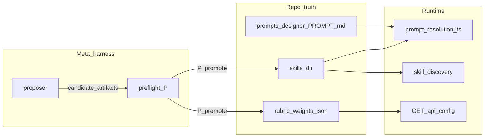

# Meta-Harness outer loop — CLI runbook

How to **run and operate** the `pnpm meta-harness` CLI: the standalone **outer optimization loop** inspired by [Meta-Harness](https://arxiv.org/abs/2603.28052). One **proposer** model (with filesystem tools) proposes harness changes; a **runner** measures them by calling your API and reading `**eval-runs/`** on disk.

This is **not** the main web app—it is a script that talks to **`pnpm dev:server`**. Rubric-weight experiments and skill / system-prompt edits stay in **`history/…/candidate-*/`** until you **`P`** promote (or you merge harness-only text into **`prompts/`** / **`skills/`** by hand — §5.3). The proposer writes **`skills/<key>/SKILL.md`** and may replace the body of **`prompts/designer-agentic-system/PROMPT.md`** (`write_system_prompt`) during a candidate; the runner saves **`skills-baseline/`** and **`prompts-baseline-designer-agentic-system/`** at session start, **restores** those repo trees before each new candidate, and restores again in **`finally`** when the run ends.

---

## 1. Prerequisites


| Requirement                 | Why                                                                                                                                                                                                                                                                                                                                  |
| --------------------------- | ------------------------------------------------------------------------------------------------------------------------------------------------------------------------------------------------------------------------------------------------------------------------------------------------------------------------------------ |
| **Node / pnpm**             | Same as the rest of the repo.                                                                                                                                                                                                                                                                                                        |
| **API up**                  | `pnpm dev:server` or `pnpm dev:all` so `http://127.0.0.1:3001/api/health` works (or change `apiBaseUrl` in `config.json`).                                                                                                                                                                                                           |
| `**OPENROUTER_API_KEY`**    | In `.env.local` or the environment. Used by **hypothesis generation** and by the **proposer** (separate OpenRouter calls).                                                                                                                                                                                                           |
| `**eval-runs/` visibility** | After each agentic run, the server writes structured logs under `{log-base}/eval-runs/<run-id>/`. In **development**, if you do not set `OBSERVABILITY_LOG_DIR` / `LLM_LOG_DIR`, the server defaults to `**logs/observability`**. The runner resolves the same base dir unless you override it in `config.json` → `evalRunsBaseDir`. |


---

## 2. Configuration: files vs command line vs environment

**Summary:** The CLI uses **both** a JSON config file and a few **flags**. There is **no** `pnpm meta-harness --config /path/...` option today—the runner always reads `**meta-harness/config.json`** at the repo root (next to `package.json`). **Benchmark “tasks”** are separate JSON files under `**meta-harness/test-cases/`**.


| Source                                    | What it controls                                                                                                                                                                                               |
| ----------------------------------------- | -------------------------------------------------------------------------------------------------------------------------------------------------------------------------------------------------------------- |
| `**meta-harness/config.json**` (required) | API URL, iteration count, proposer model + tool budget, provider defaults, optional inner revision cap, optional `evalRunsBaseDir`.                                                                            |
| **Command line**                          | `**--mode**`, `**--dry-run**`, `**--eval-only**`, `**--once**`, `**--plain**`, `**--promote**`, `**--improve**`, `**--skip-promotion-check**`, `**--test=**` (see §3). Everything else comes from `config.json` or env.                                                                         |
| `**.env.local` / `.env**`                 | `OPENROUTER_API_KEY` (and the server’s keys when you run `dev:server`). Optional `OBSERVABILITY_LOG_DIR` / `LLM_LOG_DIR` so `**eval-runs/**` land where the runner expects (unless you set `evalRunsBaseDir`). |
| `**meta-harness/test-cases/*.json**`      | Each file is one scenario: **`spec` + `model`** always; **`strategy`** required for default **`--mode=design`**; optional for **`incubate`** / **`e2e`** (hypotheses come from `POST /api/incubate`). See §3.1.   |


### 2.1 `config.json` fields


| Field                      | Meaning                                                                                                                                                                                |
| -------------------------- | -------------------------------------------------------------------------------------------------------------------------------------------------------------------------------------- |
| `mode`                     | Default mode: `incubate`, `e2e`, `design`, or `inputs`. Overridden by `--mode` on the CLI. Falls back to `design` if omitted.                      |
| `inputsGenerateTimeoutMs` | Optional per-call timeout for `POST /api/inputs/generate` (default 120 000 ms).                                                                    |
| `apiBaseUrl`               | Origin + `/api` prefix, e.g. `http://127.0.0.1:3001/api`.                                                                                                                              |
| `evalRunsBaseDir`          | Optional. Absolute path or path relative to repo root. If empty, the runner uses `OBSERVABILITY_LOG_DIR` → `LLM_LOG_DIR` → `logs/observability` (aligned with server defaults in dev). |
| `iterations`               | How many **candidate** loops to run (each loop: optional proposer → evaluate all test cases). Overridden for that run if you pass `**--once`** (forces **1** iteration).               |
| `proposerModel`            | OpenRouter model id for the proposer (tool-calling).                                                                                                                                   |
| `proposerMaxToolRounds`    | Max assistant/tool rounds per proposer turn (safety cap).                                                                                                                              |
| `defaultIncubatorProvider`  | Passed through on hydrated payloads (e.g. `openrouter`).                                                                                                                               |
| `supportsVision`           | Optional; forwarded to generate if set.                                                                                                                                                |
| `agenticMaxRevisionRounds` | Optional cap for inner revision rounds per generation.                                                                                                                                 |
| `incubateProvider`          | Provider id for **`POST /api/incubate`**. Defaults to `defaultIncubatorProvider` if omitted.                                                                                              |
| `incubateModel`             | Model id for incubate. Defaults to `minimax/minimax-m2.5` if omitted.                                                                                                                     |
| `hypothesisEvalModel`      | OpenRouter model for **incubate-mode** hypothesis rubric (six 1–5 scores). If empty, **`proposerModel`** is used.                                                                        |
| `incubateHypothesisCount`   | Default `promptOptions.count` when a test case omits **`incubate.hypothesisCount`**. Default **5**.                                                                                     |


### 2.2 Example `config.json` snippets

**Default-style local dev** (matches the file shipped in the repo — ready to run immediately):

```json
{
  "mode": "incubate",
  "apiBaseUrl": "http://127.0.0.1:3001/api",
  "evalRunsBaseDir": "",
  "iterations": 1,
  "proposerModel": "anthropic/claude-sonnet-4",
  "proposerMaxToolRounds": 24,
  "defaultIncubatorProvider": "openrouter",
  "incubateProvider": "openrouter",
  "incubateModel": "minimax/minimax-m2.5",
  "hypothesisEvalModel": "",
  "incubateHypothesisCount": 5,
  "designGenerationModel": "minimax/minimax-m2.5",
  "supportsVision": false,
  "agenticMaxRevisionRounds": 3
}
```

Key points about the defaults:

- `**iterations: 1**` — safe to start with; you see results from one candidate before committing to a long search. Increase once you trust the setup.
- `**agenticMaxRevisionRounds: 3**` — keeps each test case fast (~1-2 min). Raise to 5 if you want deeper inner revision.
- `**evalRunsBaseDir: ""**` — resolves to the server's dev default (`logs/observability`), so config + server agree out of the box.

**Longer search, cheaper inner loop** (bump iterations, limit inner revision):

```json
{
  "$comment": "overnight run — 10 candidates, fast evals",
  "apiBaseUrl": "http://127.0.0.1:3001/api",
  "evalRunsBaseDir": "",
  "iterations": 10,
  "proposerModel": "anthropic/claude-sonnet-4",
  "proposerMaxToolRounds": 24,
  "defaultIncubatorProvider": "openrouter",
  "agenticMaxRevisionRounds": 2
}
```

**Explicit log directory** (runner + server must agree—simplest is the same path for both):

```json
{
  "apiBaseUrl": "http://127.0.0.1:3001/api",
  "evalRunsBaseDir": "/tmp/auto-designer-observability",
  "iterations": 1,
  "proposerModel": "anthropic/claude-3.5-sonnet",
  "proposerMaxToolRounds": 20,
  "defaultIncubatorProvider": "openrouter"
}
```

Use that last form when you set `OBSERVABILITY_LOG_DIR=/tmp/auto-designer-observability` on `**pnpm dev:server**` as well.

---

## 3. Commands (from repo root)

The script loads `**.env.local**` then `**.env**` before reading `**config.json**`.

**Startup order:** if **`--promote`** → **`GET /api/health`** → **preflight only** → **exit** (no test-case load, no **`OPENROUTER_API_KEY`**). Otherwise: validate test cases → optional **`--dry-run` exit** → require **`OPENROUTER_API_KEY`** (unless **`--eval-only`** rules say otherwise) → **`GET /api/health`** → **preflight** (unless **`--dry-run`**, **`--skip-promotion-check`**, or **`--improve`**) → **Ink dashboard** or **`--plain`** engine.

**Preflight (unpromoted winner):** walks recent **`meta-harness/history/session-*`** for `PROMOTION_REPORT.md` + `best-candidate.json`, compares the winner’s **`skills-snapshot/`** to repo **`skills/`**, and (when present) **`candidate-*/rubric-weights.json`** to **`src/lib/rubric-weights.json`**. The **first** session (newest) with any drift is shown. **TTY:** Ink panel with section tabs (**Skills** / **Rubric weights** only) and unified diff lines per item. **`P`** copies drifted skills into **`skills/`** and overwrites **`src/lib/rubric-weights.json`** when rubrics differ, then either runs the harness (default) or exits (**`--promote`**). **After rubric promotion, restart the API** so **`GET /api/config`** serves updated **`defaultRubricWeights`**. Failures log per step and exit **1**. **`S`** / **`Q`** exit without file changes. **`[`** / **`]`** prev/next item, **`j`** / **`k`** scroll. **Plain / CI:** prints diffs only (no auto-apply); **`--promote`** exits after diffs with a hint to use TTY for **`P`**. **`--promote` uses the same preflight scan as a default run**; post-review behavior differs. Scan errors only warn on full runs; **`--promote`** ends after the warning. **`--dry-run`** skips preflight. **`--improve`** = **`--skip-promotion-check`**. Detail table: [meta-harness/README.md § CLI flow](README.md#cli-flow-boundaries). Designer **`PROMPT.md`** is not part of preflight **`P`**; use **`PROMOTION_REPORT.md`** / **`pnpm version-snapshot`** ([USER_GUIDE.md § Version history](../USER_GUIDE.md#version-history)).

**Flags:** there are no positional arguments, no `--model`, no `--url` on the CLI—change those in `**config.json`**. In an interactive terminal the runner opens an **Ink** dashboard; use `**--plain**` or redirect/pipe stdout to get classic line-by-line logs (CI, `tee`, etc.).

### 3.1 Modes (`--mode`)

| Mode | Behavior | Proposer focuses on |
|------|----------|---------------------|
| **`design`** (default) | Fixed **`strategy`** from each test case → **`POST /api/hypothesis/generate`** (agentic + eval). | **`skills/`**, **`prompts/`**, evaluators, benchmarks. |
| **`incubate`** | **`POST /api/incubate`** from spec → OpenRouter **hypothesis rubric** per hypothesis (no design build). Mean rubric score = fitness. | **Skills** (incubate-related `SKILL.md` files), optional **`write_system_prompt`**, **`add_test_case`**. **No** **`set_rubric_weights`**. |
| **`inputs`** | **`POST /api/inputs/generate`** ×3 per test case → 5-dimension rubric per section (grounding, completeness, actionability, conciseness, brief alignment). Mean = fitness. | **`inputs-gen-*`** skill packages via **`write_skill`** / **`delete_skill`**, optional **`write_system_prompt`** / **`add_test_case`**. **No** **`set_rubric_weights`**. |
| **`e2e`** | Inputs-generate → incubate → **random** hypothesis → agentic generate + eval. | Full pipeline: inputs-gen, incubate, **`skills/`**, evaluators. |

**Recommended workflow:** run **`inputs`** to tune upstream research/framing (cheap), **`incubate`** for hypothesis quality, then **`e2e`** for holistic tuning. Spec-only benchmarks (no `strategy`) are **skipped** in **`design`** mode—use them with **`incubate`** / **`e2e`**, or split test folders.

Set the default in **`config.json`** → **`"mode"`** so you don't have to type the flag every time. The CLI flag **`--mode=X`** overrides whatever is in config. If neither is set, defaults to `design`.

```bash
pnpm meta-harness --mode=incubate
pnpm meta-harness --mode=inputs
pnpm meta-harness --mode=e2e
```

**`--eval-only`:** No proposer. In **`incubate`** and **`inputs`** modes you still need **`OPENROUTER_API_KEY`** for the rubric. In **`design`** / **`e2e`**, generations use the server; rubric calls do not apply.

```bash
# Dry-run: first sorted test case after any `--test=` filters. For incubate/e2e → POST /api/incubate JSON; for design → hypothesis generate JSON.
pnpm meta-harness --dry-run

# Run only benchmarks whose JSON filename (without .json) contains a substring; repeat for OR match.
pnpm meta-harness --test=dashboard-analytics --once

# Evaluate only: no proposer. Design/e2e still run agentic generations via the API (keys per server).
# Incubate + eval-only still requires OPENROUTER_API_KEY for the rubric.
pnpm meta-harness --eval-only

# Single candidate cycle (proposer once + all test cases), then stop.
pnpm meta-harness --once

# Full run: proposer + evaluate, repeated `iterations` times from config.json.
pnpm meta-harness

# Force plain console output (no Ink TUI) even in a TTY.
pnpm meta-harness --plain
```

**Flag reference**


| Flag          | Effect                                                                                                                                  |
| ------------- | --------------------------------------------------------------------------------------------------------------------------------------- |
| `--mode`      | `incubate` / `e2e` / `design` / `inputs`. Overrides `mode` in `config.json`. See §3.1.                                                    |
| `--dry-run`   | Validates hydration + prints JSON; exits. Mode-aware: incubate/e2e → incubate body; design → generate body.                                |
| `--test=`     | Keep only test cases whose basename (no `.json`) contains the substring (case-insensitive). Multiple flags are **OR**’d. Errors if none match. |
| `--eval-only` | Skips OpenRouter **proposer**. **`incubate`** still needs **`OPENROUTER_API_KEY`** for the rubric. **`design`** / **`e2e`** use the API for generation (keys per server lockdown). Skips the automatic **baseline** pass (see §4)—every iteration is eval-only. |
| `--once`      | Sets iteration count to **1** for this invocation (ignores `iterations` in `config.json` for that run).                                 |
| `--plain`     | Use line-based `console` output only (no Ink TUI).                                                                                      |
| `--skip-promotion-check` | Skip the preflight scan for an unpromoted last-session winner (no diff UI / plain diff block). Same effect as **`--improve`**. |
| `--improve`  | Alias for **`--skip-promotion-check`**: run the harness immediately without the unpromoted-winner check. |
| `--promote`  | **Preflight only:** health + diff review (same as default preflight). **TTY + P:** apply winner **skills** + **rubric weights** into the repo, then **exit** — no benchmarks, no proposer, no **`OPENROUTER_API_KEY`**. **Plain:** diffs only, no auto-apply. Not combinable with **`--dry-run`**. |


### 3.2 Example command combinations

**Smoke-test the harness payload (no server needed):**

```bash
pnpm meta-harness --dry-run
```

**One full outer iteration without burning `iterations` from config** (good for debugging):

```bash
pnpm meta-harness --once
```

**Measure current repo `skills/` and on-disk prompts only—no proposer editing the harness first:**

```bash
pnpm meta-harness --eval-only --once
```

**Typical overnight search** (many candidates): set `"iterations": 10` (or higher) in `config.json`, ensure API is up, then:

```bash
pnpm meta-harness
```

**Lay terms:** think of `**config.json`** as the “knobs panel,” **flags** as short overrides (`--once`, `--eval-only`, `--dry-run`, `--plain`), and `**.env.local`** as where your API key lives.

### 3.3 Tunable surfaces (promotion model)

The proposer experiments on **skills**, the **designer system PROMPT.md body**, **rubric weights** (design/e2e), and **benchmark JSON**. The live app loads prompt bodies from repo **`skills/*/SKILL.md`** and **`prompts/designer-agentic-system/PROMPT.md`** via **`server/lib/prompt-resolution.ts`**. Preflight **`P`** applies **skills** and **rubric** drift only (see **`apply-promotion.ts`**).

| Surface | Repo source | Proposer tools (when enabled) | Candidate artifacts | Preflight compares | **`P`** writes |
|---------|-------------|----------------|---------------------|--------------------|----------------|
| **Skills** | `skills/` | `write_skill`, `delete_skill` | `skills-snapshot/` | Snapshot tree vs **`skills/`** | File copy / delete |
| **Designer system prompt** | `prompts/designer-agentic-system/PROMPT.md` | `write_system_prompt` | Session baseline + **`.prompt-versions/`** snapshots on write | Not in preflight **`P`** — §5.3 + **USER_GUIDE.md** | Edit file manually or replay from **`.prompt-versions/`** |
| **Rubric weights** | `src/lib/rubric-weights.json` | `set_rubric_weights` | `rubric-weights.json` | Winner JSON vs repo JSON | Overwrite JSON; **restart API** |

**Baseline note:** **`skills-baseline/`** and **`prompts-baseline-designer-agentic-system/`** freeze repo **`skills/`** and **`prompts/designer-agentic-system/`** at session start. The runner restores both before each proposed candidate and in **`finally`**, so cross-candidate experiments do not accumulate in the repo. Only **`P`** (or manual steps) writes promoted skills/rubric into the app tree; **`PROMPT.md`** is manual or **`.prompt-versions/`** replay.



---

## 4. What one iteration does

The exact evaluate step depends on the mode you chose (section 3.1). Here is the full sequence:

0. **New session directory**: Each run creates **`meta-harness/history/session-<mode>-<ISO-timestamp>/`** (e.g. **`session-design-…`**, **`session-incubate-…`**, **`session-e2e-…`**) with a **`session.json`** (mode, iterations, config snapshot). All candidates for that run live under that folder only — prior runs stay in sibling **`session-*`** folders (gitignored), so the proposer never confuses another run’s **`candidate-*`** with this one.
0b. **Skills baseline** (outer-loop startup, not promotion preflight): Once the session directory exists, the runner copies repo **`skills/`** into **`session-…/skills-baseline/`** (or creates an empty directory if **`skills/`** is missing). This snapshot is the restore source for the rest of the run.
0c. **Designer prompt baseline**: Copies **`prompts/designer-agentic-system/`** into **`session-…/prompts-baseline-designer-agentic-system/`** (same empty-dir fallback). Restored together with **`skills/`** between candidates.
1. **Baseline `candidate-0`** (when not `--eval-only`): Evaluates the **current repo** (current `skills/` and on-disk prompts) as **`candidate-0 (baseline)`** inside the **new session directory** before any proposer runs. Baseline **always** runs for a new session (no resume skip across runs). Baseline does **not** count against **`iterations`** in `config.json`.
2. **Proposer loop** (skipped if `--eval-only`): For each configured iteration, the runner **restores** repo **`skills/`** and **`prompts/designer-agentic-system/`** from session baselines (clean slate per candidate), then calls OpenRouter with a mode-specific system prompt and tools. In **incubate** / **inputs** mode, **`set_rubric_weights`** is disabled; **`write_skill`**, **`delete_skill`**, and **`write_system_prompt`** are available. Context includes **this session’s** prior **`candidate-*`** (scores, per-candidate harness artifacts, per-test **`summary.json`** rubric means, **`proposal.md`** excerpt) plus a **reference table** of prior sessions’ best scores from **`best-candidate.json`**. The proposer may **write** `skills/<key>/SKILL.md`, **`write_system_prompt`** (designer **`PROMPT.md`** body), adjust rubric weights (**design/e2e** only), or **add** `meta-harness/test-cases/*.json`. It should finish with **`submit_candidate`** and a short **reasoning** written to **`session-…/candidate-N/proposal.md`**. If it **runs out of tool rounds** without calling **`submit_candidate`** but **did** edit disk surfaces or weights, those changes are **still evaluated** for that candidate with an auto-reason string; if it made **no** changes, the reasoning explains that (suggest checking history / tool budget).
3. **Snapshot**: Copies the current **`skills/`** tree (after this candidate’s proposer + before eval consumes it) to **`session-…/candidate-N/skills-snapshot/`**.
4. **Evaluate**: For each selected test-case JSON (all under `**test-cases/**`, or the subset matched by **`--test=`**), behavior is mode-dependent. In design mode, hydrates each test case into a full `**/api/hypothesis/generate**` payload (agentic), streams SSE until done, then waits for `**eval-runs/<correlation-id>:lane-0/meta.json`** . In incubate mode, calls POST /api/incubate per test case and runs an OpenRouter LLM rubric on each hypothesis (no design build). In e2e mode, calls incubate, randomly picks one hypothesis, then generates and evaluates like design mode.
5. **Scores**: Writes per-test `**test-results/<case>/summary.json`** (includes **`rubricMeans`** for agentic runs when available) and `**aggregate.json**` (mean overall score). Updates **`session-…/best-candidate.json**` when the mean improves.
6. **Changelog**: Writes `**CHANGELOG.md`** inside the candidate folder, summarizing what changed and a per-test score table (see §5.1).
7. **Promotion report** (end of the full run): Writes **`session-…/PROMOTION_REPORT.md`** at the **session root** (alongside `session.json` / `best-candidate.json`). The report still names the winning `candidate-*` folder and prints a short summary in the terminal (Ink summary panel or `--plain` logs). This is the **manual apply guide**: skill snapshot vs current `skills/`, rubric deltas, new test cases, and a checklist (see §5.2).

**Important:** Repo **`skills/`** and **`prompts/designer-agentic-system/`** are **restored** from session baselines after each candidate and when the run exits (`**finally**`), so you do **not** need git to undo cross-candidate experiments. **`skills-snapshot/`** still records what that candidate evaluated against. The API resolves prompts from the repo (**`skills/`**, **`prompts/designer-agentic-system/PROMPT.md`**) per request. **Test-case** JSON edits under **`meta-harness/test-cases/`** do persist on disk across candidates (not reverted by the runner).

### 4.1 Preflight checks

Before any candidate runs, the CLI:

- Verifies `**/api/health**` is reachable (fails fast if server is down).
- Lists test case files (exits if the folder is empty).
- Checks `**OPENROUTER_API_KEY**` if the proposer is needed.

### 4.2 What you see in the terminal

The runner prints a **startup banner** with your settings (iterations, test cases, API URL, proposer model, revision cap), then per-candidate:

```
──── Proposer (anthropic/claude-sonnet-4) ──────────────────────
  [proposer round 1] list_dir meta-harness/history
  [proposer round 1] read_file skills/design-quality/SKILL.md
  [proposer round 2] write_skill typography-scale
  [proposer round 3] submit_candidate Rewrote spacing guidance…
  proposer done (14.2s)
  skills touched: typography-scale
  reasoning: Rewrote spacing guidance in a new typography-scale…

──── Test 1/3: landing-page-saas ───────────────────────────────
  phase: building
  phase: evaluating
  eval round 1: score=3.45 → revising
  revision round 2 starting…
  eval round 2: score=3.82
  landing-page-saas done (48.3s) score=3.82 stop=satisfied

──── Test 2/3: dashboard-analytics ─────────────────────────────
  …

──── Results: candidate-1 (loop 1/3) ───────────────────────────
  mean score   3.67
  best so far  candidate-1 (3.67)
  ** new best **
  changelog    meta-harness/history/session-…/candidate-1/CHANGELOG.md
```

**Lay terms:** you can watch the proposer browsing files and making edits in real time; then each test case shows phases, eval scores, and whether it triggered revisions — so you see if things are getting better or worse before the full run finishes.

### 4.3 Ink terminal UI (default in a TTY)

When stdout is a TTY and you do **not** pass `--plain`, the runner renders a React **Ink** dashboard: header with timer, proposer tool trace, per-test rows with live SSE-derived status, scoreboard, activity log, and **`q`** to request stop after the current step / **`d`** to toggle raw SSE detail lines. Artifacts are still written under `meta-harness/history/` as before.

---

## 5. Files and folders


| Path                    | Role                                                                                                                                                  |
| ----------------------- | ----------------------------------------------------------------------------------------------------------------------------------------------------- |
| `config.json`           | CLI settings.                                                                                                                                         |
| `test-cases/*.json`     | **Simplified** benchmarks (`spec` + `model`; `strategy` optional for incubate/e2e). See `test-case-hydrator.ts`.                                      |
| `history/session-…/`    | **Gitignored.** Per-run folder: **`session.json`**, **`best-candidate.json`**, **`PROMOTION_REPORT.md`** (after a full run, when there is a best candidate), and **`candidate-0`**, **`candidate-1`**, … (per-candidate proposals, skills snapshot, test results, aggregates, changelog). |
| `runner.tsx`            | CLI entry (Ink vs plain).                                                                                                                             |
| `runner-core.ts`       | Outer-loop engine; `RunnerCallbacks` only (no UI).                                                                                                     |
| `ui/`                   | Ink app (`App.tsx`, panels, reducer state).                                                                                                            |
| `proposer.ts`           | OpenRouter tool loop; **mode-aware** prompts and tools (`incubate`/`inputs` omit `set_rubric_weights`).                                                    |
| `modes.ts`              | Shared `MetaHarnessMode` type.                                                                                                                        |
| `hypothesis-evaluator.ts` | OpenRouter **incubate-mode** rubric (six 1–5 dimensions per hypothesis).                                                                           |
| `evaluator.ts`          | SSE + `eval-runs` wait (design / e2e generate path).                                                                                                  |
| `test-case-hydrator.ts` | Simplified JSON → incubate body or `HypothesisGenerateRequestSchema`.                                                                                  |
| `promotion-report.ts`   | Builds `PROMOTION_REPORT.md` + `PromotionSummary` (prompt / skill / test-case deltas + checklist).                                                  |


Server-side structured logs (prompts, raw evaluator traces, round files) live under:

`{evalRunsBaseDir}/eval-runs/<lane-correlation-id>/`

The lane id is `<your correlationId>:lane-0` for the default single-lane setup.

### 5.1 Per-candidate CHANGELOG.md

After each candidate finishes, the runner writes **`history/session-…/candidate-N/CHANGELOG.md`**. Example:

```markdown
# candidate-3

**Iteration:** 3 / 5
**Mean score:** 3.91 (3 test cases)

## What the proposer changed

Added a typography-scale skill with explicit spacing rhythm rules
and line-height guidance.

## Per-test results

| Test case | Score | Stop reason |
|-----------|-------|-------------|
| dashboard-analytics | 3.85 | satisfied |
| landing-page-saas | 4.02 | satisfied |
| onboarding-checklist | 3.87 | max_revisions |
```

**This answers "what changed and why"** in a human-readable file you can skim without digging into JSON or raw eval traces. The `proposal.md` alongside it has the proposer's full reasoning; `skills-snapshot/` has the skills that were active.

### 5.2 `PROMOTION_REPORT.md` (manual promotion)

After **all** iterations finish, the runner writes **`meta-harness/history/session-…/PROMOTION_REPORT.md`** at the session root (only when there is a winning candidate id). The body still identifies **`candidate-<best>`** and paths under that folder for applying changes.

Open that file for:

| Section | What you get |
|--------|----------------|
| **1. Result summary** | Winning candidate, mean score, mode, and a table of every candidate’s mean score |
| **2. (report §2)** | When present, per-key bodies in **`PROMOTION_REPORT.md`** — merge into the matching **`skills/*/SKILL.md`** or **`prompts/designer-agentic-system/PROMPT.md`** (see §5.3) |
| **3. Skill changes** | Diff of **`skills-snapshot/`** (winner) vs repo **`skills/`** — after a full run, live **`skills/`** has been restored to the pre-run baseline, so this is effectively **winner vs original app tree** |
| **4. Rubric weight changes** | Table of current vs winner blend when **`rubric-weights.json`** differs from **`src/lib/rubric-weights.json`** |
| **5. New test cases** | Test-case JSON names that appeared under `meta-harness/test-cases/` since the run **started** |
| **6. How to apply** | Numbered checklist: sync **`skills/`** → rubric JSON + API restart if needed → `pnpm test` / `pnpm lint` |
| **7. Proposer reasoning** | Copy of `proposal.md` |

**Lay terms:** rubric weights and any harness-only prompt experiments live in **artifacts** under **`history/`**; skills are mirrored temporarily under **`skills/`** during a candidate and then **restored**. Preflight **`P`** copies **skills** + **rubric** drift automatically; anything that still maps to **`prompts/`** you edit by hand (§5.3). This report is your “ship list” for the rest.

The terminal also shows a **short line count** (how many skill paths / new tests / rubric deltas) so you know whether to open the report before you leave the desk.

### 5.3 Merging harness prompt text into the repo

Runtime copy comes from **`skills/*/SKILL.md`** and **`prompts/designer-agentic-system/PROMPT.md`**, resolved by **`server/lib/prompt-resolution.ts`**. Legacy **`candidate-*/prompt-overrides.json`** is retained for old sessions only (new runs write `{}`); preflight **`P`** does not sync it.

1. **Find the text** — **`PROMOTION_REPORT.md`** §2 (if present) or the winning **`candidate-*`** folder artifacts.
2. **Map keys to files** — Each key corresponds to a skill package path or the designer system **`PROMPT.md`** (see **`server/lib/prompt-discovery.ts`** / **`prompt-resolution.ts`**).
3. **Edit and verify** — Paste or merge into the right **`SKILL.md`** / **`PROMPT.md`**, restart the API if needed, then run **`pnpm test`** / **`pnpm lint`**.

---

## 6. Adding or changing benchmark tasks

1. Copy an existing file under `**test-cases/`**.
2. **Name vs filename:** the JSON **`"name"`** field must match the file basename **without** `.json` (e.g. `foo.json` → `"name": "foo"`). A mismatch is skipped so the TUI rows, disk folders, and summaries cannot silently diverge.
3. Keep the required shape: `name`, `spec.title`, `spec.sections` (map of section id → string or `{ "content": "..." }`), `model` (`providerId`, `modelId`, optional `thinkingLevel`).
   - **For `--mode=design`:** also include `strategy` (`id`, `name`, `hypothesis`, `rationale`, `measurements`, `dimensionValues`). Test cases **without** `strategy` are skipped in design mode.
   - **For `--mode=incubate` / `--mode=e2e` / `--mode=inputs`:** `strategy` is **optional** (hypotheses come from the incubate endpoint; inputs mode does not use strategy). `inputs` mode requires a non-empty `design-brief` in `spec.sections`. Add an optional `incubate` block: `{ "hypothesisCount": 5 }` to control how many hypotheses are requested.
4. Run `**pnpm meta-harness --dry-run --mode=<your-mode>**` to ensure hydration passes.

The proposer may also call `**add_test_case**`; new files must still pass `**SimplifiedMetaHarnessTestCaseSchema**`.

---

## 7. Optional live integration test

With the API running and keys available:

```bash
META_HARNESS_LIVE=1 pnpm vitest run meta-harness/__tests__/runner-live.test.ts
```

This performs one real agentic generation and asserts `**eval-runs/.../meta.json**` exists. It is **slow** and **costs tokens**; default CI does not set `META_HARNESS_LIVE`.

---

## 8. Troubleshooting


| Symptom                        | What to check                                                                                                                                            |
| ------------------------------ | -------------------------------------------------------------------------------------------------------------------------------------------------------- |
| `Set OPENROUTER_API_KEY`       | Key missing for proposer or for generation (even `--eval-only` needs generation).                                                                        |
| `HTTP 4xx/5xx` from generate   | Server logs; body too large; lockdown model rules; missing credentials on server.                                                                        |
| `evalRunDir` null / timeout    | Log base mismatch: server wrote under `**logs/observability`** but runner points elsewhere—set `**evalRunsBaseDir**` in `config.json` or align env vars. |
| Proposer makes bad skill edits | Lower `**proposerMaxToolRounds**`, use a stronger `**proposerModel**`, or run `**--eval-only**` while you hand-edit `**skills/**`.                       |
| No `history/` in git           | `**meta-harness/history/**` is in `**.gitignore**` by design; copy artifacts out if you need to share them.                                              |


---

## 9. Relation to the main app

- **Does not** replace the canvas or change the server code path—only **calls** `POST /api/incubate` and `POST /api/hypothesis/generate` like the UI does.
- **Does** implement the paper’s “outer loop” **shape**: filesystem history + proposer + repeated evaluate. Full automation quality depends on models, budget, and benchmarks—same as in the paper’s experiments.

---

## 10. Best use recommendations (from the paper)

These follow [Meta-Harness](https://arxiv.org/abs/2603.28052) (Lee et al., 2026): an outer loop stores **full** artifacts on disk, a **proposer** reads them **selectively** (not as one compressed summary), and evaluation uses **tasks** that represent what you actually want to improve.

### Preserve diagnostic depth, not just scores

The paper argues that common optimizers fail at harness engineering because they **compress feedback** too much: memoryless updates, **scalar scores only**, or short LLM summaries. Their loop instead keeps **source, scores, and execution traces** for every candidate. In their ablations, access to **full traces** dominates weaker feedback regimes.

**Here:** Keep server `**eval-runs/`** logging enabled and aligned with the runner’s `**evalRunsBaseDir**`. When reviewing or prompting the proposer, prioritize `**round-*/*.raw.txt**` (evaluator reasoning + JSON) and `**aggregate.json**`, not only `**meta.json**`’s final score. The inner app’s revision agent already benefits from traces; the outer loop should too.

### Treat the filesystem as the long-term memory

The proposer is designed to `**grep` / read** many small files across **all prior candidates** instead of ingesting history as a single prompt. In their reported runs, the agent touches many files per iteration because **total experience exceeds context limits**—**adaptive browsing** matters.

**Here:** Old sessions accumulate under `**meta-harness/history/session-*/**` (gitignored). Each new run gets a **new** `**session-*`** folder; the proposer only learns from **the current session’s** `**candidate-***` plus a compact **prior-sessions best** table. You can delete old `**session-*`** folders to save disk; that only removes historical reference for future runs.

### Fix the benchmark tasks before chasing the harness

Their Figure 2 step (2) is **evaluate on tasks**. If tasks are noisy, biased, or unrelated to product goals, the outer loop optimizes the wrong signal.

**Here:** Invest in `**test-cases/*.json`** that mirror real specs and hypotheses you care about. Add coverage across layout types (e.g. marketing page vs dense dashboard). Prefer a **stable** suite when comparing candidates; only expand when you want the loop to optimize for new scenarios.

### One causal hypothesis per candidate (early on)

The paper frames **credit assignment at the harness level**: link failures back to **which harness choice** (prompt, retrieval, presentation) likely caused them. Harness effects are **long-horizon**—one bad instruction can show up many steps later—so muddy multi-edit candidates make learning harder.

**Here:** Early in a search, encourage the proposer (via your instructions or manual runs) to make **small, testable edits**: one skill, one **`PROMPT.md`** / **`SKILL.md`** change, or one evaluation-facing tweak—then re-measure on the full suite. Widen the search space once you see clear score movement.

### Use a proposer that can use tools well

They use a **coding agent**, not a single-shot chat completion, because the proposer must **choose what to inspect** and **apply patches** against a growing tree of logs.

**Here:** Set `**proposerModel`** to a model that is reliably strong at **tool calling** and long-horizon reasoning. Give enough `**proposerMaxToolRounds`** for read → diagnose → edit → `**submit_candidate**`, but cap it to limit runaway cost (see troubleshooting).

### What to avoid (paper’s implied “anti-patterns”)


| Avoid                                                                     | Why (paper)                                                  |
| ------------------------------------------------------------------------- | ------------------------------------------------------------ |
| Optimizing from **mean score alone** with no traces                       | Loses the linkage from failure to harness decision.          |
| **Replacing** raw logs with human summaries before the proposer sees them | Summaries drop the detail their method relies on.            |
| **Deleting** prior candidate directories                                  | Breaks non-Markovian comparison across iterations.           |
| Huge unrelated **multi-surface** harness edits per candidate              | Harder credit assignment; measure drift vs. your benchmarks. |


**In plain terms:** the paper’s recipe is “**save everything important on disk, let the next iteration read the real evidence, and evaluate on honest tasks**.” Your CLI is closest to that when `**eval-runs/`** and `**history/**` stay rich, stable, and actually consulted—not when you chase a single number with a wiped folder each time.

---

For a short overview, see `**README.md**` in this folder.