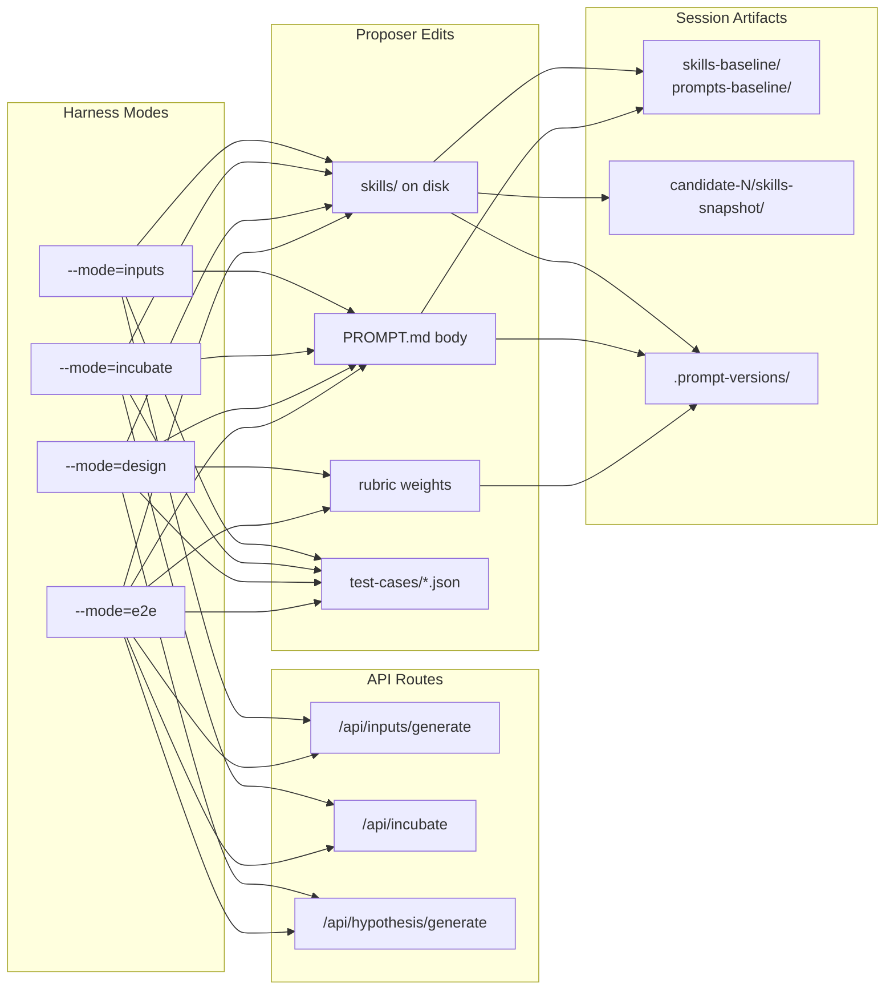

# Meta-Harness outer loop

Standalone CLI inspired by [Meta-Harness](https://arxiv.org/abs/2603.28052): a **proposer** agent edits **skills**, **rubric weights** (when tools are enabled), and benchmark JSON; a **runner** scores each candidate. **`--mode=design`** (default) runs fixed strategies through **`POST /api/hypothesis/generate`**. **`--mode=incubate`** runs **`POST /api/incubate`** plus an OpenRouter **hypothesis rubric** (no design build). **`--mode=inputs`** optimizes the three **inputs-generate prompts** (`inputs-gen-research-context`, `inputs-gen-objectives-metrics`, `inputs-gen-design-constraints`) by calling **`POST /api/inputs/generate`** per test case and scoring output with a 5-dimension rubric. **`--mode=e2e`** runs the full pipeline: inputs-gen → incubate → random hypothesis → agentic build → multi-rubric eval.



**Operator runbook:** [META_HARNESS_OUTER_LOOP.md](./META_HARNESS_OUTER_LOOP.md) — how to run `pnpm meta-harness`, config, flags, folders, benchmarks, troubleshooting.

## Prerequisites

1. **API server running** (`pnpm dev:server` or `pnpm dev:all`).
2. **`OPENROUTER_API_KEY`** in `.env.local` (or env) for the **proposer**, for **`--mode=incubate`** and **`--mode=inputs`** rubric calls, and for generation when using OpenRouter-backed models on the server.
3. Optional: set **`OBSERVABILITY_LOG_DIR`** or rely on dev default `logs/observability` so `eval-runs/<id>/` exists after agentic runs.

## Usage

```bash
# From repo root; loads .env.local via dotenv in runner
pnpm meta-harness

# One full iteration (propose + evaluate all test cases), then exit
pnpm meta-harness --once

# Skip proposer (evaluate current repo state only; no LLM proposer call)
pnpm meta-harness --eval-only

# Only run benchmarks whose JSON basename contains a substring (multiple --test= OR’d)
pnpm meta-harness --test=dashboard-analytics --once

# Dry run: show hydrated payload + paths, no HTTP (incubate body if --mode=incubate|e2e)
pnpm meta-harness --dry-run
pnpm meta-harness --mode=incubate --dry-run

# Hypothesis-quality loop (incubate + rubric only)
pnpm meta-harness --mode=incubate

# Inputs auto-fill quality loop (inputs-generate + rubric only)
pnpm meta-harness --mode=inputs

# Full pipeline: inputs-gen → incubate → random hypothesis → build + eval
pnpm meta-harness --mode=e2e

# Classic log lines (no Ink dashboard) — useful for CI or piping to a file
pnpm meta-harness --plain

# Skip the preflight scan and run the harness immediately (same as --improve)
pnpm meta-harness --skip-promotion-check

# Skip preflight (shorthand)
pnpm meta-harness --improve

# Full promotion review only (same diff experience as default preflight; then exit — no benchmarks, no OPENROUTER key)
pnpm meta-harness --promote
```

In a normal terminal, the runner uses an **Ink** (React-in-terminal) UI; `--plain` keeps the previous `console.log` behavior.

### CLI flow (boundaries)

| Invocation | Health | Preflight (scan + diffs) | Harness (tests / proposer) |
|------------|:------:|:------------------------:|:---------------------------:|
| **`pnpm meta-harness`** (default) | yes | yes — **full** Ink or plain diffs | yes |
| **`--improve`** or **`--skip-promotion-check`** | yes | **skipped** | yes |
| **`--promote`** | yes | yes — **same full** experience as default | **no** (exits after review) |
| **`--dry-run`** | no* | no | no (*exits after printing one hydrated payload) |

**`--promote` is not a lite preflight.** It uses the same code path as the default preflight: same session scan, same unified diffs grouped by **Skills / Rubric weights**, same `PreflightReview` / `printPlainPreflightSummary`. The only difference is you never load benchmarks or run the outer loop — useful when you only want the “should I promote?” review.

### Preflight promotion check

**When preflight runs (default or `--promote`):** the CLI scans recent **`history/session-*`** folders (newest first) for a completed session (`PROMOTION_REPORT.md` + `best-candidate.json`) whose winning artifacts still **differ** from the live repo: **`skills-snapshot/`** vs **`skills/`**, and (if the winner has **`rubric-weights.json`**) that file vs **`src/lib/rubric-weights.json`**. If something is stale:

- **TTY:** Ink **unified diffs** per item with a **section navigation** row (counts per surface). **`P`** Promote: applies the winner’s skill tree into **`skills/`**, overwrites **`src/lib/rubric-weights.json`** when rubrics drifted, then continues (default run) or exits (**`--promote`**). **Restart the API** after promoting rubric weights so **`GET /api/config`** picks up the file. **`S`** / **`Q`** exit without changing files. Scroll `j`/`k` or ↑/↓; items `[`/`]`. On failure, the CLI exits **1** with a per-step log.
- **`--plain` / non-TTY:** full diffs printed to stdout under **Skills** / **Rubric weights** section headers — **no automatic apply** (use TTY + **P** or promote manually). Default run **continues** into the harness; **`--promote`** **exits** after diffs.

**`--improve`** (or **`--skip-promotion-check`**) skips preflight and goes straight to the harness.

**`--promote`** cannot be combined with **`--dry-run`**.

If nothing is stale, one line is logged (default **continues**; **`--promote`** exits **0**). On a full run, scan failures warn and the harness still starts; with **`--promote`**, a scan failure warns and the CLI exits **0**.

## Layout

- `config.json` — mode (`incubate` / `inputs` / `e2e` / `design`), API URL, proposer model, iteration budget. The `--mode` CLI flag overrides the config value.
- `test-cases/*.json` — benchmarks: **`spec` + `model`** always; **`strategy`** required for **`--mode=design`**; optional for **`incubate`** / **`e2e`**. Optional **`incubateHypothesisCount`** sets how many strategies the incubate step asks for (defaults in `config.json`). Example without strategy: `test-cases/spec-only-landing-saas.json`.
- `history/` — per-session and per-candidate artifacts (gitignored). Each run creates **`history/session-<mode>-…/`** (`incubate` / `inputs` / `e2e` / `design` prefix before the timestamp) with `session.json`, **`skills-baseline/`** (copy of repo **`skills/`** at run start), **`prompts-baseline-designer-agentic-system/`** (copy of **`prompts/designer-agentic-system/`**), `best-candidate.json`, and **`PROMOTION_REPORT.md`** at the session root after a full run (it names the winning `candidate-*` inside that session). Under the session folder, each **`candidate-*`** holds `proposal.md`, `skills-snapshot/`, `test-results/`, `aggregate.json`, legacy **`prompt-overrides.json`** (always `{}` for new runs), etc. When **`history/candidate-0/aggregate.json`** is missing (not `--eval-only`), the runner evaluates **`candidate-0`** as a **baseline** first—even if other `candidate-*` folders exist from an old run—then runs the configured **`iterations`** of propose+eval. The runner **restores** repo **`skills/`** and **`prompts/designer-agentic-system/`** from those baselines before each new candidate and when the run ends; experiments stay under **`candidate-*`** until **`P`**. If the proposer exhausts its tool budget without **`submit_candidate`** but did change skills or **`PROMPT.md`** for that turn, those edits are still evaluated for that candidate.

**Also:** Optional HTTP timeouts and other `config.json` fields are in [META_HARNESS_OUTER_LOOP.md §2](./META_HARNESS_OUTER_LOOP.md). The Ink dashboard marks a finished test **unscored** (warning) when there is no usable score — distinct from **error**. The proposer’s system prompts (`proposer-prompts.ts`) require an explicit **refine-on-leader** vs **explore** choice each turn; tuning is via **disk** (`write_skill`, `delete_skill`, `write_system_prompt`) plus **`set_rubric_weights`** in design/e2e only — not auto-merged from the session best.

## Promoting changes (skills, rubric weights)

Harness artifacts stay under **`history/…/candidate-*/`** until you promote them. With a **TTY** preflight, **`P`** updates **`skills/`** and **`src/lib/rubric-weights.json`** when those surfaces drift. **Plain** mode or manual runs: follow **`PROMOTION_REPORT.md`** to copy the winner’s **`skills-snapshot/`** into **`skills/`** and align **`rubric-weights.json`**, then restart the API if rubrics changed (root **AGENTS.md**).

**Version store:** Before **`P`** overwrites live files, the runner copies the **prior** **`skills/`** tree, **`prompts/designer-agentic-system/PROMPT.md`**, and **`src/lib/rubric-weights.json`** contents into repo-root **`.prompt-versions/`** (manifest + `snapshots/`). The **proposer** tools (`write_skill`, `delete_skill`, `write_system_prompt`) do the same. Commit **`.prompt-versions/`** with other changes so history travels with the repo. Manual operators: **`pnpm version-snapshot`** (see **USER_GUIDE.md**).

Manual promotion checklist: [META_HARNESS_OUTER_LOOP.md §5.2](./META_HARNESS_OUTER_LOOP.md#52-promotion_reportmd-manual-promotion). **Tunable surfaces** overview: [META_HARNESS_OUTER_LOOP.md §3.3](./META_HARNESS_OUTER_LOOP.md#33-tunable-surfaces-promotion-model).

## Live E2E (optional)

```bash
pnpm dev:server   # terminal 1
META_HARNESS_LIVE=1 pnpm vitest run meta-harness/__tests__/runner-live.test.ts
```

Requires a working API and keys; skipped when `META_HARNESS_LIVE` is unset.
